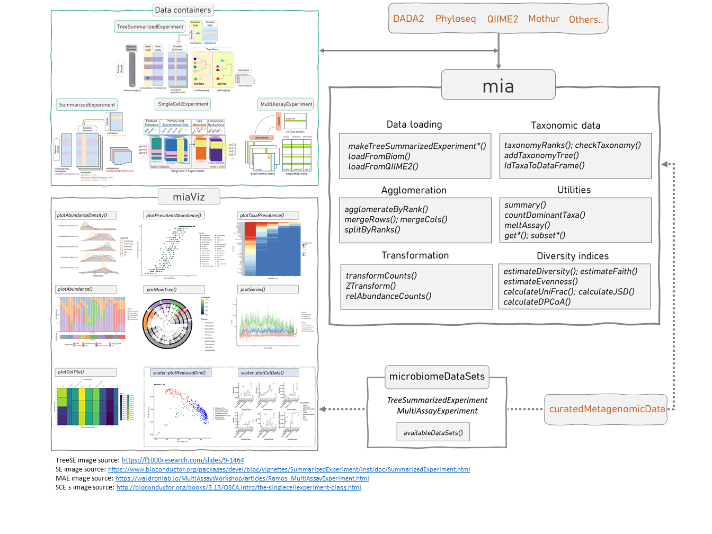

# Microbiome Data {#containers}


```{r setup, echo=FALSE, results="asis"}
library(rebook)
chapterPreamble()
```


## Data science framework

The building blocks of the framework are **data container**
(SummarizedExperiment and its derivatives), **packages** from various
developers using the TreeSE container, open **demonstration data
sets**, in a separate Chapter on [#example-data], and **online
tutorials** including this online book as well as the various package
vignettes and other material.

```{r echo=FALSE}

```


## Data containers

[`SummarizedExperiment`](https://bioconductor.org/packages/release/bioc/html/SummarizedExperiment.html)
(`SE`) is a generic and highly optimized container for complex data
structures. It has become a common choice for analysing various types
of biomedical profiling data, such as RNAseq, ChIp-Seq, microarrays,
flow cytometry, proteomics, and single-cell
sequencing.

[`TreeSummarizedExperiment`](https://www.bioconductor.org/packages/release/bioc/html/TreeSummarizedExperiment.html)
(`TreeSE`) was developed as an extension to incorporate hierarchical
information (such as phylogenetic trees and sample hierarchies) and
reference sequences.

[`MultiAssayExperiment`](https://www.bioconductor.org/packages/release/bioc/html/MultiAssayExperiment.html)
(`MAE`) provides an organized way to bind several different data
structures together in a single object. For example, we can bind
microbiome data (in `TreeSE` format) with metabolomic profiling data
(in `SE`) format, with shared sample metadata. This is convenient and
robust for instance in subsetting and other data manipulation
tasks. Microbiome data can be part of multiomics experiments and
analysis strategies and we want to outline the understanding in which
we think the packages explained and used in this book relate to these
experiment layouts using the `TreeSummarizedExperiment` and classes
beyond.

This section provides an introductions to these data containers. In
microbiome data science, these containers link taxonomic abundance
tables with rich side information on the features and
samples. Taxonomic abundance data can be obtained by 16S rRNA amplicon
or metagenomic sequencing, phylogenetic microarrays, or by other
means. Many microbiome experiments include multiple versions and types
of data generated independently or derived from each other through
transformation or agglomeration. We start by providing recommendations
on how to represent different varieties of multi-table data within the
`TreeSummarizedExperiment` class.

The options and recommendations are summarized in Table \@ref(tab:options).

### Assay data

The original count-based taxonomic abundance tables may have different 
transformations, such as logarithmic, Centered Log-Ratio (CLR), or relative 
abundance. These are typically stored in _**assays**_.

```{r}
library(mia)
data(GlobalPatterns, package="mia")
se <- GlobalPatterns
assays(se)
```

As an example, the relative abundance is calculated.

```{r}
se <- relAbundanceCounts(se)
assays(se)
```

Here the dimension of the count data remains unchanged. This is
actually a requirement for any `SummarizedExperiment` object.


### Alternative experiments

_**Alternative experiments**_ differ from transformations as they can
contain complementary data, which is no longer tied to the same
dimensions as the assay data. However, the number of samples (columns)
must be the same.

This can come into play for instance when one has taxonomic abundance
profiles quantified with different measurement technologies, such as
phylogenetic microarrays, amplicon sequencing, or metagenomic
sequencing. Such alternative experiments that concern the same samples
can be stored as

1. Separate _assays_ assuming that the taxonomic information can be mapped 
between feature directly 1:1; or 
2. data in the _altExp_ slot of the `TreeSummarizedExperiment`, if the feature 
dimensions differ. Each element of the _altExp_ slot is a `SummarizedExperiment`
or an object from a derived class with independent feature data.


As an example, we show how to store taxonomic abundance tables
agglomerated at different taxonomic levels. However, the data could as
well originate from entirely different measurement sources as long as
the samples are matched.

```{r}
# Agglomerate the data to Phylym level
se.phylum <- agglomerateByRank(se, "Phylum")
# both have the same number of columns (samples)
dim(se)
dim(se.phylum)

# Add the new table as an alternative experiment
altExp(se, "Phylum") <- se.phylum
altExpNames(se)

# Pick a sample subset: this acts on both altExp and assay data
se[,1:10]
dim(altExp(se[,1:10],"Phylum"))
```

For more details of altExp have a look at the [Intro vignette](https://bioconductor.org/packages/release/bioc/vignettes/SingleCellExperiment/inst/doc/intro.html) of the 
`SingleCellExperiment` package [@R-SingleCellExperiment].


### MultiAssayExperiments

_**Multiple experiments**_ relate to complementary measurement types,
such as transcriptomic or metabolomic profiling of the microbiome or
the host. Multiple experiments can be represented using the same
options as alternative experiments, or by using the
`MultiAssayExperiment` class [@R-MultiAssayExperiment]. Depending on how the 
datasets relate to each other the data can be stored as:

1. Separate _altExp_ if the samples can be matched directly 1:1; or
2. As `MultiAssayExperiment` objects, in which the connections between
samples are defined through a `sampleMap`. Each element on the
`experimentsList` of an `MultiAssayExperiment` is `matrix` or
`matrix`-like object including `SummarizedExperiment` objects, and the
number of samples can differ between the elements.


```{r}
#TODO: Find the right dataset to explain a non 1:1 sample relationship
```


For information have a look at the [intro vignette](https://bioconductor.org/packages/release/bioc/vignettes/MultiAssayExperiment/inst/doc/MultiAssayExperiment.html) of the `MultiAssayExperiment` package.  

 
   Option   Rows (features)    Cols (samples)               Recommended  
---------   --------------    ---------------  ------------------------
   assays  	     match              match       Data transformations  
   altExp             free              match    Alternative experiments  
MultiAssay            free      free (mapping)    Multi-omic experiments    

Table: (\#tab:options) **Recommended options for storing multiple data tables in microbiome studies** The _assays_ are best suited for data transformations (one-to-one match between samples and columns across the assays). The _alternative experiments_ are particularly suitable for alternative versions of the data that are of same type but may have a different number of features (e.g. taxonomic groups); this is for instance the case with taxonomic abundance tables agglomerated at different levels (e.g. genus vs. phyla) or alternative profiling technologies (e.g. amplicon sequencing vs. shallow shotgun metagenomics). For alternative experiments one-to-one match between samples (cols) is required but the alternative experiment tables can have different numbers of features (rows). Finally, elements of the _MultiAssayExperiment_ provide the most flexible way to incorporate multi-omic data tables with flexible numbers of samples and features. We recommend these conventions as the basis for methods development and application in microbiome studies.


## Loading experimental microbiome data

### Import from external files

Microbiome (taxonomic) profiling data is commonly distributed in
various file formats. You can import such external data files as a
(Tree)SummarizedExperiment object but the details depend on the file
format. Here, we provide examples for common formats.

**CSV data tables** can be imported with the standard R functions,
  then converted to the desired format. For detailed examples, you can
  check the [Bioconductor course
  material](https://bioconductor.org/help/course-materials/2019/BSS2019/04_Practical_CoreApproachesInBioconductor.html)
  by Martin Morgan. The following example reads abundance tables,
  taxonomic mapping tables, and sample metadata, assuming that the
  input data files are properly prepared with appropriate row and
  column names.

```{r importingcsv, message=FALSE, eval=FALSE}
counts  <- read.csv(count_file)   # Abundance table (e.g. ASV data; to assay data)
tax     <- read.csv(tax_file)     # Taxonomy table (to rowData)
samples <- read.csv(sample_file)  # Sample data (to colData)
se <- SummarizedExperiment(assays = list(counts = counts),
                           colData = samples,
                           rowData = tax)
```

Specific import functions are provided for:

-   Biom files (see `help(mia::loadFromBiom)`)
-   QIIME2 files (see `help(mia::loadFromQIIME2)`)
-   Mothur files (see `help(mia::loadFromMothur)`)


#### Biom example

This example shows how Biom files are imported into a
`TreeSummarizedExperiment` object.

The data is from following publication: 
Tengeler AC _et al._ (2020) [**Gut microbiota from persons with
attention-deficit/hyperactivity disorder affects the brain in
mice**](https://doi.org/10.1186/s40168-020-00816-x). 

The data set consists of 3 files:

-   biom file: abundance table and taxonomy information
-   csv file: sample metadata
-   tree file: phylogenetic tree


Store the data in your desired local directory (for instance, _data/_ under the
working directory), and define source file paths

```{r}
biom_file_path <- "data/Aggregated_humanization2.biom"
sample_meta_file_path <- "data/Mapping_file_ADHD_aggregated.csv"
tree_file_path <- "data/Data_humanization_phylo_aggregation.tre"
```  

Now we can load the biom data into a SummarizedExperiment (SE) object.

```{r}
library(mia)

# Imports the data
se <- loadFromBiom(biom_file_path)

# Check
se
```  

The `assays` slot includes a list of abundance tables. The imported
abundance table is named as "counts".  Let us inspect only the first
cols and rows.

```{r}
assays(se)$counts[1:3, 1:3]
```

The `rowdata` includes taxonomic information from the biom file. The `head()` command
shows just the beginning of the data table for an overview.

`knitr::kable()` is for printing the information more nicely.

```{r}
head(rowData(se))
```

These taxonomic rank names (column names) are not real rank
names. Let’s replace them with real rank names.

In addition to that, the taxa names include, e.g., '"k__' before the name, so let's
make them cleaner by removing them. 

```{r}
names(rowData(se)) <- c("Kingdom", "Phylum", "Class", "Order", 
                        "Family", "Genus")

# Goes through the whole DataFrame. Removes '.*[kpcofg]__' from strings, where [kpcofg] 
# is any character from listed ones, and .* any character.
rowdata_modified <- BiocParallel::bplapply(rowData(se), 
                                           FUN = stringr::str_remove, 
                                           pattern = '.*[kpcofg]__')

# Genus level has additional '\"', so let's delete that also
rowdata_modified <- BiocParallel::bplapply(rowdata_modified, 
                                           FUN = stringr::str_remove, 
                                           pattern = '\"')

# rowdata_modified is a list, so it is converted back to DataFrame format. 
rowdata_modified <- DataFrame(rowdata_modified)

# And then assigned back to the SE object
rowData(se) <- rowdata_modified

# Now we have a nicer table
head(rowData(se))
```

We notice that the imported biom file did not contain the sample meta data
yet, so it includes an empty data frame.

```{r}
head(colData(se))
```

Let us add a sample metadata file.

```{r}
# We use this to check what type of data it is
# read.table(sample_meta_file_path)

# It seems like a comma separated file and it does not include headers
# Let us read it and then convert from data.frame to DataFrame
# (required for our purposes)
sample_meta <- DataFrame(read.table(sample_meta_file_path, sep = ",", header = FALSE))

# Add sample names to rownames
rownames(sample_meta) <- sample_meta[,1]

# Delete column that included sample names
sample_meta[,1] <- NULL

# We can add headers
colnames(sample_meta) <- c("patient_status", "cohort", "patient_status_vs_cohort", "sample_name")

# Then it can be added to colData
colData(se) <- sample_meta
```

Now `colData` includes the sample metadata.

```{r}
head(colData(se))
```

Now, let's add a phylogenetic tree.

The current data object, se, is a SummarizedExperiment object. This
does not include a slot for adding a phylogenetic tree. In order to do
this, we can convert the SE object to an extended TreeSummarizedExperiment
object which includes also a `rowTree` slot.

```{r}
tse <- as(se, "TreeSummarizedExperiment")

# tse includes same data as se
tse
```

Next, let us read the tree data file and add it to the R data object (tse).

```{r}
# Reads the tree file
tree <- ape::read.tree(tree_file_path)

# Add tree to rowTree
rowTree(tse) <- tree

# Check
tse
```

Now `rowTree` includes a phylogenetic tree:

```{r, eval=FALSE}
head(rowTree(tse))
```


### Conversions between data formats in R

If the data has already been imported in R in another format, it
can be readily converted into `TreeSummarizedExperiment`, as shown in our next
example. Note that similar conversion functions to
`TreeSummarizedExperiment` are available for multiple data formats via
the `mia` package (see makeTreeSummarizedExperimentFrom* for phyloseq,
Biom, and DADA2).

```{r, message=FALSE}
library(mia)

# phyloseq example data
data(GlobalPatterns, package="phyloseq") 
GlobalPatterns_phyloseq <- GlobalPatterns
GlobalPatterns_phyloseq
```

```{r, message=FALSE}
# convert phyloseq to TSE
GlobalPatterns_TSE <- makeTreeSummarizedExperimentFromPhyloseq(GlobalPatterns_phyloseq) 
GlobalPatterns_TSE
```

We can also convert `TreeSummarizedExperiment` objects into `phyloseq`
with respect to the shared components that are supported by both
formats (i.e. taxonomic abundance table, sample metadata, taxonomic
table, phylogenetic tree, sequence information). This is useful for
instance when additional methods are available for `phyloseq`.

```{r, message=FALSE}
# convert TSE to phyloseq
GlobalPatterns_phyloseq2 <- makePhyloseqFromTreeSummarizedExperiment(GlobalPatterns_TSE) 
GlobalPatterns_phyloseq2
```


## Demonstration Data {#example-data}


Open demonstration data for testing and benchmarking purposes is
available from multiple locations. This chapter introduces some
options. The other chapters of this book provide ample examples about
the use of the data.


### Package data {#package-data}

The `mia` R package contains example data sets that are direct
conversions from the alternative `phyloseq` container to the
`TreeSummarizedExperiment` container.

List the [available
datasets](https://microbiome.github.io/mia/reference/index.html) in
the `mia` package:


```{r, message=FALSE, eval=FALSE}
library(mia)
data(package="mia")
```

Load the `GlobalPatterns` data from the `mia` package:

```{r, message=FALSE}
data("GlobalPatterns", package="mia")
GlobalPatterns
```


Check the documentation for this data set:

```{r, message=FALSE, echo=FALSE}
help(GlobalPatterns)
```


### ExperimentHub data

[ExperimentHub](https://bioconductor.org/packages/release/bioc/vignettes/ExperimentHub/inst/doc/ExperimentHub.html)
provides a variety of data resources, including the
[microbiomeDataSets](https://bioconductor.org/packages/devel/data/experiment/html/microbiomeDataSets.html)
package.

A table of the available data sets is available through the `availableDataSets`
function.

```{r, message=FALSE}
library(microbiomeDataSets)
availableDataSets()
```

All data are downloaded from ExperimentHub and cached for local
re-use. Check the [man pages of each
function](https://microbiome.github.io/microbiomeDataSets/reference/index.html)
for a detailed documentation of the data contents and references. Let
us retrieve a `r Biocpkg("MultiAssayExperiment")` data set:

```{r, message=FALSE, eval=FALSE}
mae <- HintikkaXOData()
```

Data is available in `r Biocpkg("SummarizedExperiment")`, `r
Biocpkg("TreeSummarizedExperiment")`, and `r
Biocpkg("MultiAssayExperiment")` data containers; see the separate
page on [alternative
containers](https://microbiome.github.io/OMA/multitable.html) for more
details.


### Other data sources

The
[curatedMetagenomicData](https://waldronlab.io/curatedMetagenomicData)
is an independent source that provides various example data sets as
`(Tree)SummarizedExperiment` objects. This resource provides curated
human microbiome data including gene families, marker abundance,
marker presence, pathway abundance, pathway coverage, and relative
abundance for samples from different body sites. See the package
homepage for more details on data availability and access.

As one example, let us retrieve the Vatanen (2016) [@Vatanen2016] data
set. This is a larger collection with a bit longer download time.


```{r, message=FALSE, eval=FALSE}
library(curatedMetagenomicData)
se <- curatedMetagenomicData("Vatanen*", dryrun = FALSE, counts = TRUE)
```


## Microbiome data specific aspects

```{r, message=FALSE}
library(mia)
data("GlobalPatterns", package = "mia")
se <- GlobalPatterns 
se
```

### Assays  

The `assays` slot contains the experimental data as count matrices. Multiple 
matrices can be stored the result of `assays` is actually a list of matrices.

```{r}
assays(se)
```

Individual assays can be accessed via `assay`

```{r}
assay(se, "counts")[1:5,1:7]
```

To illustrate the use of multiple assays, the relative abundance data can be 
calcualted and stored along the original count data using `relAbundanceCounts`.

```{r}
se <- relAbundanceCounts(se)
assays(se)
```

Now there are two assays available in the `se` object, `counts` and 
`relabundance`.

```{r}
assay(se, "relabundance")[1:5,1:7]
```

### colData

`colData` contains data on the samples.

```{r coldata}
colData(se)
```

### rowData

`rowData` contains data on the features of the analyzed samples. Of particular
interest for the microbiome field this is used to store taxonomic information.

```{r rowdata}
rowData(se)
```

### rowTree  

Phylogenetic trees also play an important role for the microbiome field. The 
`TreeSummarizedExperiment` class is able to keep track of feature and node
relations via two functions, `rowTree` and `rowLinks`.

A tree can be accessed via `rowTree` as `phylo` object.       
```{r rowtree}
rowTree(se)
```

The links to the individual features are available through `rowLinks`.

```{r rowlinks}
rowLinks(se)
```

Please note that there can be a 1:1 relationship between tree nodes and 
features, but this is not a must have. This means there can be features, which
are not linked to nodes, and nodes, which are not linked to features. To change
the links in an existing object, the `changeTree` function is available.


## Session Info {-}

```{r sessionInfo, echo=FALSE, results='asis'}
prettySessionInfo()
```
