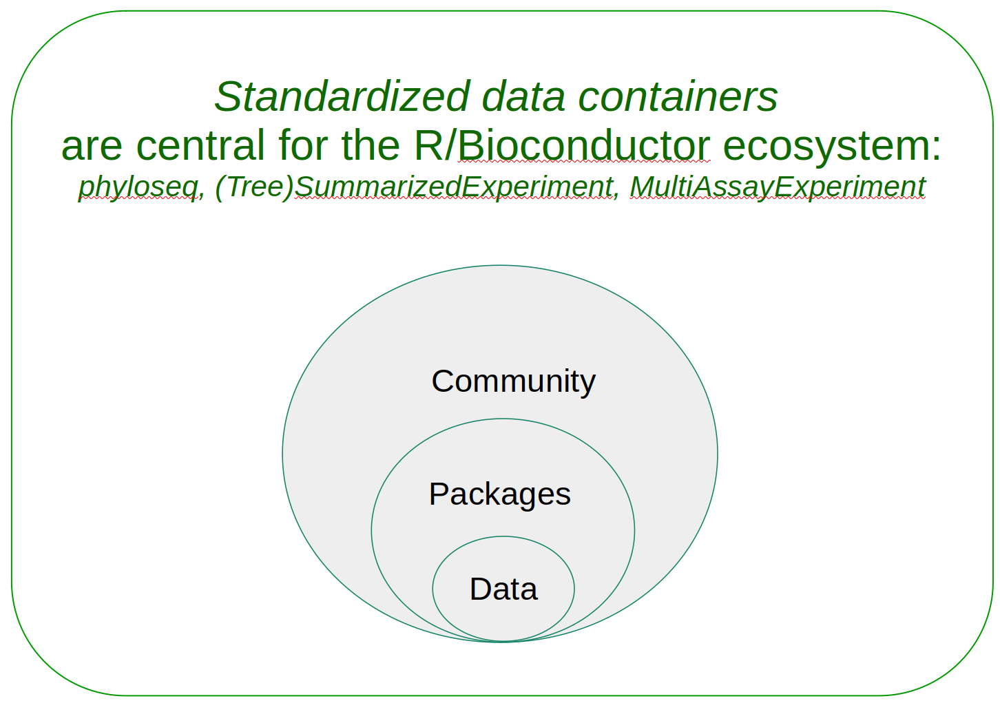

# Packages {#packages}

```{r setup, echo=FALSE, results="asis"}
library(rebook)
chapterPreamble()
```


The Bioconductor microbiome data science framework consists of:

- **data containers**, designed to organize multi-assay microbiome data
- **R packages** that provide dedicated methods for analysing such data
- **community** of users and developers 




This section provides an overview of the package ecosystem. Section
\@ref(example-data) links to various open microbiome data resources
that support this framework.


## Package installation

You can install all packages that are required to run every example in this book via the following command:

```{r eval=FALSE, message=FALSE}
source("https://raw.githubusercontent.com/microbiome/OMA/master/install_packages.R")
```

### Installing specific packages {#packages_specific}

You can install R packages of your choice with the following command
line procedure.

**Bioconductor release version** is the most stable and tested version
but may miss some of the latest methods and updates. It can be
installed with:

```{r eval=FALSE, message=FALSE}
BiocManager::install("microbiome/mia")
```

**Bioconductor development version** requires the installation of the
latest R beta version. This is primarily recommended for those who
already have experience with R/Bioconductor and need access to the
latest updates.

```{r eval=FALSE, message=FALSE}
BiocManager::install("microbiome/mia", version="devel")
```

**Github development version** provides access to the latest but
potentially unstable features. This is useful when you want access to
all available tools.

```{r eval=FALSE, message=FALSE}
devtools::install_github("microbiome/mia")
```


## Package ecosystem {#ecosystem}

Methods for the analysis and manipulation of
`(Tree)SummarizedExperiment` and `MultiAssayExperiment` data
containers are available through a number of R packages. Some of these
are listed below. If you know more tips on such packages, data
sources, or other resources, kindly [let us
know](https://microbiome.github.io) through the issues, pull requests,
or online channels.


### mia family of methods

- [mia](https://microbiome.github.io/mia/): Microbiome analysis tools [@R_mia]
- [miaViz](https://microbiome.github.io/miaViz/): Microbiome analysis specific visualization [@Ernst2022]
- [miaSim](https://microbiome.github.io/miaSim/): Microbiome data simulations [@Simsek2021]
- [miaTime](https://microbiome.github.io/miaTime/): Microbiome time series analysis [@Lahti2021]


### Tree-based methods {#sub-tree-methods}

- [philr](http://bioconductor.org/packages/devel/bioc/html/philr.html) (@Silverman2017)


### Differential abundance {#sub-diff-abund}

- [ANCOMBC](https://bioconductor.org/packages/devel/bioc/html/ANCOMBC.html) for differential abundance analysis
- [benchdamic](https://bioconductor.org/packages/release/bioc/vignettes/benchdamic/inst/doc/intro.html) for benchmarking differential abundance methods
- [LinDA](https://cran.r-project.org/web/packages/MicrobiomeStat/) for differential abundance analysis
- [ZicoSeq](https://cran.r-project.org/web/packages/GUniFrac/) for differential abundance analysis
- [ALDEx2](https://www.bioconductor.org/packages/release/bioc/html/ALDEx2.html) for differential abundance analysis
- [phyloseq](https://www.bioconductor.org/packages/release/bioc/html/phyloseq.html) for data preparation into phyloseq format for differential abundance analysis, such as ANCOMBC requires the input data is phyloseq format


### Manipulation {#sub-manipulation}

- [MicrobiotaProcess](https://bioconductor.org/packages/release/bioc/html/MicrobiotaProcess.html) for analyzing microbiome and other ecological data within the tidy framework


### Further options

- [Tools for Microbiome
  Analysis](https://microsud.github.io/Tools-Microbiome-Analysis/)
  site listed over 130 R packages for microbiome data science in
  2023. Many of these are not in Bioconductor, or do not directly
  support the data containers used in this book but can be used with
  minor modifications.

