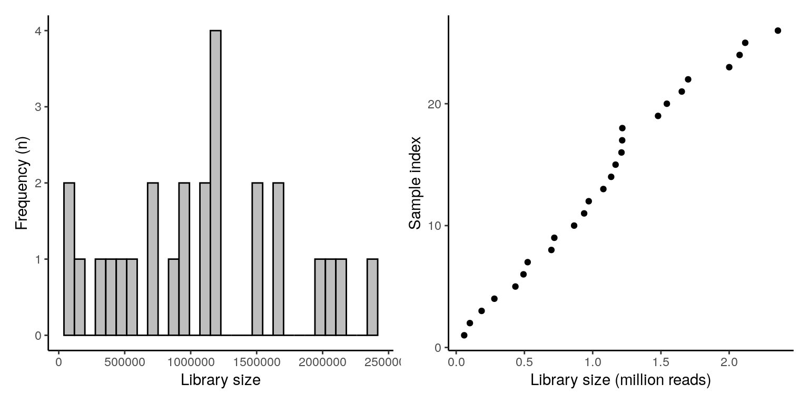
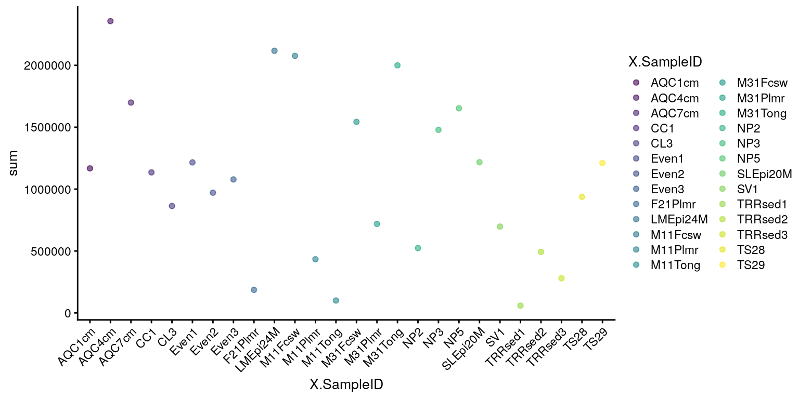
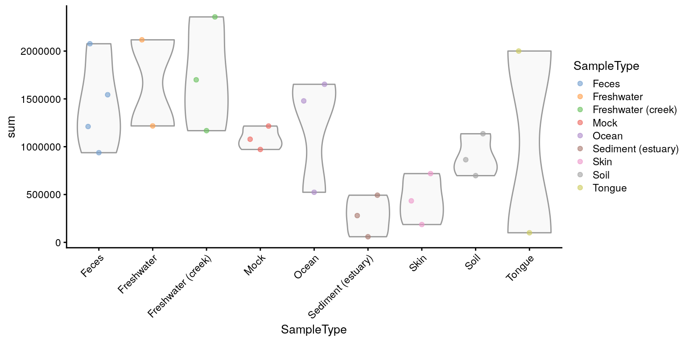

# Quality Control {#quality-control}

<script>
document.addEventListener("click", function (event) {
    if (event.target.classList.contains("rebook-collapse")) {
        event.target.classList.toggle("active");
        var content = event.target.nextElementSibling;
        if (content.style.display === "block") {
            content.style.display = "none";
        } else {
            content.style.display = "block";
        }
    }
})
</script>

<style>
.rebook-collapse {
  background-color: #eee;
  color: #444;
  cursor: pointer;
  padding: 18px;
  width: 100%;
  border: none;
  text-align: left;
  outline: none;
  font-size: 15px;
}

.rebook-content {
  padding: 0 18px;
  display: none;
  overflow: hidden;
  background-color: #f1f1f1;
}
</style>


```r
library(mia)
data("GlobalPatterns")
se <- GlobalPatterns 
```

## Get top taxa and taxonomy   

### Features  

The `getTopTaxa` can be used for identifying top taxa in the data.   

```r
top_features <- getTopTaxa(se, method="median", top=10)
tax_data <- rowData(se)[top_features,taxonomyRanks(se)]
tax_data
```

```
## DataFrame with 10 rows and 7 columns
##            Kingdom         Phylum               Class             Order
##        <character>    <character>         <character>       <character>
## 549656    Bacteria  Cyanobacteria         Chloroplast     Stramenopiles
## 331820    Bacteria  Bacteroidetes         Bacteroidia     Bacteroidales
## 317182    Bacteria  Cyanobacteria         Chloroplast     Stramenopiles
## 94166     Bacteria Proteobacteria Gammaproteobacteria    Pasteurellales
## 279599    Bacteria  Cyanobacteria    Nostocophycideae        Nostocales
## 158660    Bacteria  Bacteroidetes         Bacteroidia     Bacteroidales
## 329744    Bacteria Actinobacteria      Actinobacteria   Actinomycetales
## 326977    Bacteria Actinobacteria      Actinobacteria Bifidobacteriales
## 248140    Bacteria  Bacteroidetes         Bacteroidia     Bacteroidales
## 550960    Bacteria Proteobacteria Gammaproteobacteria Enterobacteriales
##                    Family           Genus                Species
##               <character>     <character>            <character>
## 549656                 NA              NA                     NA
## 331820     Bacteroidaceae     Bacteroides                     NA
## 317182                 NA              NA                     NA
## 94166     Pasteurellaceae     Haemophilus Haemophilusparainflu..
## 279599        Nostocaceae  Dolichospermum                     NA
## 158660     Bacteroidaceae     Bacteroides                     NA
## 329744             ACK-M1              NA                     NA
## 326977 Bifidobacteriaceae Bifidobacterium Bifidobacteriumadole..
## 248140     Bacteroidaceae     Bacteroides      Bacteroidescaccae
## 550960 Enterobacteriaceae     Providencia                     NA
```

## Library size   

The total counts/sample can be calculated using the
`perCellQCMetrics`/`addPerCellQC` from the `scater` package. The first one 
just calculates the values, whereas the latter one directly adds them to the
`colData`.


```r
library(scater)
perCellQCMetrics(se)
```

```
## DataFrame with 26 rows and 3 columns
##               sum  detected     total
##         <numeric> <numeric> <numeric>
## CL3        864077      6964    864077
## CC1       1135457      7679   1135457
## SV1        697509      5729    697509
## M31Fcsw   1543451      2667   1543451
## M11Fcsw   2076476      2574   2076476
## ...           ...       ...       ...
## TS28       937466      2679    937466
## TS29      1211071      2629   1211071
## Even1     1216137      4213   1216137
## Even2      971073      3130    971073
## Even3     1078241      2776   1078241
```

```r
se <- addPerCellQC(se)
colData(se)
```

```
## DataFrame with 26 rows and 10 columns
##         X.SampleID   Primer Final_Barcode Barcode_truncated_plus_T
##           <factor> <factor>      <factor>                 <factor>
## CL3        CL3      ILBC_01        AACGCA                   TGCGTT
## CC1        CC1      ILBC_02        AACTCG                   CGAGTT
## SV1        SV1      ILBC_03        AACTGT                   ACAGTT
## M31Fcsw    M31Fcsw  ILBC_04        AAGAGA                   TCTCTT
## M11Fcsw    M11Fcsw  ILBC_05        AAGCTG                   CAGCTT
## ...            ...      ...           ...                      ...
## TS28         TS28   ILBC_25        ACCAGA                   TCTGGT
## TS29         TS29   ILBC_26        ACCAGC                   GCTGGT
## Even1        Even1  ILBC_27        ACCGCA                   TGCGGT
## Even2        Even2  ILBC_28        ACCTCG                   CGAGGT
## Even3        Even3  ILBC_29        ACCTGT                   ACAGGT
##         Barcode_full_length SampleType
##                    <factor>   <factor>
## CL3             CTAGCGTGCGT      Soil 
## CC1             CATCGACGAGT      Soil 
## SV1             GTACGCACAGT      Soil 
## M31Fcsw         TCGACATCTCT      Feces
## M11Fcsw         CGACTGCAGCT      Feces
## ...                     ...        ...
## TS28            GCATCGTCTGG      Feces
## TS29            CTAGTCGCTGG      Feces
## Even1           TGACTCTGCGG      Mock 
## Even2           TCTGATCGAGG      Mock 
## Even3           AGAGAGACAGG      Mock 
##                                        Description       sum  detected
##                                           <factor> <numeric> <numeric>
## CL3     Calhoun South Carolina Pine soil, pH 4.9      864077      6964
## CC1     Cedar Creek Minnesota, grassland, pH 6.1     1135457      7679
## SV1     Sevilleta new Mexico, desert scrub, pH 8.3    697509      5729
## M31Fcsw M3, Day 1, fecal swab, whole body study      1543451      2667
## M11Fcsw M1, Day 1, fecal swab, whole body study      2076476      2574
## ...                                            ...       ...       ...
## TS28                                       Twin #1    937466      2679
## TS29                                       Twin #2   1211071      2629
## Even1                                      Even1     1216137      4213
## Even2                                      Even2      971073      3130
## Even3                                      Even3     1078241      2776
##             total
##         <numeric>
## CL3        864077
## CC1       1135457
## SV1        697509
## M31Fcsw   1543451
## M11Fcsw   2076476
## ...           ...
## TS28       937466
## TS29      1211071
## Even1     1216137
## Even2      971073
## Even3     1078241
```

The distribution of calculated library sizes can be visualized as a histogram.


```r
library(ggplot2)
ggplot(as.data.frame(colData(se))) +
    geom_histogram(aes(x = sum), color = "black", fill = "gray", bins = 30) +
    labs(x = "Library size", y = "Frequency") +
    theme_bw() +
    theme(panel.grid.major = element_blank(), # Removes the grid
          panel.grid.minor = element_blank(),
          panel.border = element_blank(),
          panel.background = element_blank(),
          axis.line = element_line(colour = "black")) # Adds y-axis
```

<div class="figure">

<p class="caption">(\#fig:plot-viz-lib-size-1)Library size distribution.</p>
</div>

Library sizes - and other variables from `colData` - can be also visualized by using 
specified function called `plotColData`.


```r
library(ggplot2)
plotColData(se,"sum","X.SampleID", colour_by = "X.SampleID") + 
    theme(axis.text.x = element_text(angle = 45, hjust=1))
```

<div class="figure">

<p class="caption">(\#fig:plot-viz-lib-size-2)Library sizes per sample.</p>
</div>


```r
plotColData(se,"sum","SampleType", colour_by = "SampleType") + 
    theme(axis.text.x = element_text(angle = 45, hjust=1))
```

<div class="figure">

<p class="caption">(\#fig:plot-viz-lib-size-3)Library sizes per sample type.</p>
</div>


## Session Info {-}

<button class="rebook-collapse">View session info</button>
<div class="rebook-content">
```
R version 4.1.0 (2021-05-18)
Platform: x86_64-pc-linux-gnu (64-bit)
Running under: Ubuntu 20.04.2 LTS

Matrix products: default
BLAS/LAPACK: /usr/lib/x86_64-linux-gnu/openblas-pthread/libopenblasp-r0.3.8.so

locale:
 [1] LC_CTYPE=en_US.UTF-8       LC_NUMERIC=C              
 [3] LC_TIME=en_US.UTF-8        LC_COLLATE=en_US.UTF-8    
 [5] LC_MONETARY=en_US.UTF-8    LC_MESSAGES=C             
 [7] LC_PAPER=en_US.UTF-8       LC_NAME=C                 
 [9] LC_ADDRESS=C               LC_TELEPHONE=C            
[11] LC_MEASUREMENT=en_US.UTF-8 LC_IDENTIFICATION=C       

attached base packages:
[1] stats4    stats     graphics  grDevices utils     datasets  methods  
[8] base     

other attached packages:
 [1] scater_1.21.2                  ggplot2_3.3.5                 
 [3] scuttle_1.3.0                  mia_1.1.7                     
 [5] TreeSummarizedExperiment_2.1.3 Biostrings_2.61.1             
 [7] XVector_0.33.0                 SingleCellExperiment_1.15.1   
 [9] SummarizedExperiment_1.23.1    Biobase_2.53.0                
[11] GenomicRanges_1.45.0           GenomeInfoDb_1.29.3           
[13] IRanges_2.27.0                 S4Vectors_0.31.0              
[15] BiocGenerics_0.39.1            MatrixGenerics_1.5.1          
[17] matrixStats_0.59.0             BiocStyle_2.21.3              
[19] rebook_1.3.0                  

loaded via a namespace (and not attached):
  [1] ggbeeswarm_0.6.0            colorspace_2.0-2           
  [3] ellipsis_0.3.2              BiocNeighbors_1.11.0       
  [5] farver_2.1.0                bit64_4.0.5                
  [7] fansi_0.5.0                 decontam_1.13.0            
  [9] splines_4.1.0               codetools_0.2-18           
 [11] sparseMatrixStats_1.5.0     cachem_1.0.5               
 [13] knitr_1.33                  jsonlite_1.7.2             
 [15] cluster_2.1.2               graph_1.71.2               
 [17] BiocManager_1.30.16         compiler_4.1.0             
 [19] assertthat_0.2.1            Matrix_1.3-4               
 [21] fastmap_1.1.0               lazyeval_0.2.2             
 [23] BiocSingular_1.9.1          htmltools_0.5.1.1          
 [25] tools_4.1.0                 rsvd_1.0.5                 
 [27] gtable_0.3.0                glue_1.4.2                 
 [29] GenomeInfoDbData_1.2.6      reshape2_1.4.4             
 [31] dplyr_1.0.7                 Rcpp_1.0.7                 
 [33] jquerylib_0.1.4             vctrs_0.3.8                
 [35] ape_5.5                     nlme_3.1-152               
 [37] DECIPHER_2.21.0             DelayedMatrixStats_1.15.0  
 [39] xfun_0.24                   stringr_1.4.0              
 [41] beachmat_2.9.0              lifecycle_1.0.0            
 [43] irlba_2.3.3                 XML_3.99-0.6               
 [45] zlibbioc_1.39.0             MASS_7.3-54                
 [47] scales_1.1.1                parallel_4.1.0             
 [49] yaml_2.2.1                  memoise_2.0.0              
 [51] gridExtra_2.3               sass_0.4.0                 
 [53] stringi_1.7.3               RSQLite_2.2.7              
 [55] highr_0.9                   ScaledMatrix_1.1.0         
 [57] tidytree_0.3.4              permute_0.9-5              
 [59] filelock_1.0.2              BiocParallel_1.27.2        
 [61] rlang_0.4.11                pkgconfig_2.0.3            
 [63] bitops_1.0-7                evaluate_0.14              
 [65] lattice_0.20-44             purrr_0.3.4                
 [67] labeling_0.4.2              treeio_1.17.2              
 [69] CodeDepends_0.6.5           cowplot_1.1.1              
 [71] bit_4.0.4                   tidyselect_1.1.1           
 [73] plyr_1.8.6                  magrittr_2.0.1             
 [75] bookdown_0.22               R6_2.5.0                   
 [77] generics_0.1.0              DelayedArray_0.19.1        
 [79] DBI_1.1.1                   withr_2.4.2                
 [81] mgcv_1.8-36                 pillar_1.6.1               
 [83] RCurl_1.98-1.3              tibble_3.1.3               
 [85] dir.expiry_1.1.0            crayon_1.4.1               
 [87] utf8_1.2.2                  rmarkdown_2.9              
 [89] viridis_0.6.1               grid_4.1.0                 
 [91] blob_1.2.2                  vegan_2.5-7                
 [93] digest_0.6.27               tidyr_1.1.3                
 [95] munsell_0.5.0               DirichletMultinomial_1.35.0
 [97] beeswarm_0.4.0              viridisLite_0.4.0          
 [99] vipor_0.4.5                 bslib_0.2.5.1              
```
</div>
