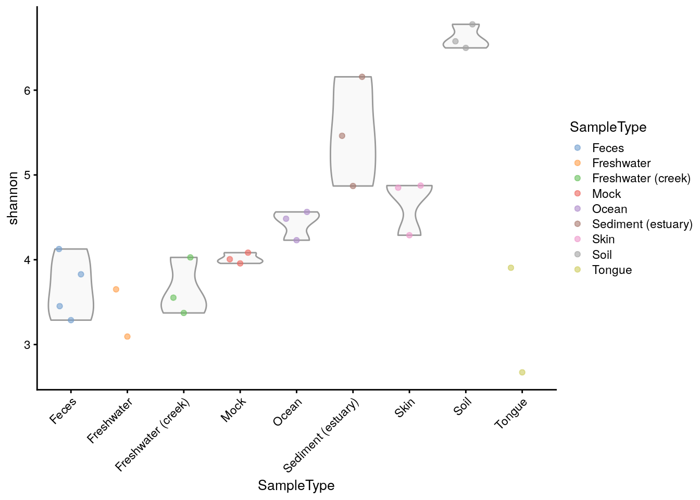
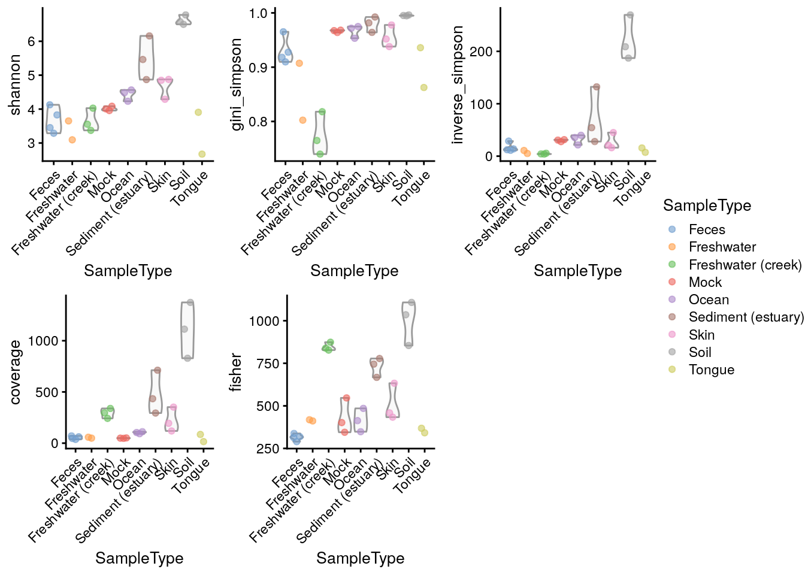
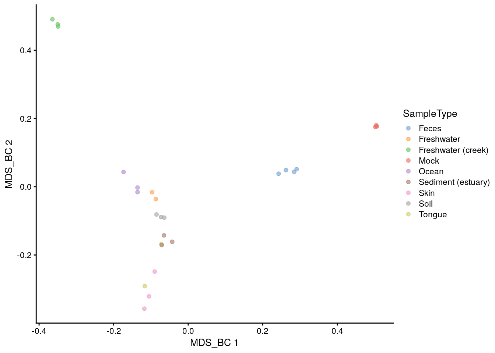
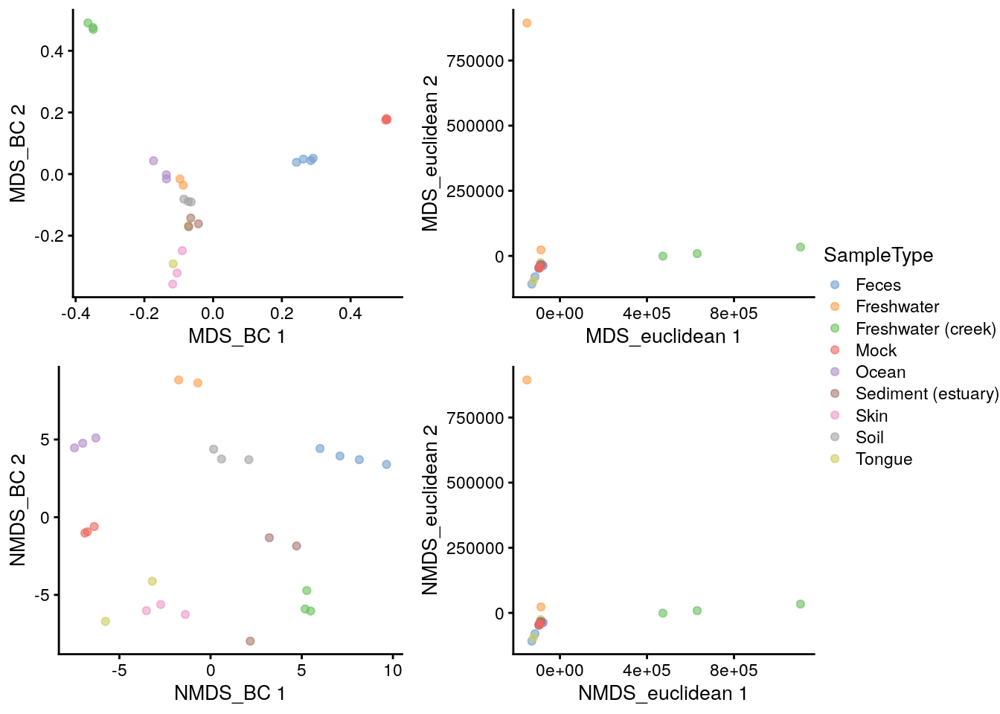
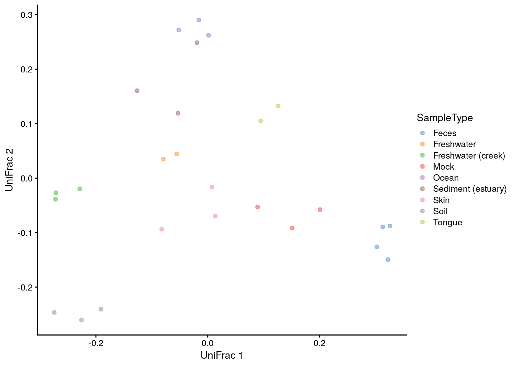
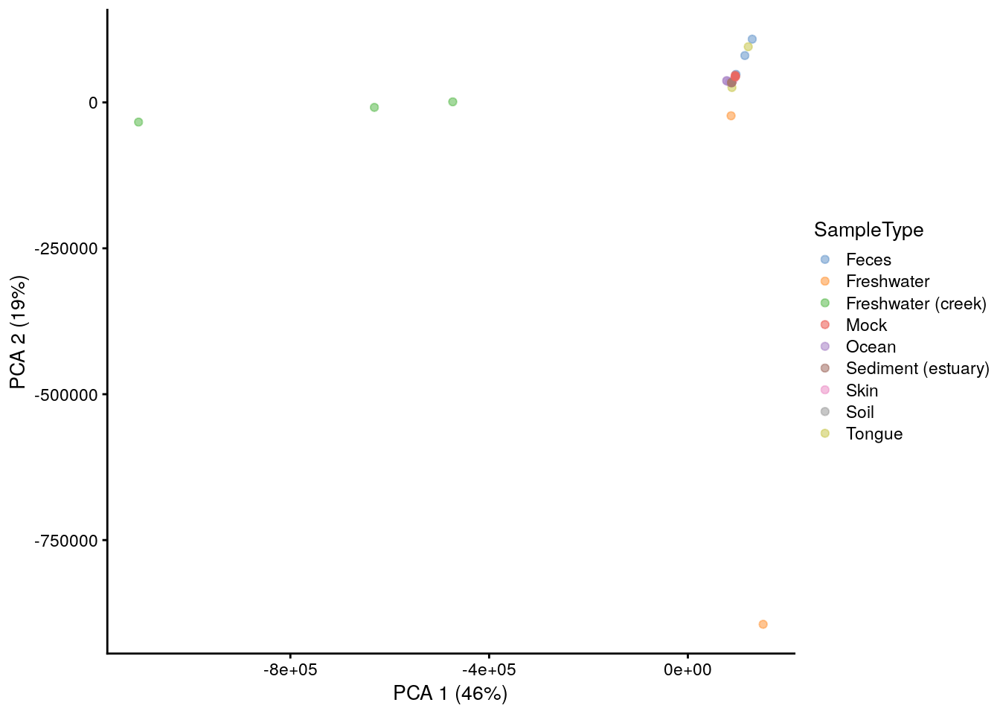
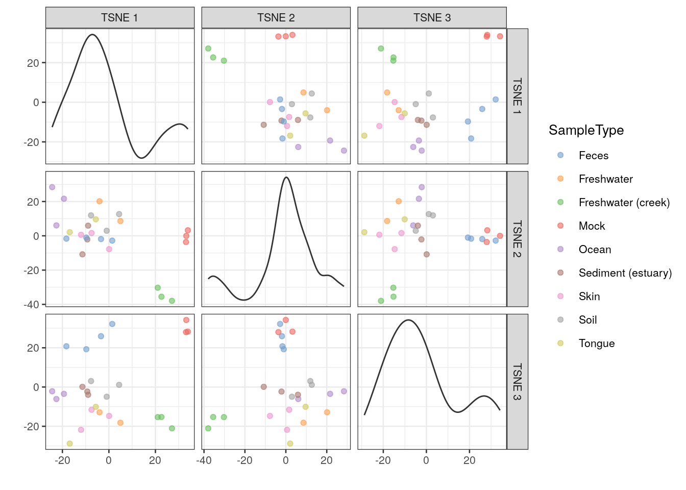
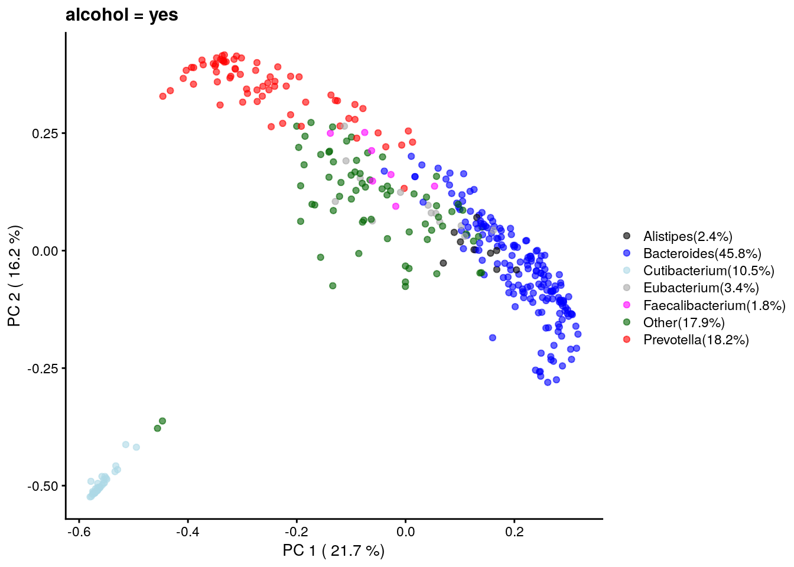
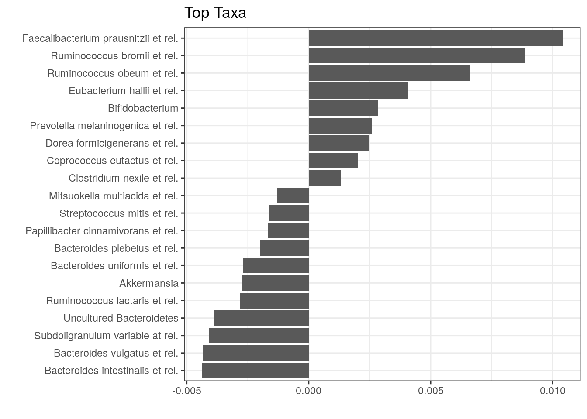

# Microbiome Diversity {#microbiome-diversity}

<script>
document.addEventListener("click", function (event) {
    if (event.target.classList.contains("rebook-collapse")) {
        event.target.classList.toggle("active");
        var content = event.target.nextElementSibling;
        if (content.style.display === "block") {
            content.style.display = "none";
        } else {
            content.style.display = "block";
        }
    }
})
</script>

<style>
.rebook-collapse {
  background-color: #eee;
  color: #444;
  cursor: pointer;
  padding: 18px;
  width: 100%;
  border: none;
  text-align: left;
  outline: none;
  font-size: 15px;
}

.rebook-content {
  padding: 0 18px;
  display: none;
  overflow: hidden;
  background-color: #f1f1f1;
}
</style>

Diversity measurements are an important topic, when analyzing microbiome data. 
Typically three levels of diversity measurements exist, which are trying to
put a number on different aspects of the questions associated with diversity 
[@Whittaker1690].

Many different ways for estimating such diversity measurements have been 
described in the literature. Which measurement is best or applicable for your 
samples, is not the aim of the following sections.


```r
library(mia)
data("GlobalPatterns")
se <- GlobalPatterns
```

## Alpha diversity

**_Alpha diversity_**, also sometimes interchangeably used with the terms
**_species diversity_** or **_species richness_**, summarizes the number
different species and their abundance per sample into a single number.

For this purpose wrapper functions are available interacting with other packages
implementing the calculation, such as `_vegan_` [@R-vegan].

`estimateAlphaDiversity` is the main function for this purpose, which calculates
the selected diversity based on the selected assay data and adds it to the 
`colData` of the `SummarizedExperiment` under the given column `name`.


```r
se <- estimateAlphaDiversity(se, abund_values = "counts",
                             index = "shannon", name = "shannon")
head(colData(se)$shannon)
```

```
##     CL3     CC1     SV1 M31Fcsw M11Fcsw M31Plmr 
##   6.577   6.777   6.498   3.828   3.288   4.289
```

This allows the values to analyzed directly from the `colData`, for example
by plotting them using `plotColData` from the `_scater_` package [@R-scater].


```r
library(scater)
plotColData(se, "shannon", "SampleType", colour_by = "SampleType") +
    theme(axis.text.x = element_text(angle=45,hjust=1))
```

<div class="figure">

<p class="caption">(\#fig:plot-div-shannon)Shannon diversity estimates plotted grouped by sample type.</p>
</div>

By default `estimateAlphaDiversity` will calculate all available estimates...


```r
se <- estimateAlphaDiversity(se)
```

.. and a plot comparing them can then be constructed directly.


```r
plots <- lapply(c("shannon","simpson","inv_simpson", "richness", "chao1", "ACE"),
                plotColData,
                object = se,
                x = "SampleType",
                colour_by = "SampleType")
plots <- lapply(plots,"+", theme(axis.text.x = element_text(angle=45,hjust=1)))
ggpubr::ggarrange(plotlist = plots, nrow = 2, ncol = 3, common.legend = TRUE, legend = "right")
```



## Beta diversity

In comparison to alpha diversities, beta diversities describe inter-microbiome
(dis-)similarites. Technically speaking, beta diversities are usually
represented as `dist` objects, which contain triangular data describing the
distance between each pair of samples. These distances can be subjected to
multi-dimensional scaling, also known as PCoA, to retrieve reduced dimensions
for further evaluation or visualization.

### Calculating beta diversity

In the following examples distances are calculated by variable functions
supplied to the `FUN` argument. The function can defined by the usre, but it
must return a `dist` function, which can then be used to calculate reduced
dimension either via MDS or NMDS and the results can be stored in the
`reducedDim`. The whole process is wrapped in the `runMDS` and `runNMDS`
functions.


```r
se <- runMDS2(se, FUN = vegan::vegdist, name = "MDS_BC")
```

To visualize reduced dimensions, `scater` implements the `plotReducedDim` 
function, which can enrich a plot with additional information as colour, shape 
or size.


```r
plotReducedDim(se, "MDS_BC", colour_by = "SampleType")
```

<div class="figure">

<p class="caption">(\#fig:plot-mds-bray-curtis)MDS plot based on the Bray-Curtis distances on the GlobalPattern dataset.</p>
</div>

With additional tools from the `ggplot2` universe, comparisons can be 
performed informing on the applicability to visualize the samples in a 
meaningful way.


```r
se <- runMDS2(se, FUN = vegan::vegdist, name = "MDS_euclidean",
             method = "euclidean")
se <- runNMDS(se, FUN = vegan::vegdist, name = "NMDS_BC")
```

```
## initial  value 47.733208 
## iter   5 value 33.853364
## iter  10 value 32.891200
## final  value 32.823570 
## converged
```

```r
se <- runNMDS(se, FUN = vegan::vegdist, name = "NMDS_euclidean",
              method = "euclidean")
```

```
## initial  value 31.882673 
## final  value 31.882673 
## converged
```

```r
plots <- lapply(c("MDS_BC","MDS_euclidean","NMDS_BC","NMDS_euclidean"),
                plotReducedDim, object = se, colour_by = "SampleType")
ggpubr::ggarrange(plotlist = plots, nrow = 2, ncol = 2, common.legend = TRUE,
                  legend = "right")
```

<div class="figure">

<p class="caption">(\#fig:plot-mds-nmds-comparison)Comparison of MDS and NMDS plots based on the Bray-Curtis or euclidean distances on the GlobalPattern dataset.</p>
</div>

The _UniFrac_ is a special case, since it requires data on the relationship
of features in form on a `phylo` tree. `calculateUniFrac` performs the 
calculation to return a `dist` object, which can again be used within `runMDS`.


```r
se <- runMDS2(se, FUN = calculateUniFrac, name = "UniFrac",
              tree = rowTree(se),
              ntop = nrow(se))
```


```r
plotReducedDim(se, "UniFrac", colour_by = "SampleType")
```

<div class="figure">

<p class="caption">(\#fig:plot-unifrac)UniFrac distances scaled by MDS of the GlobalPattern dataset.</p>
</div>

### Other ordination methods

Other dimension reduction methods, such as `PCA`, `t-SNE` and `UMAP` are 
inherited directly from the `scater` package.


```r
se <- runPCA(se, name = "PCA", exprs_values = "counts", ncomponents = 10)
```


```r
plotReducedDim(se, "PCA", colour_by = "SampleType")
```

<div class="figure">

<p class="caption">(\#fig:plot-pca)PCA plot on the GlobalPatterns data set containing sample from different sources.</p>
</div>

As mentioned before, applicability of the different methods depends on your
sample set.


```r
se <- runTSNE(se, name = "TSNE", exprs_values = "counts", ncomponents = 3)
```


```r
plotReducedDim(se, "TSNE", colour_by = "SampleType", ncomponents = c(1:3))
```

<div class="figure">

<p class="caption">(\#fig:plot-tsne)t-SNE plot on the GlobalPatterns data set containing sample from different sources.</p>
</div>

## Community comparisons

TODO: Introduction


```r
library(microbiomeDataSets)
se.lahti <- LahtiMData()
```


```r
se.lahti <- relAbundanceCounts(se.lahti)
se.lahti <- runNMDS(se.lahti, FUN = vegan::vegdist, name = "BC", nmdsFUN = "monoMDS",
                    exprs_values = "relabundance",
                    keep_dist = TRUE)
```


```r
plotReducedDim(se.lahti, "BC", colour_by = "group")
```



TODO: Conclusion

### PERMANOVA - significance test for group-level differences

TODO: Introduction, References


```r
library(vegan)
permanova <- vegan::adonis(t(assay(se.lahti,"relabundance")) ~ group,
                           data = colData(se.lahti),
                           permutations = 9999)

# P-value
print(as.data.frame(permanova$aov.tab)["group", "Pr(>F)"])
```

```
## [1] 0.2812
```


```r
coef <- coefficients(permanova)["group1",]
top.coef <- sort(head(coef[rev(order(abs(coef)))],20))
```

TODO: Conclusion


```r
ggplot(data.frame(x = top.coef,
                  y = factor(names(top.coef),
                                      unique(names(top.coef)))),
        aes(x = x, y = y)) +
    geom_bar(stat="identity") +
    labs(x="",y="",title="Top Taxa") +
    theme_bw()
```



TODO: Conclusion

### PERMDISP2 - Checking the homogeneity condition

TODO: Introduction, References


```r
anova(vegan::betadisper(attr(reducedDim(se.lahti,"BC"),"dist"),
                        colData(se.lahti)$group))
```

```
## Analysis of Variance Table
## 
## Response: Distances
##           Df Sum Sq Mean Sq F value Pr(>F)
## Groups     1  0.000 0.00002       0   0.95
## Residuals 42  0.158 0.00376
```

TODO: Conclusion

## Further reading

In certain settings beta diversities might be used to group samples without
prior knowledge. For this we want to point to excellent resources on 
[how to extract information from the clusters](http://bioconductor.org/books/release/OSCA/clustering.html).

## Session Info {-}

<button class="rebook-collapse">View session info</button>
<div class="rebook-content">
```
R version 4.0.3 (2020-10-10)
Platform: x86_64-pc-linux-gnu (64-bit)
Running under: Ubuntu 20.04.1 LTS

Matrix products: default
BLAS/LAPACK: /usr/lib/x86_64-linux-gnu/openblas-pthread/libopenblasp-r0.3.8.so

locale:
 [1] LC_CTYPE=en_US.UTF-8       LC_NUMERIC=C              
 [3] LC_TIME=en_US.UTF-8        LC_COLLATE=en_US.UTF-8    
 [5] LC_MONETARY=en_US.UTF-8    LC_MESSAGES=C             
 [7] LC_PAPER=en_US.UTF-8       LC_NAME=C                 
 [9] LC_ADDRESS=C               LC_TELEPHONE=C            
[11] LC_MEASUREMENT=en_US.UTF-8 LC_IDENTIFICATION=C       

attached base packages:
[1] parallel  stats4    stats     graphics  grDevices utils     datasets 
[8] methods   base     

other attached packages:
 [1] vegan_2.5-7                      lattice_0.20-41                 
 [3] permute_0.9-5                    microbiomeDataSets_0.98.4       
 [5] MultiAssayExperiment_1.16.0      scater_1.18.3                   
 [7] ggplot2_3.3.3                    mia_0.98.21                     
 [9] MicrobiomeExperiment_0.99.0.9014 Biostrings_2.58.0               
[11] XVector_0.30.0                   TreeSummarizedExperiment_1.6.2  
[13] SingleCellExperiment_1.12.0      SummarizedExperiment_1.20.0     
[15] Biobase_2.50.0                   GenomicRanges_1.42.0            
[17] GenomeInfoDb_1.26.2              IRanges_2.24.1                  
[19] S4Vectors_0.28.1                 BiocGenerics_0.36.0             
[21] MatrixGenerics_1.2.0             matrixStats_0.57.0              
[23] BiocStyle_2.18.1                 rebook_1.0.0                    
[25] BiocManager_1.30.10             

loaded via a namespace (and not attached):
  [1] readxl_1.3.1                  backports_1.2.1              
  [3] AnnotationHub_2.22.0          BiocFileCache_1.14.0         
  [5] splines_4.0.3                 BiocParallel_1.24.1          
  [7] digest_0.6.27                 htmltools_0.5.0              
  [9] viridis_0.5.1                 magrittr_2.0.1               
 [11] memoise_1.1.0                 cluster_2.1.0                
 [13] openxlsx_4.2.3                colorspace_2.0-0             
 [15] blob_1.2.1                    rappdirs_0.3.1               
 [17] haven_2.3.1                   xfun_0.19                    
 [19] dplyr_1.0.2                   callr_3.5.1                  
 [21] crayon_1.3.4                  RCurl_1.98-1.2               
 [23] graph_1.68.0                  ape_5.4-1                    
 [25] glue_1.4.2                    gtable_0.3.0                 
 [27] zlibbioc_1.36.0               DelayedArray_0.16.0          
 [29] car_3.0-10                    BiocSingular_1.6.0           
 [31] abind_1.4-5                   scales_1.1.1                 
 [33] DBI_1.1.0                     rstatix_0.6.0                
 [35] Rcpp_1.0.5                    xtable_1.8-4                 
 [37] viridisLite_0.3.0             foreign_0.8-81               
 [39] bit_4.0.4                     rsvd_1.0.3                   
 [41] httr_1.4.2                    ellipsis_0.3.1               
 [43] pkgconfig_2.0.3               XML_3.99-0.5                 
 [45] farver_2.0.3                  scuttle_1.0.4                
 [47] CodeDepends_0.6.5             dbplyr_2.0.0                 
 [49] AnnotationDbi_1.52.0          tidyselect_1.1.0             
 [51] labeling_0.4.2                rlang_0.4.10                 
 [53] later_1.1.0.1                 munsell_0.5.0                
 [55] BiocVersion_3.12.0            cellranger_1.1.0             
 [57] tools_4.0.3                   DirichletMultinomial_1.32.0  
 [59] generics_0.1.0                RSQLite_2.2.1                
 [61] ExperimentHub_1.16.0          broom_0.7.3                  
 [63] fastmap_1.0.1                 evaluate_0.14                
 [65] stringr_1.4.0                 yaml_2.2.1                   
 [67] processx_3.4.5                knitr_1.30                   
 [69] bit64_4.0.5                   zip_2.1.1                    
 [71] purrr_0.3.4                   nlme_3.1-151                 
 [73] sparseMatrixStats_1.2.0       mime_0.9                     
 [75] compiler_4.0.3                beeswarm_0.2.3               
 [77] curl_4.3                      interactiveDisplayBase_1.28.0
 [79] ggsignif_0.6.0                tibble_3.0.4                 
 [81] stringi_1.5.3                 highr_0.8                    
 [83] ps_1.5.0                      forcats_0.5.0                
 [85] Matrix_1.3-0                  vctrs_0.3.6                  
 [87] pillar_1.4.7                  lifecycle_0.2.0              
 [89] BiocNeighbors_1.8.2           data.table_1.13.6            
 [91] cowplot_1.1.1                 bitops_1.0-6                 
 [93] irlba_2.3.3                   httpuv_1.5.4                 
 [95] R6_2.5.0                      bookdown_0.21                
 [97] promises_1.1.1                gridExtra_2.3                
 [99] rio_0.5.16                    vipor_0.4.5                  
[101] codetools_0.2-18              MASS_7.3-53                  
[103] assertthat_0.2.1              withr_2.3.0                  
[105] GenomeInfoDbData_1.2.4        mgcv_1.8-33                  
[107] hms_0.5.3                     grid_4.0.3                   
[109] beachmat_2.6.4                tidyr_1.1.2                  
[111] rmarkdown_2.6                 DelayedMatrixStats_1.12.1    
[113] carData_3.0-4                 Rtsne_0.15                   
[115] ggpubr_0.4.0                  shiny_1.5.0                  
[117] ggbeeswarm_0.6.0             
```
</div>
