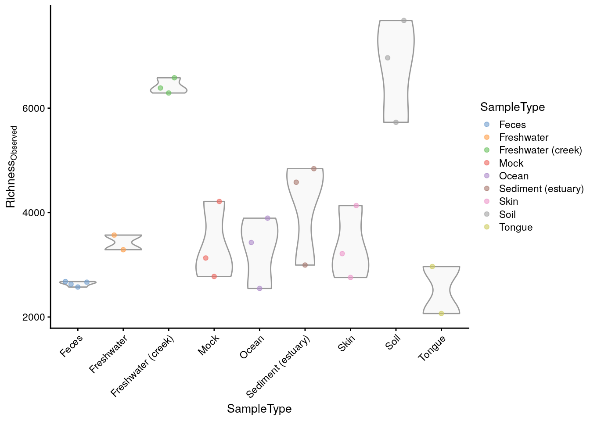
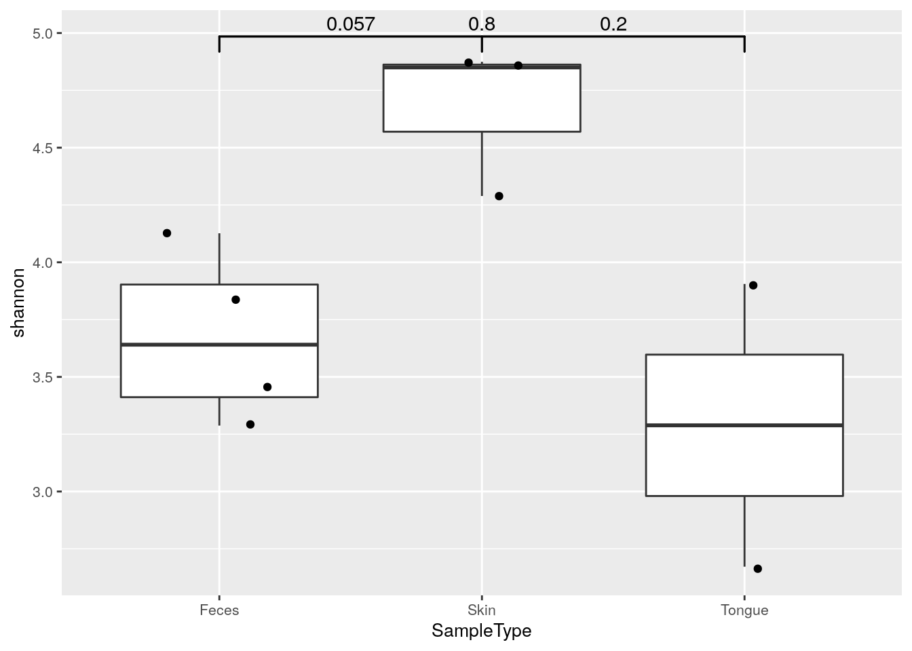
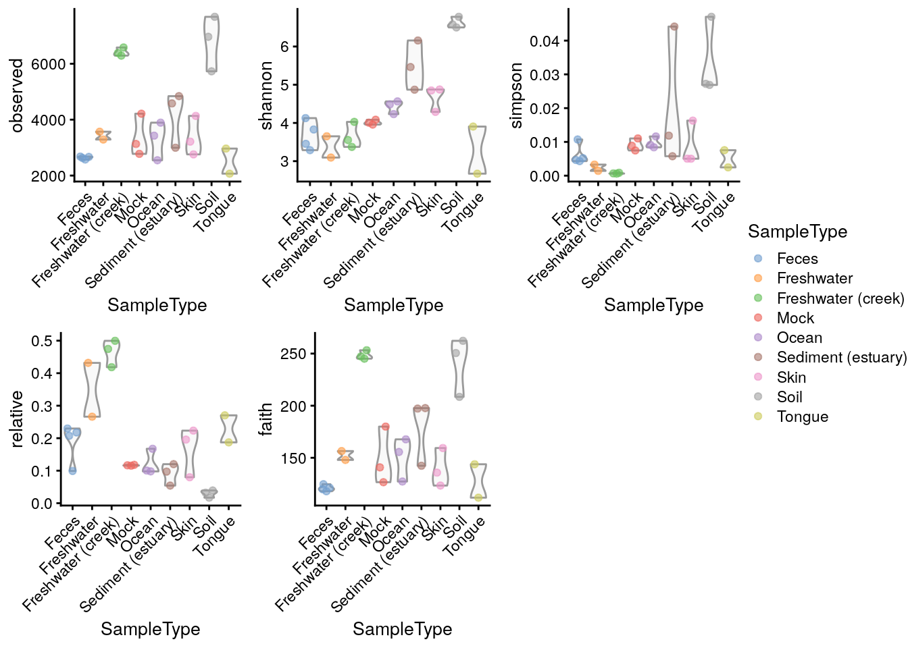

<script>
document.addEventListener("click", function (event) {
    if (event.target.classList.contains("rebook-collapse")) {
        event.target.classList.toggle("active");
        var content = event.target.nextElementSibling;
        if (content.style.display === "block") {
            content.style.display = "none";
        } else {
            content.style.display = "block";
        }
    }
})
</script>

<style>
.rebook-collapse {
  background-color: #eee;
  color: #444;
  cursor: pointer;
  padding: 18px;
  width: 100%;
  border: none;
  text-align: left;
  outline: none;
  font-size: 15px;
}

.rebook-content {
  padding: 0 18px;
  display: none;
  overflow: hidden;
  background-color: #f1f1f1;
}
</style>


Diversity estimates are a central topic in microbiome data analysis. 

There are three commonly employed levels of diversity measurements,
which are trying to put a number on different aspects of the questions
associated with diversity [@Whittaker1960].

Many different ways for estimating such diversity measurements have been 
described in the literature. Which measurement is best or applicable for your 
samples, is not the aim of the following sections.


```r
library(mia)
data("GlobalPatterns")
se <- GlobalPatterns
```


## Alpha diversity

**_Alpha diversity_**, also sometimes interchangeably used with the
term **_species diversity_**, summarizes the distribution of species
abundances in a given sample into a single number that depends on
species richness and evenness. Diversity indices measure the overall
community heterogeneity. A number of ecological diversity measures are
available. The Hill coefficient combines many standard indices into a
single equation that provides observed richness, inverse Simpson, and
Shannon diversity, and generalized diversity as special cases. In
general, diversity increases together with increasing richness and
evenness. Sometimes richness, evenness, and dominance are considered
to be variants of alpha diversity.

**Richness** refers to the total number of species in a community
(sample). The simplest richness index is the number of observed
species (observed richness). Assuming limited sampling from the
community, however, this may underestimate the true species
richness. Several estimators are available, including for instance ACE
[@Chao1992] and Chao1 [@Chao1984]. Richness estimates are unaffected
by species abundances.
  
**Phylogenetic diversity** was first proposed by [@Faith1992], unlike the 
  diversity measures mentioned above, Phylogenetic diversity (PD) 
  measure incorporates information from phylogenetic relationships 
  stored in `phylo` tree between species in a community (sample). The 
  Faith's PD is calculated as the sum of branch length of all species in 
  a community (sample).

**Evenness** focuses on species abundances, and can thus complement
  the number of species. A typical evenness index is the Pielou's
  evenness, which is Shannon diversity normalized by the observed
  richness.

**Dominance** indices are in general negatively correlated with
  diversity, and sometimes used in ecological literature. High
  dominance is obtained when one or few species have a high share of
  the total species abundance in the community.  
  
### Estimating alpha diversity

Alpha diversity can be estimated with wrapper functions that interact
with other packages implementing the calculation, such as _`vegan`_
[@R-vegan].

#### Richness  

Richness gives the number of features present within a community and can be calculated with `estimateRichness`. Each of the estimate diversity/richness/evenness/dominance functions adds the calculated measure(s) to the `colData` of the `SummarizedExperiment` under the given column `name`. Here, we calculate `observed` features as a measure of richness.     


```r
se <- mia::estimateRichness(se, 
                       abund_values = "counts", 
                       index = "observed", 
                       name="observed")

head(colData(se)$observed)
```

```
##     CL3     CC1     SV1 M31Fcsw M11Fcsw M31Plmr 
##    6964    7679    5729    2667    2574    3214
```
This allows access to the values to be analyzed directly from the `colData`, for example
by plotting them using `plotColData` from the _`scater`_ package [@R-scater].


```r
library(scater)
plotColData(se, 
            "observed", 
            "SampleType", 
            colour_by = "SampleType") +
    theme(axis.text.x = element_text(angle=45,hjust=1)) + 
  ylab(expression(Richness[Observed]))
```

<div class="figure">

<p class="caption">(\#fig:plot-div-shannon)Shannon diversity estimates plotted grouped by sample type.</p>
</div>

#### Diversity  

**Non-Phylogenetic measures**  
The main function, `estimateDiversity`, calculates the selected
diversity index based on the selected assay data.  


```r
se <- mia::estimateDiversity(se, 
                             abund_values = "counts",
                             index = "shannon", 
                             name = "shannon")
head(colData(se)$shannon)
```

```
##     CL3     CC1     SV1 M31Fcsw M11Fcsw M31Plmr 
##   6.577   6.777   6.498   3.828   3.288   4.289
```

Alpha diversities can be visualized with boxplot. Here, Shannon index is compared 
between different sample type groups. Individual data points are visualized by 
plotting them as points with `geom_jitter`.

`geom_signif` is used to test, if these differences are statistically significant.
It adds p-values to plot.


```r
if( !require(ggsignif) ){
  install.packages(ggsignif)
}
library(ggplot2)
library(ggsignif)

# Subsets the data. Takes only those samples that are from feces, skin, or tongue,
# and creates data frame from the collected data
df <- as.data.frame(colData(se)[colData(se)$SampleType %in% 
                                  c("Feces", "Skin", "Tongue"), ])

# Changes old levels with new levels
df$SampleType <- factor(df$SampleType)

# For significance testing, all different combinations are determined
comb <- split(t(combn(levels(df$SampleType), 2)), 
           seq(nrow(t(combn(levels(df$SampleType), 2)))))

ggplot(df, aes(x = SampleType, y = shannon)) +
  # Outliers are removed, because otherwise each data point would be plotted twice; 
  # as an outlier of boxplot and as a point of dotplot.
  geom_boxplot(outlier.shape = NA) + 
  geom_jitter(width = 0.2) + 
  geom_signif(comparisons = comb, map_signif_level = FALSE) +
  theme(text = element_text(size = 10))
```



**Phylogenetic diversity**  

The phylogenetic diversity is calculated by `mia::estimateDiversity`. This is a faster re-implementation of   
the widely function in _`picante`_ [@R-picante, @Kembel2010].  

Load `picante` R package and get the `phylo` stored in `rowTree`. 

```r
se <- mia::estimateDiversity(se, 
                             abund_values = "counts",
                             index = "faith", 
                             name = "faith")
head(colData(se)$faith)
```

```
## [1] 250.5 262.3 208.5 117.9 119.8 135.8
```

#### Evenness  

Evenness can be calculated with `estimateEvenness`.  


```r
se <- estimateEvenness(se, 
                       abund_values = "counts", 
                       index="simpson")
head(colData(se)$simpson)
```

```
## [1] 0.026871 0.027197 0.047049 0.005179 0.004304 0.005011
```


#### Dominance  

Dominance can be calculated with `estimateDominance`. Here, the `Relative index` is calculated which is the relative abundance of the most dominant species in the sample.   


```r
se <- estimateDominance(se, 
                       abund_values = "counts", 
                       index="relative")

head(colData(se)$relative)
```

```
##     CL3     CC1     SV1 M31Fcsw M11Fcsw M31Plmr 
## 0.03910 0.03226 0.01690 0.22981 0.21778 0.22329
```

#### Rarity  
TODO...


### Visualize alpha diversities  

A plot comparing all the diversity measures calculated above and stored in `colData` can then be constructed directly.  

```r
plots <- lapply(c("observed", "shannon","simpson", "relative", "faith"),
                plotColData,
                object = se,
                x = "SampleType",
                colour_by = "SampleType")
plots <- lapply(plots,"+", theme(axis.text.x = element_text(angle=45,hjust=1)))
ggpubr::ggarrange(plotlist = plots, nrow = 2, ncol = 3, common.legend = TRUE, legend = "right")
```


