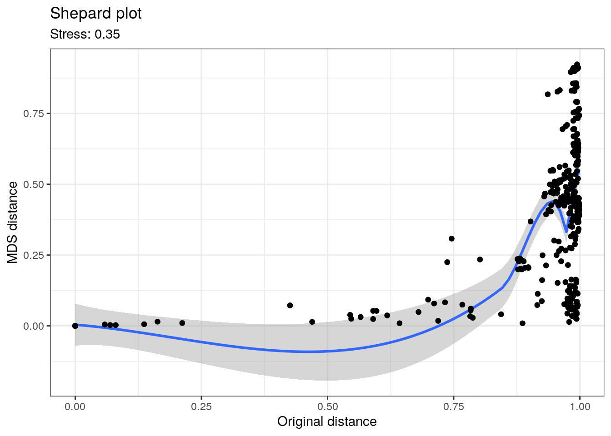
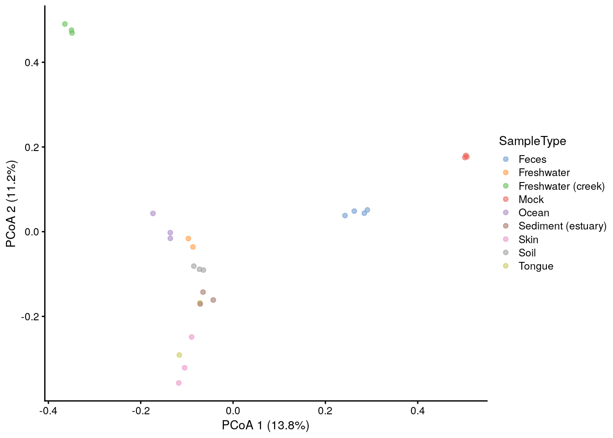
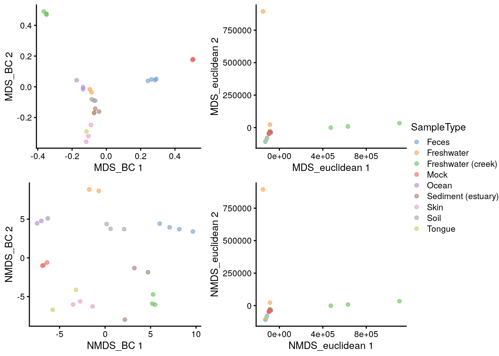
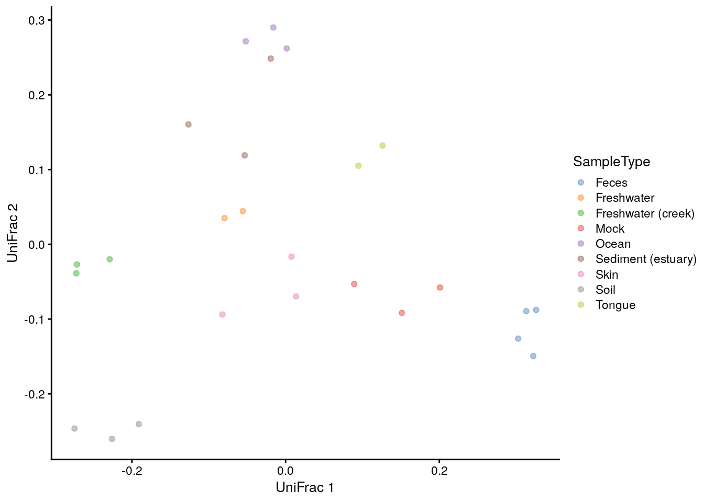
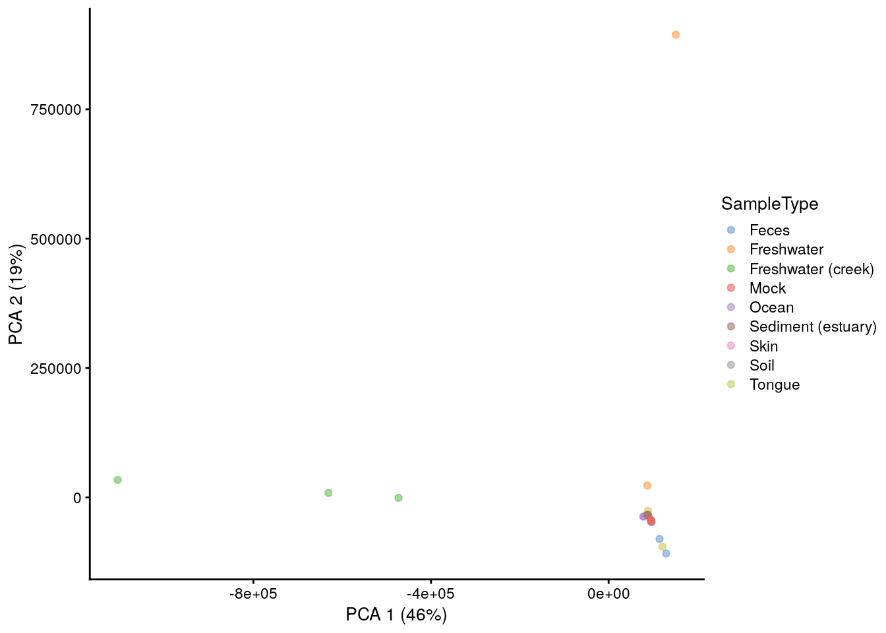
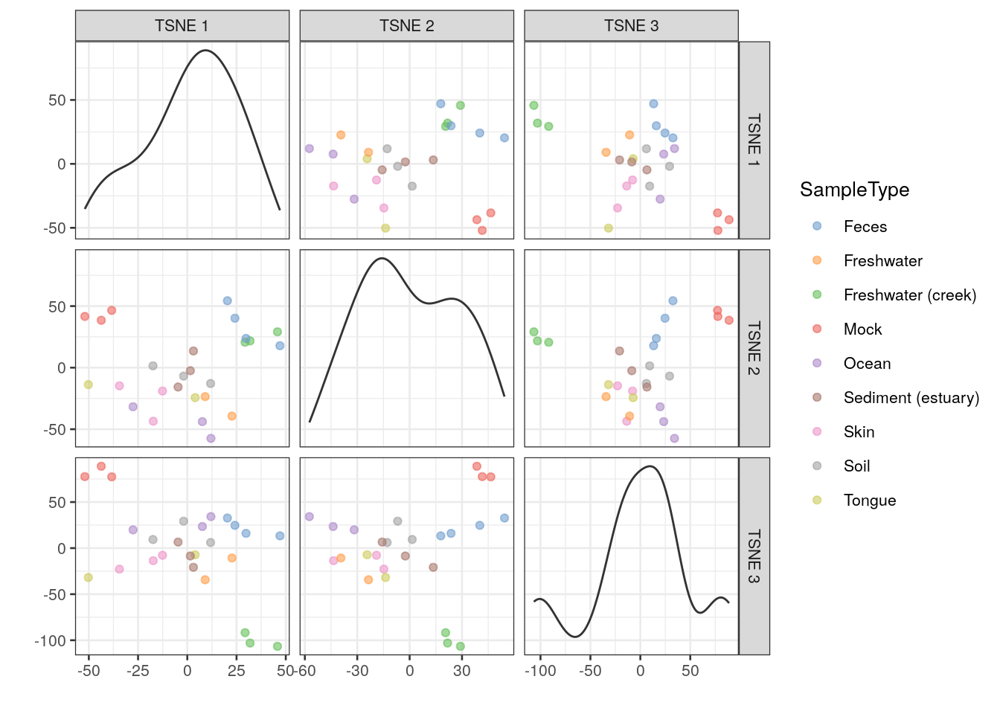
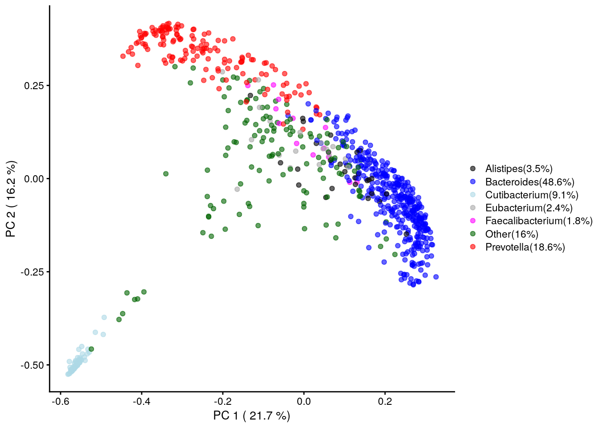
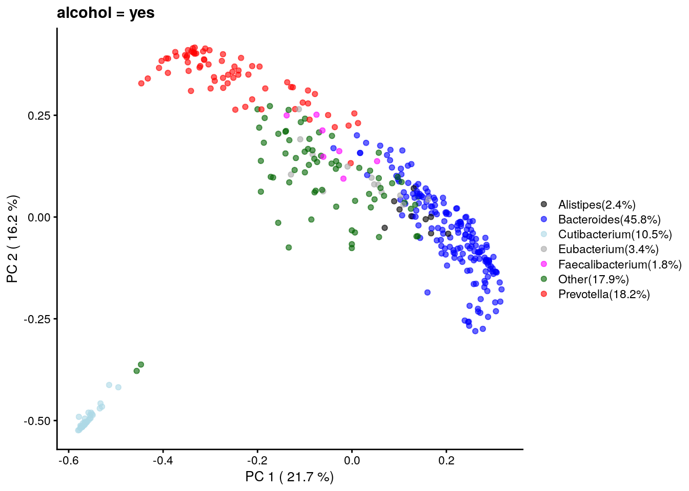
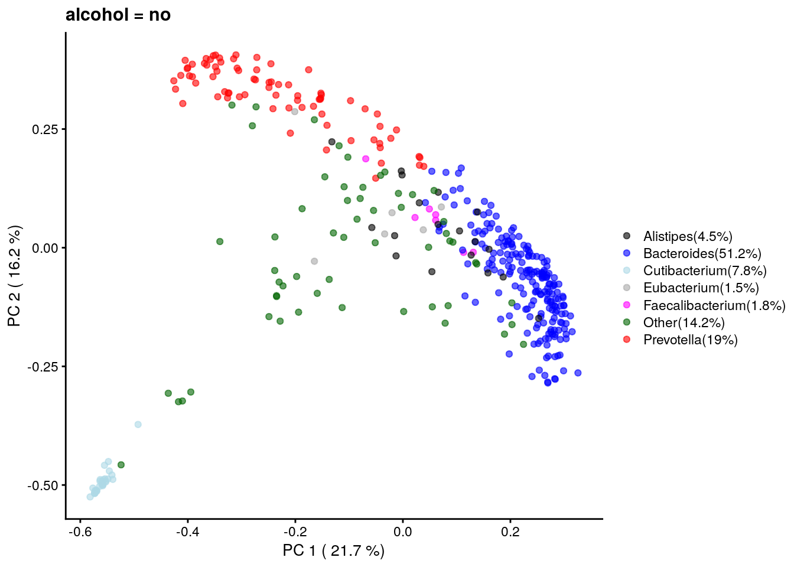
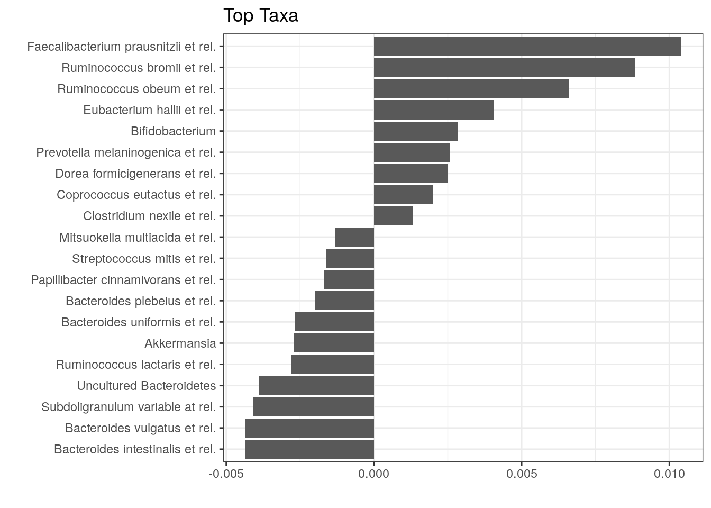

<script>
document.addEventListener("click", function (event) {
    if (event.target.classList.contains("rebook-collapse")) {
        event.target.classList.toggle("active");
        var content = event.target.nextElementSibling;
        if (content.style.display === "block") {
            content.style.display = "none";
        } else {
            content.style.display = "block";
        }
    }
})
</script>

<style>
.rebook-collapse {
  background-color: #eee;
  color: #444;
  cursor: pointer;
  padding: 18px;
  width: 100%;
  border: none;
  text-align: left;
  outline: none;
  font-size: 15px;
}

.rebook-content {
  padding: 0 18px;
  display: none;
  overflow: hidden;
  background-color: #f1f1f1;
}
</style>
## Beta diversity

Where alpha diversity focuses on community variation within a
community (sample), beta diversity quantifies (dis-)similarites
between communities (samples). Some of the most popular beta diversity
measures in microbiome research include Bray-Curtis index (for
compositional data), Jaccard index (for presence / absence data,
ignoring abundance information), Aitchison distance (Euclidean
distance for clr transformed abundances, aiming to avoid the
compositionality bias), and the Unifrac distances (that take into
account the phylogenetic tree information). Only some of the commonly
used beta diversity measures are actual _distances_; this is a
mathematically well-defined concept and many ecological beta diversity
measures, such as Bray-Curtis index, are not proper distances.
Therefore, the term dissimilarity or beta diversity is commonly used.

Technically, beta diversities are usually represented as `dist`
objects, which contain triangular data describing the distance between
each pair of samples. These distances can be further subjected to
ordination. Ordination is a common concept in ecology that aims to
reduce the dimensionsionality of the data for further evaluation or
visualization. Ordination techniques aim to capture as much of
essential information in the data as possible in a lower dimensional
representation.  Dimension reduction is bound to loose information but
the common ordination techniques aim to preserve relevant information
of sample similarities in an optimal way, which is defined in
different way by different methods. [TODO add references and/or link
to ordination chapter instead?]

Some of the most common ordination methods in microbiome research
include Principal Component Analysis (PCA), metric and non-metric
multi-dimensional scaling (MDS, NMDS), The MDS methods is also known
as Principal Coordinates Analysis (PCoA). Other recently popular
techniques include t-SNE and UMAP. 


### Explained variance

The percentage of explained variance is typically shown for PCA
ordination plots. This quantifies the proportion of overall variance
in the data that is captured by the PCA axes, or how well the
ordination axes reflect the original distances.

Sometimes a similar measure is shown for MDS/PCoA. The interpretation
is generally different, however, and hence we do not recommend using
it. PCA is a special case of PCoA with Euclidean distances.  With
non-Euclidean dissimilarities PCoA uses a trick where the pointwise
dissimilarities are first cast into similarities a Euclidean space
(with some information loss i.e. stress) and then projected to the
maximal variance axes. In this case, the maximal variance axes do not
directly reflect the correspondence of the projected distances and
original distances, as they do for PCA.

In typical use cases, we would like to know how well the ordination
reflects the original similarity structures; then the quantity of
interest is the so-called "stress" function, which measures the
difference in pairwise similarities between the data points in the
original (high-dimensional) vs. projected (low-dimensional) space.

Hence, we propose that for PCoA and other ordination methods, users
would report relative stress (varies in the unit interval; the smaller
the better). This can be calculated as shown below. For further
examples, check the [note from Huber
lab](https://www.huber.embl.de/users/klaus/Teaching/statisticalMethods-lab.pdf).


```r
# Example data
library(mia)
data(GlobalPatterns)

# Data matrix (features x samples)
x <- GlobalPatterns
x <- transformCounts(x, method = "relabundance")
x <- assay(x, "relabundance")

# Quantify dissimilarities in the original feature space
library(vegan)
d0 <- as.matrix(vegdist(t(x), "bray"))

# PCoA Ordination
pcoa <- as.data.frame(cmdscale(d0, k = 2))
names(pcoa) <- c("PCoA1", "PCoA2")

# Quantify dissimilarities in the ordination space
dp <- as.matrix(dist(pcoa))

# Calculate stress i.e. relative difference in the original and
# projected dissimilarities
stress <- sum((dp - d0)^2)/sum(d0^2)
```


Shepard plot visualizes the original versus projected (ordination)
dissimilarities between the data points:


```r
ord <- order(as.vector(d0))
df <- data.frame(d0 = as.vector(d0)[ord],
                  dmds = as.vector(dp)[ord])

library(ggplot2)
ggplot(aes(x = d0, y = dmds), data=df) + 
       geom_smooth() +
       geom_point() +       
       labs(title = "Shepard plot",
       x = "Original distance",
       y = "MDS distance",       
            subtitle = paste("Stress:", round(stress, 2))) +
  theme_bw()
```




### Estimating beta diversity

In the following examples dissimilarities are calculated by 
functions supplied to the `FUN` argument. This function can defined by
the user. It must return a `dist` function, which can then be used to
calculate reduced dimension either via ordination methods (such as MDS
or NMDS), and the results can be stored in the `reducedDim`.

This entire process is wrapped in the `runMDS` and `runNMDS`
functions.


```r
library(scater)
se <- GlobalPatterns
se <- runMDS(se, FUN = vegan::vegdist, name = "MDS_BC", exprs_values = "counts")
```

Sample similarities can be visualized on a lower-dimensional display
(typically 2D) using the `plotReducedDim` function in the
`scater`package. This provides also further tools to incorporate
additional information using variations in colour, shape or size.


```r
# Create ggplot object
p <- plotReducedDim(se, "MDS_BC", colour_by = "SampleType")

# Add explained variance for each axis
e <- attr(reducedDim(se, "MDS_BC"), "eig");
rel_eig <- e/sum(e[e>0])		  
p <- p + labs(x = paste("PCoA 1 (", round(100 * rel_eig[[1]],1), "%", ")", sep = ""),
              y = paste("PCoA 2 (", round(100 * rel_eig[[2]],1), "%", ")", sep = ""))

print(p)
```

<div class="figure">

<p class="caption">(\#fig:plot-mds-bray-curtis)MDS plot based on the Bray-Curtis distances on the GlobalPattern dataset.</p>
</div>


With additional tools from the `ggplot2` universe, comparisons can be 
performed informing on the applicability to visualize sample similarities in a 
meaningful way.


```r
se <- runMDS(se, FUN = vegan::vegdist, name = "MDS_euclidean",
             method = "euclidean", exprs_values = "counts")
se <- runNMDS(se, FUN = vegan::vegdist, name = "NMDS_BC")
```

```
## initial  value 47.733208 
## iter   5 value 33.853364
## iter  10 value 32.891200
## final  value 32.823570 
## converged
```

```r
se <- runNMDS(se, FUN = vegan::vegdist, name = "NMDS_euclidean",
              method = "euclidean")
```

```
## initial  value 31.882673 
## final  value 31.882673 
## converged
```

```r
plots <- lapply(c("MDS_BC","MDS_euclidean","NMDS_BC","NMDS_euclidean"),
                plotReducedDim, object = se, colour_by = "SampleType")
ggpubr::ggarrange(plotlist = plots, nrow = 2, ncol = 2, common.legend = TRUE,
                  legend = "right")
```

<div class="figure">

<p class="caption">(\#fig:plot-mds-nmds-comparison)Comparison of MDS and NMDS plots based on the Bray-Curtis or euclidean distances on the GlobalPattern dataset.</p>
</div>

The _UniFrac_ method is a special case, as it requires data on the
relationship of features in form on a `phylo` tree. `calculateUniFrac`
performs the calculation to return a `dist` object, which can again be
used within `runMDS`.


```r
se <- runMDS(se, FUN = calculateUniFrac, name = "UniFrac",
             tree = rowTree(se),
             ntop = nrow(se),
             exprs_values = "counts")
```


```r
plotReducedDim(se, "UniFrac", colour_by = "SampleType")
```

<div class="figure">

<p class="caption">(\#fig:plot-unifrac)UniFrac distances scaled by MDS of the GlobalPattern dataset.</p>
</div>

### Other ordination methods

Other dimension reduction methods, such as `PCA`, `t-SNE` and `UMAP` are 
inherited directly from the `scater` package.


```r
se <- runPCA(se, name = "PCA", exprs_values = "counts", ncomponents = 10)
```


```r
plotReducedDim(se, "PCA", colour_by = "SampleType")
```

<div class="figure">

<p class="caption">(\#fig:plot-pca)PCA plot on the GlobalPatterns data set containing sample from different sources.</p>
</div>

As mentioned before, applicability of the different methods depends on your
sample set.

FIXME: let us switch to UMAP for the examples?


```r
se <- runTSNE(se, name = "TSNE", exprs_values = "counts", ncomponents = 3)
```


```r
plotReducedDim(se, "TSNE", colour_by = "SampleType", ncomponents = c(1:3))
```

<div class="figure">

<p class="caption">(\#fig:plot-tsne)t-SNE plot on the GlobalPatterns data set containing sample from different sources.</p>
</div>

### Visualizing the most dominant genus on PCoA

In this section we visualize most dominant genus in the alcohol study dataset from [curatedMetagenomicData](https://bioconductor.org/packages/release/data/experiment/vignettes/curatedMetagenomicData/inst/doc/curatedMetagenomicData.html) on PCoA.
A similar visualization has been used in [Taxonomic signatures of cause-specific mortality risk in human gut microbiome](https://www.nature.com/articles/s41467-021-22962-y), Salosensaari et al. (2021).


```r
# Installing the package
if (!require(curatedMetagenomicData)){
  BiocManager::install("curatedMetagenomicData")  
}
```

Retrieving data as a TreeSummarizedExperiment object.


```r
library(curatedMetagenomicData)
library(dplyr)
library(DT)
# Querying the data
tse <- sampleMetadata %>%
    filter(age >= 18) %>% # taking only data of age 18 or above
    filter(!is.na(alcohol)) %>% # excluding missing values
    returnSamples("relative_abundance")
tse
```

```
## class: TreeSummarizedExperiment 
## dim: 1057 780 
## metadata(0):
## assays(1): relative_abundance
## rownames(1057):
##   k__Bacteria|p__Actinobacteria|c__Actinobacteria|o__Propionibacteriales|f__Propionibacteriaceae|g__Cutibacterium|s__Cutibacterium_acnes
##   k__Bacteria|p__Proteobacteria|c__Gammaproteobacteria|o__Enterobacterales|f__Enterobacteriaceae|g__Klebsiella|s__Klebsiella_pneumoniae
##   ...
##   k__Bacteria|p__Firmicutes|c__Clostridia|o__Clostridiales|f__Lachnospiraceae|g__Anaerostipes|s__Anaerostipes_sp_494a
##   k__Bacteria|p__Bacteroidetes|c__Bacteroidia|o__Bacteroidales|f__Barnesiellaceae|g__Barnesiella|s__Barnesiella_viscericola
## rowData names(7): Kingdom Phylum ... Genus Species
## colnames(780): WBE003 WBE004 ... YSZC12003_37879 YSZC12003_37880
## colData names(129): study_name subject_id ... ALT eGFR
## reducedDimNames(0):
## mainExpName: NULL
## altExpNames(0):
## rowLinks: a LinkDataFrame (1057 rows)
## rowTree: 1 phylo tree(s) (10430 leaves)
## colLinks: NULL
## colTree: NULL
```

Agglomerating the data at a Genus level and getting the dominant taxa per sample.


```r
tse_Genus <- agglomerateByRank(tse, rank="Genus")
tse_Genus <- addPerSampleDominantTaxa(tse_Genus,abund_values="relative_abundance", name = "dominant_taxa")
```

Performing PCoA with Bray-Curtis dissimilarity.

```r
tse_Genus <- runMDS(tse_Genus, FUN = vegan::vegdist,
              name = "PCoA_BC", exprs_values = "relative_abundance")
```

Getting top taxa and visualizing the abundance on PCoA.


```r
# Getting the 6 top taxa
top_taxa <- getTopTaxa(tse_Genus,top = 6, abund_values = "relative_abundance")

# Naming all the rest of non top-taxa as "Other"
most_abundant <- lapply(colData(tse_Genus)$dominant_taxa,
                   function(x){if (x %in% top_taxa) {x} else {"Other"}})

# Storing the previous results as a new column within colData
colData(tse_Genus)$most_abundant <- as.character(most_abundant)

# Calculating percentage of the most abundant
most_abundant_freq <- table(as.character(most_abundant))
most_abundant_percent <- round(most_abundant_freq/sum(most_abundant_freq)*100, 1)

# Retrieving the explained variance
e <- attr(reducedDim(tse_Genus, "PCoA_BC"), "eig");
var_explained <- e/sum(e[e>0])*100

# Visualization
plot <-plotReducedDim(tse_Genus,"PCoA_BC", colour_by = "most_abundant") +
  scale_colour_manual(values = c("black", "blue", "lightblue", "darkgray", "magenta", "darkgreen", "red"),
                      labels=paste0(names(most_abundant_percent),"(",most_abundant_percent,"%)"))+
  labs(x=paste("PC 1 (",round(var_explained[1],1),"%)"),
       y=paste("PC 2 (",round(var_explained[2],1),"%)"),
       color="")
plot
```



Similarly lets visualize and compare the alcohol sub-polulation.

```r
# Calculating the frequencies and percentages for both categories
freq_yes <- table(as.character(most_abundant[colData(tse_Genus)$alcohol=="yes"]))
freq_no <- table(as.character(most_abundant[colData(tse_Genus)$alcohol=="no"]))
percent_yes <- round(freq_yes/sum(freq_yes)*100, 1)
percent_no <- round(freq_no/sum(freq_no)*100, 1)

# Visualization
plotReducedDim(tse_Genus[,colData(tse_Genus)$alcohol=="yes"],
                          "PCoA_BC", colour_by = "most_abundant") +
  scale_colour_manual(values = c("black", "blue", "lightblue", "darkgray", "magenta", "darkgreen", "red"),
                      labels=paste0(names(percent_yes),"(",percent_yes,"%)"))+
  labs(x=paste("PC 1 (",round(var_explained[1],1),"%)"),
       y=paste("PC 2 (",round(var_explained[2],1),"%)"),
       title = "alcohol = yes", color="")
```



```r
plotReducedDim(tse_Genus[,colData(tse_Genus)$alcohol=="no"],
                          "PCoA_BC", colour_by = "most_abundant") +
  scale_colour_manual(values = c("black", "blue", "lightblue", "darkgray", "magenta", "darkgreen", "red"),
                      labels=paste0(names(percent_no),"(",percent_no,"%)"))+
  labs(x=paste("PC 1 (",round(var_explained[1],1),"%)"),
       y=paste("PC 2 (",round(var_explained[2],1),"%)"),
       title = "alcohol = no", color="")
```



## Community comparisons [TODO combine with the material above for simplicity?]


A typical comparison of community composition starts with a visual
comparison of the groups on a 2D ordination.

Let us load an example data set:


```r
library(microbiomeDataSets)
se.lahti <- LahtiMData()
```


Then we estimate relative abundances and MDS ordination based on
Bray-Curtis (BC) dissimilarity between the groups, and visualize the
results.


```r
se.lahti <- relAbundanceCounts(se.lahti)
se.lahti <- runNMDS(se.lahti, FUN = vegan::vegdist, name = "BC", nmdsFUN = "monoMDS",
                    exprs_values = "relabundance",
                    keep_dist = TRUE)
```


```r
plotReducedDim(se.lahti, "BC", colour_by = "group")
```


No clear difference between the groups can be visually observed.


### Testing differences in community composition between sample groups

The permutational analysis of variance (PERMANOVA) [@Anderson2001] is
a widely used non-parametric multivariate method that can be used to
estimate the actual statistical significance of differences in the
observed community composition between two groups of
samples.

PERMANOVA evaluates the hypothesis that the centroids and dispersion
of the community are equivalent between the compared groups. A small
p-value indicates that the compared groups have, on average, a
different community composition.

This method is implemented in the `vegan` package (function `adonis`).


```r
library(vegan)
permanova <- vegan::adonis(t(assay(se.lahti,"relabundance")) ~ group,
                           data = colData(se.lahti),
                           permutations = 9999)

# P-value
print(as.data.frame(permanova$aov.tab)["group", "Pr(>F)"])
```

```
## [1] 0.2728
```

In this case, the community composition is not significantly different
between the groups.

Let us visualize the model coefficients for species that exhibit the
largest differences between the groups. This gives some insights into
how the groups tend to differ from each other in terms of community
composition.


```r
coef <- coefficients(permanova)["group1",]
top.coef <- sort(head(coef[rev(order(abs(coef)))],20))
```


```r
ggplot(data.frame(x = top.coef,
                  y = factor(names(top.coef),
                                      unique(names(top.coef)))),
        aes(x = x, y = y)) +
    geom_bar(stat="identity") +
    labs(x="",y="",title="Top Taxa") +
    theme_bw()
```



In the above example, the largest differences between the two groups
can be attributed to _Bacteroides intestinalis_ (elevated in the first
group) and _Faecalibacterium prausnitzii_ (elevated in the second
group), and many other co-varying species.


### Checking the homogeneity condition 

It is important to note that the application of PERMANOVA assumes
homogeneous group dispersions (variances). This can be tested with the
PERMDISP2 method [@Anderson2006].


```r
anova(vegan::betadisper(attr(reducedDim(se.lahti,"BC"),"dist"),
                        colData(se.lahti)$group))
```

```
## Analysis of Variance Table
## 
## Response: Distances
##           Df Sum Sq Mean Sq F value Pr(>F)
## Groups     1  0.000 0.00002       0   0.95
## Residuals 42  0.158 0.00376
```

In our example, the groups have similar dispersion, and PERMANOVA is
an appropriate choice for comparing community compositions.


## Further reading

In certain settings, beta diversities might be used to group samples without
prior knowledge. For this we want to point to excellent resources on 
[how to extract information from the clusters](http://bioconductor.org/books/release/OSCA/clustering.html).

See also [community typing](15-microbiome-community.md).

## Session Info {-}

<button class="rebook-collapse">View session info</button>
<div class="rebook-content">
```
R version 4.1.0 (2021-05-18)
Platform: x86_64-pc-linux-gnu (64-bit)
Running under: Ubuntu 20.04.2 LTS

Matrix products: default
BLAS/LAPACK: /usr/lib/x86_64-linux-gnu/openblas-pthread/libopenblasp-r0.3.8.so

locale:
 [1] LC_CTYPE=en_US.UTF-8       LC_NUMERIC=C              
 [3] LC_TIME=en_US.UTF-8        LC_COLLATE=en_US.UTF-8    
 [5] LC_MONETARY=en_US.UTF-8    LC_MESSAGES=C             
 [7] LC_PAPER=en_US.UTF-8       LC_NAME=C                 
 [9] LC_ADDRESS=C               LC_TELEPHONE=C            
[11] LC_MEASUREMENT=en_US.UTF-8 LC_IDENTIFICATION=C       

attached base packages:
[1] stats4    stats     graphics  grDevices utils     datasets  methods  
[8] base     

other attached packages:
 [1] microbiomeDataSets_1.1.0       MultiAssayExperiment_1.19.3   
 [3] DT_0.18                        dplyr_1.0.7                   
 [5] curatedMetagenomicData_3.1.1   scater_1.21.2                 
 [7] scuttle_1.3.0                  ggplot2_3.3.5                 
 [9] vegan_2.5-7                    lattice_0.20-44               
[11] permute_0.9-5                  mia_1.1.7                     
[13] TreeSummarizedExperiment_2.1.3 Biostrings_2.61.1             
[15] XVector_0.33.0                 SingleCellExperiment_1.15.1   
[17] SummarizedExperiment_1.23.1    Biobase_2.53.0                
[19] GenomicRanges_1.45.0           GenomeInfoDb_1.29.3           
[21] IRanges_2.27.0                 S4Vectors_0.31.0              
[23] BiocGenerics_0.39.1            MatrixGenerics_1.5.1          
[25] matrixStats_0.59.0             BiocStyle_2.21.3              
[27] rebook_1.3.0                  

loaded via a namespace (and not attached):
  [1] readxl_1.3.1                  backports_1.2.1              
  [3] AnnotationHub_3.1.3           BiocFileCache_2.1.1          
  [5] plyr_1.8.6                    lazyeval_0.2.2               
  [7] splines_4.1.0                 BiocParallel_1.27.2          
  [9] digest_0.6.27                 htmltools_0.5.1.1            
 [11] viridis_0.6.1                 fansi_0.5.0                  
 [13] magrittr_2.0.1                memoise_2.0.0                
 [15] ScaledMatrix_1.1.0            cluster_2.1.2                
 [17] DECIPHER_2.21.0               openxlsx_4.2.4               
 [19] colorspace_2.0-2              rappdirs_0.3.3               
 [21] blob_1.2.1                    haven_2.4.1                  
 [23] xfun_0.24                     crayon_1.4.1                 
 [25] RCurl_1.98-1.3                jsonlite_1.7.2               
 [27] graph_1.71.2                  ape_5.5                      
 [29] glue_1.4.2                    gtable_0.3.0                 
 [31] zlibbioc_1.39.0               DelayedArray_0.19.1          
 [33] car_3.0-11                    BiocSingular_1.9.1           
 [35] abind_1.4-5                   scales_1.1.1                 
 [37] DBI_1.1.1                     rstatix_0.7.0                
 [39] Rcpp_1.0.7                    xtable_1.8-4                 
 [41] viridisLite_0.4.0             decontam_1.13.0              
 [43] tidytree_0.3.4                foreign_0.8-81               
 [45] bit_4.0.4                     rsvd_1.0.5                   
 [47] htmlwidgets_1.5.3             httr_1.4.2                   
 [49] dir.expiry_1.1.0              ellipsis_0.3.2               
 [51] pkgconfig_2.0.3               XML_3.99-0.6                 
 [53] farver_2.1.0                  dbplyr_2.1.1                 
 [55] CodeDepends_0.6.5             sass_0.4.0                   
 [57] utf8_1.2.1                    AnnotationDbi_1.55.1         
 [59] later_1.2.0                   tidyselect_1.1.1             
 [61] labeling_0.4.2                rlang_0.4.11                 
 [63] reshape2_1.4.4                BiocVersion_3.14.0           
 [65] cellranger_1.1.0              munsell_0.5.0                
 [67] tools_4.1.0                   cachem_1.0.5                 
 [69] ExperimentHub_2.1.1           DirichletMultinomial_1.35.0  
 [71] generics_0.1.0                RSQLite_2.2.7                
 [73] broom_0.7.8                   evaluate_0.14                
 [75] stringr_1.4.0                 fastmap_1.1.0                
 [77] yaml_2.2.1                    knitr_1.33                   
 [79] bit64_4.0.5                   zip_2.2.0                    
 [81] purrr_0.3.4                   KEGGREST_1.33.0              
 [83] nlme_3.1-152                  sparseMatrixStats_1.5.0      
 [85] mime_0.11                     compiler_4.1.0               
 [87] png_0.1-7                     interactiveDisplayBase_1.31.0
 [89] beeswarm_0.4.0                filelock_1.0.2               
 [91] curl_4.3.2                    ggsignif_0.6.2               
 [93] treeio_1.17.2                 tibble_3.1.2                 
 [95] bslib_0.2.5.1                 stringi_1.7.3                
 [97] highr_0.9                     forcats_0.5.1                
 [99] Matrix_1.3-4                  vctrs_0.3.8                  
[101] pillar_1.6.1                  lifecycle_1.0.0              
[103] BiocManager_1.30.16           jquerylib_0.1.4              
[105] BiocNeighbors_1.11.0          data.table_1.14.0            
[107] cowplot_1.1.1                 bitops_1.0-7                 
[109] irlba_2.3.3                   httpuv_1.6.1                 
[111] R6_2.5.0                      promises_1.2.0.1             
[113] bookdown_0.22                 gridExtra_2.3                
[115] rio_0.5.27                    vipor_0.4.5                  
[117] codetools_0.2-18              MASS_7.3-54                  
[119] assertthat_0.2.1              withr_2.4.2                  
[121] GenomeInfoDbData_1.2.6        mgcv_1.8-36                  
[123] parallel_4.1.0                hms_1.1.0                    
[125] grid_4.1.0                    beachmat_2.9.0               
[127] tidyr_1.1.3                   rmarkdown_2.9                
[129] DelayedMatrixStats_1.15.0     carData_3.0-4                
[131] Rtsne_0.15                    ggpubr_0.4.0                 
[133] shiny_1.6.0                   ggbeeswarm_0.6.0             
```
</div>
