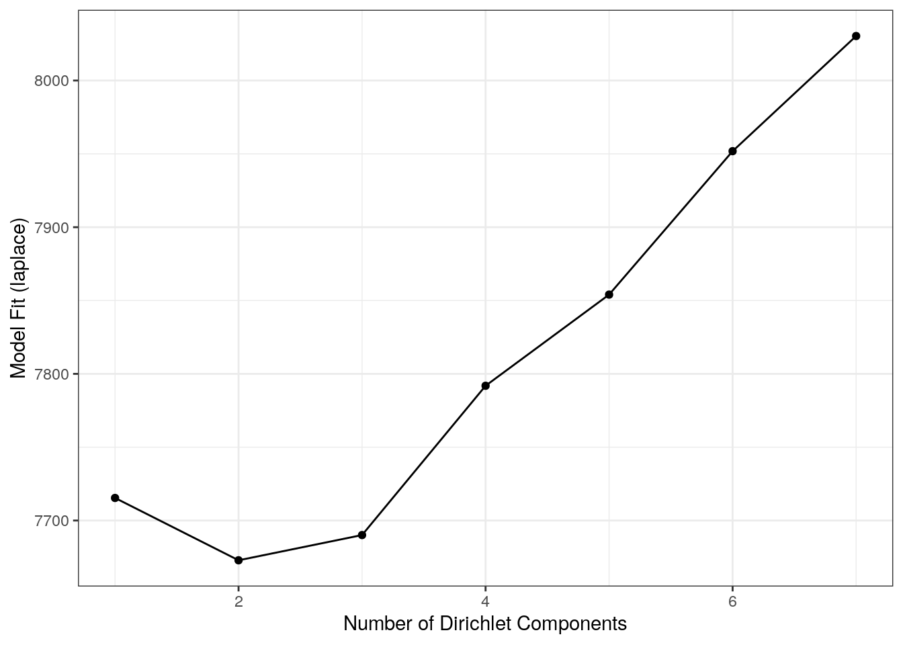
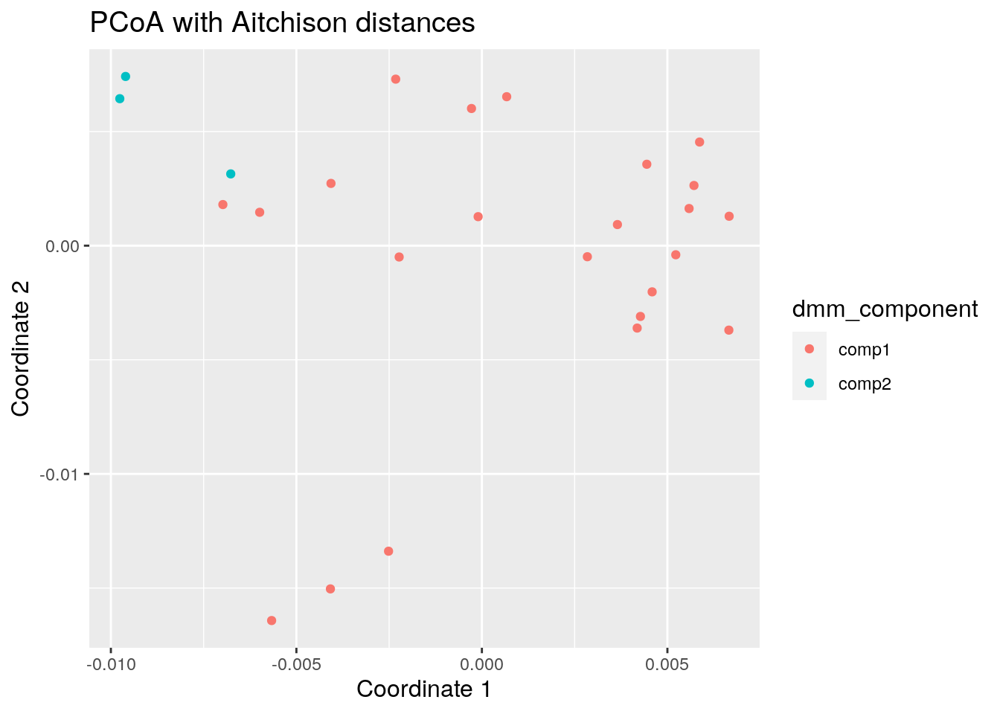

# Microbiome Community {#microbiome-community}

<script>
document.addEventListener("click", function (event) {
    if (event.target.classList.contains("rebook-collapse")) {
        event.target.classList.toggle("active");
        var content = event.target.nextElementSibling;
        if (content.style.display === "block") {
            content.style.display = "none";
        } else {
            content.style.display = "block";
        }
    }
})
</script>

<style>
.rebook-collapse {
  background-color: #eee;
  color: #444;
  cursor: pointer;
  padding: 18px;
  width: 100%;
  border: none;
  text-align: left;
  outline: none;
  font-size: 15px;
}

.rebook-content {
  padding: 0 18px;
  display: none;
  overflow: hidden;
  background-color: #f1f1f1;
}
</style>

```
## Loading required package: ecodist
```


```r
library(mia)
data("GlobalPatterns")
tse <- GlobalPatterns
```


## Community composition

Heatmaps

### Composition barplot

A typical way to visualize microbiome composition is by using composition barplot.
In the following, relative abundance is calculated and top 5 taxa is retrieved for the
Phylum rank. Thereafter, the barplot is visualized ordering rank by abundance values
and samples by "Bacteroidetes":


```r
library(miaViz)
# Computing relative abundance
tse <- relAbundanceCounts(tse)

# Getting top taxa on a Phylum level
tse_phylum <- agglomerateByRank(tse, rank ="Phylum", onRankOnly=TRUE)
top_taxa <- getTopTaxa(tse_phylum,top = 5, abund_values = "relabundance")

# Renaming the "Phylum" rank to keep only top taxa and the rest to "Other"
phylum_renamed <- lapply(rowData(tse)$Phylum,
                   function(x){if (x %in% top_taxa) {x} else {"Other"}})
rowData(tse)$Phylum <- as.character(phylum_renamed)

# Visualizing the composition barplot, with samples order by "Bacteroidetes"
plotAbundance(tse, abund_values="relabundance", rank = "Phylum",
              order_rank_by="abund", order_sample_by = "Bacteroidetes")
```


## Community typing

### Dirichlet Multinomial Mixtures (DMM)

This section focus on DMM analysis. 

One technique that allows to search for groups of samples that are
similar to each other is the [Dirichlet-Multinomial Mixture
Model](https://journals.plos.org/plosone/article?id=10.1371/journal.pone.0030126). In
DMM, we first determine the number of clusters (k) that best fit the
data (model evidence) using Laplace approximation. After fitting the
model with k clusters, we obtain for each sample k probabilities that
reflect the probability that a sample belongs to the given cluster.

Let's cluster the data with DMM clustering. 


```r
# Runs model and calculates the most likely number of clusters from 1 to 7.
# Since this is a large dataset it takes long computational time.
# For this reason we use only a subset of the data; agglomerated by Phylum as a rank.
tse <- GlobalPatterns
tse <- agglomerateByRank(tse, rank = "Phylum", agglomerateTree=TRUE)
tse_dmn <- runDMN(tse, name = "DMN", k = 1:7)
```


```r
# It is stored in metadata
tse_dmn
```

```
## class: TreeSummarizedExperiment 
## dim: 67 26 
## metadata(1): DMN
## assays(1): counts
## rownames(67): Phylum:Crenarchaeota Phylum:Euryarchaeota ...
##   Phylum:Synergistetes Phylum:SR1
## rowData names(7): Kingdom Phylum ... Genus Species
## colnames(26): CL3 CC1 ... Even2 Even3
## colData names(7): X.SampleID Primer ... SampleType Description
## reducedDimNames(0):
## mainExpName: NULL
## altExpNames(0):
## rowLinks: a LinkDataFrame (67 rows)
## rowTree: 1 phylo tree(s) (66 leaves)
## colLinks: NULL
## colTree: NULL
```

Return information on metadata that the object contains.


```r
names(metadata(tse_dmn))
```

```
## [1] "DMN"
```

This returns a list of DMN objects for a closer investigation.


```r
getDMN(tse_dmn)
```

```
## [[1]]
## class: DMN 
## k: 1 
## samples x taxa: 26 x 67 
## Laplace: 7715 BIC: 7802 AIC: 7760 
## 
## [[2]]
## class: DMN 
## k: 2 
## samples x taxa: 26 x 67 
## Laplace: 7673 BIC: 7927 AIC: 7842 
## 
## [[3]]
## class: DMN 
## k: 3 
## samples x taxa: 26 x 67 
## Laplace: 7689 BIC: 8076 AIC: 7948 
## 
## [[4]]
## class: DMN 
## k: 4 
## samples x taxa: 26 x 67 
## Laplace: 7751 BIC: 8274 AIC: 8103 
## 
## [[5]]
## class: DMN 
## k: 5 
## samples x taxa: 26 x 67 
## Laplace: 7854 BIC: 8553 AIC: 8340 
## 
## [[6]]
## class: DMN 
## k: 6 
## samples x taxa: 26 x 67 
## Laplace: 7942 BIC: 8822 AIC: 8566 
## 
## [[7]]
## class: DMN 
## k: 7 
## samples x taxa: 26 x 67 
## Laplace: NaN BIC: NaN AIC: NaN
```


Show Laplace approximation (model evidence) for each model of the k models.


```r
library(miaViz)
plotDMNFit(tse_dmn, type = "laplace")
```



Return the model that has the best fit.


```r
getBestDMNFit(tse_dmn, type = "laplace")
```

```
## class: DMN 
## k: 2 
## samples x taxa: 26 x 67 
## Laplace: 7673 BIC: 7927 AIC: 7842
```
### PCoA for ASV-level data with Bray-Curtis; with DMM clusters shown with colors

Group samples and return DMNGroup object that contains a summary.
Patient status is used for grouping.


```r
dmn_group <- calculateDMNgroup(tse_dmn, variable = "SampleType",  exprs_values = "counts",
                               k = 2, seed=.Machine$integer.max)

dmn_group
```

```
## class: DMNGroup 
## summary:
##                    k samples taxa    NLE  LogDet Laplace    BIC  AIC
## Feces              2       4   67 1078.3 -106.19   901.1 1171.9 1213
## Freshwater         2       2   67  889.6  -97.28   716.9  936.4 1025
## Freshwater (creek) 2       3   67 1600.3  860.08  1906.3 1674.5 1735
## Mock               2       3   67 1008.4  -55.37   856.6 1082.5 1143
## Ocean              2       3   67 1096.7  -56.21   944.6 1170.9 1232
## Sediment (estuary) 2       3   67 1195.5   18.63  1080.8 1269.7 1331
## Skin               2       3   67  992.6  -84.81   826.2 1066.8 1128
## Soil               2       3   67 1380.3   11.21  1261.8 1454.5 1515
## Tongue             2       2   67  783.0 -107.74   605.1  829.8  918
```

Mixture weights  (rough measure of the cluster size).


```r
DirichletMultinomial::mixturewt(getBestDMNFit(tse_dmn))
```

```
##       pi theta
## 1 0.5385 20.59
## 2 0.4615 15.28
```


Samples-cluster assignment probabilities / how probable it is that sample belongs
to each cluster


```r
head(DirichletMultinomial::mixture(getBestDMNFit(tse_dmn)))
```

```
##              [,1]      [,2]
## CL3     1.000e+00 4.972e-17
## CC1     1.000e+00 3.800e-22
## SV1     1.000e+00 2.013e-12
## M31Fcsw 7.397e-26 1.000e+00
## M11Fcsw 1.072e-16 1.000e+00
## M31Plmr 9.954e-14 1.000e+00
```

Contribution of each taxa to each component


```r
head(DirichletMultinomial::fitted(getBestDMNFit(tse_dmn)))
```

```
##                          [,1]      [,2]
## Phylum:Crenarchaeota  0.30441 0.1354637
## Phylum:Euryarchaeota  0.23141 0.1468593
## Phylum:Actinobacteria 1.21032 1.0600251
## Phylum:Spirochaetes   0.21408 0.1318401
## Phylum:MVP-15         0.02988 0.0007626
## Phylum:Proteobacteria 6.83954 1.8153719
```
Get the assignment probabilities


```r
prob <- DirichletMultinomial::mixture(getBestDMNFit(tse_dmn))
# Add column names
colnames(prob) <- c("comp1", "comp2")

# For each row, finds column that has the highest value. Then extract the column 
# names of highest values.
vec <- colnames(prob)[max.col(prob,ties.method = "first")]
```

Computing the euclidean PCoA and storing it as a dataframe


```r
# Does clr transformation. Pseudocount is added, because data contains zeros.
tse <- transformCounts(tse, method = "clr", pseudocount = 1)

# Gets clr table
clr_assay <- assays(tse)$clr

# Transposes it to get taxa to columns
clr_assay <- t(clr_assay)

# Calculates Euclidean distances between samples. Because taxa is in columns,
# it is used to compare different samples.
euclidean_dist <- vegan::vegdist(clr_assay, method = "euclidean")

# Does principal coordinate analysis
euclidean_pcoa <- ecodist::pco(euclidean_dist)

# Creates a data frame from principal coordinates
euclidean_pcoa_df <- data.frame(pcoa1 = euclidean_pcoa$vectors[,1], 
                                pcoa2 = euclidean_pcoa$vectors[,2])
```


```r
# Creates a data frame that contains principal coordinates and DMM information
euclidean_dmm_pcoa_df <- cbind(euclidean_pcoa_df,
                               dmm_component = vec)
# Creates a plot
euclidean_dmm_plot <- ggplot(data = euclidean_dmm_pcoa_df, 
                             aes(x=pcoa1, y=pcoa2,
                                 color = dmm_component)) +
  geom_point() +
  labs(x = "Coordinate 1",
       y = "Coordinate 2",
       title = "PCoA with Aitchison distances") +  
  theme(title = element_text(size = 12)) # makes titles smaller

euclidean_dmm_plot
```




## Session Info {-}

<button class="rebook-collapse">View session info</button>
<div class="rebook-content">
```
R version 4.1.0 (2021-05-18)
Platform: x86_64-pc-linux-gnu (64-bit)
Running under: Ubuntu 20.04.2 LTS

Matrix products: default
BLAS/LAPACK: /usr/lib/x86_64-linux-gnu/openblas-pthread/libopenblasp-r0.3.8.so

locale:
 [1] LC_CTYPE=en_US.UTF-8       LC_NUMERIC=C              
 [3] LC_TIME=en_US.UTF-8        LC_COLLATE=en_US.UTF-8    
 [5] LC_MONETARY=en_US.UTF-8    LC_MESSAGES=C             
 [7] LC_PAPER=en_US.UTF-8       LC_NAME=C                 
 [9] LC_ADDRESS=C               LC_TELEPHONE=C            
[11] LC_MEASUREMENT=en_US.UTF-8 LC_IDENTIFICATION=C       

attached base packages:
[1] stats4    stats     graphics  grDevices utils     datasets  methods  
[8] base     

other attached packages:
 [1] miaViz_1.1.1                   ggraph_2.0.5                  
 [3] ggplot2_3.3.5                  mia_1.1.7                     
 [5] TreeSummarizedExperiment_2.1.3 Biostrings_2.61.1             
 [7] XVector_0.33.0                 SingleCellExperiment_1.15.1   
 [9] SummarizedExperiment_1.23.1    Biobase_2.53.0                
[11] GenomicRanges_1.45.0           GenomeInfoDb_1.29.3           
[13] IRanges_2.27.0                 S4Vectors_0.31.0              
[15] BiocGenerics_0.39.1            MatrixGenerics_1.5.1          
[17] matrixStats_0.59.0             ecodist_2.0.7                 
[19] BiocStyle_2.21.3               rebook_1.3.0                  

loaded via a namespace (and not attached):
  [1] ggtree_3.1.2                ggnewscale_0.4.5           
  [3] ggbeeswarm_0.6.0            colorspace_2.0-2           
  [5] ellipsis_0.3.2              scuttle_1.3.0              
  [7] BiocNeighbors_1.11.0        aplot_0.0.6                
  [9] farver_2.1.0                graphlayouts_0.7.1         
 [11] ggrepel_0.9.1               bit64_4.0.5                
 [13] fansi_0.5.0                 decontam_1.13.0            
 [15] splines_4.1.0               codetools_0.2-18           
 [17] sparseMatrixStats_1.5.0     cachem_1.0.5               
 [19] knitr_1.33                  scater_1.21.2              
 [21] polyclip_1.10-0             jsonlite_1.7.2             
 [23] cluster_2.1.2               graph_1.71.2               
 [25] ggforce_0.3.3               BiocManager_1.30.16        
 [27] compiler_4.1.0              rvcheck_0.1.8              
 [29] assertthat_0.2.1            Matrix_1.3-4               
 [31] fastmap_1.1.0               lazyeval_0.2.2             
 [33] tweenr_1.0.2                BiocSingular_1.9.1         
 [35] htmltools_0.5.1.1           tools_4.1.0                
 [37] igraph_1.2.6                rsvd_1.0.5                 
 [39] gtable_0.3.0                glue_1.4.2                 
 [41] GenomeInfoDbData_1.2.6      reshape2_1.4.4             
 [43] dplyr_1.0.7                 Rcpp_1.0.7                 
 [45] jquerylib_0.1.4             vctrs_0.3.8                
 [47] ape_5.5                     nlme_3.1-152               
 [49] DECIPHER_2.21.0             DelayedMatrixStats_1.15.0  
 [51] xfun_0.24                   stringr_1.4.0              
 [53] beachmat_2.9.0              lifecycle_1.0.0            
 [55] irlba_2.3.3                 XML_3.99-0.6               
 [57] zlibbioc_1.39.0             MASS_7.3-54                
 [59] scales_1.1.1                tidygraph_1.2.0            
 [61] parallel_4.1.0              yaml_2.2.1                 
 [63] memoise_2.0.0               gridExtra_2.3              
 [65] sass_0.4.0                  stringi_1.7.3              
 [67] RSQLite_2.2.7               highr_0.9                  
 [69] ScaledMatrix_1.1.0          permute_0.9-5              
 [71] tidytree_0.3.4              filelock_1.0.2             
 [73] BiocParallel_1.27.2         rlang_0.4.11               
 [75] pkgconfig_2.0.3             bitops_1.0-7               
 [77] evaluate_0.14               lattice_0.20-44            
 [79] purrr_0.3.4                 labeling_0.4.2             
 [81] patchwork_1.1.1             treeio_1.17.2              
 [83] CodeDepends_0.6.5           bit_4.0.4                  
 [85] tidyselect_1.1.1            plyr_1.8.6                 
 [87] magrittr_2.0.1              bookdown_0.22              
 [89] R6_2.5.0                    generics_0.1.0             
 [91] DelayedArray_0.19.1         DBI_1.1.1                  
 [93] withr_2.4.2                 mgcv_1.8-36                
 [95] pillar_1.6.1                RCurl_1.98-1.3             
 [97] tibble_3.1.2                dir.expiry_1.1.0           
 [99] crayon_1.4.1                utf8_1.2.1                 
[101] rmarkdown_2.9               viridis_0.6.1              
[103] grid_4.1.0                  blob_1.2.1                 
[105] vegan_2.5-7                 digest_0.6.27              
[107] tidyr_1.1.3                 munsell_0.5.0              
[109] DirichletMultinomial_1.35.0 beeswarm_0.4.0             
[111] viridisLite_0.4.0           vipor_0.4.5                
[113] bslib_0.2.5.1              
```
</div>
