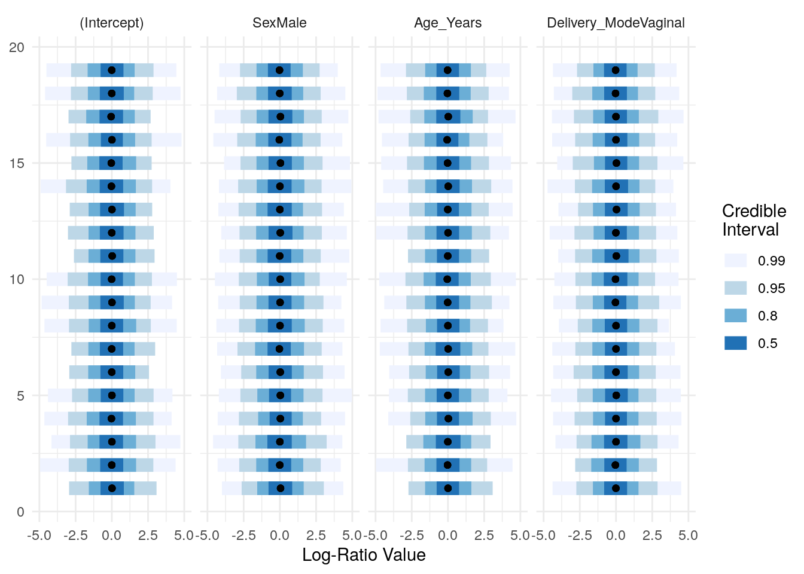
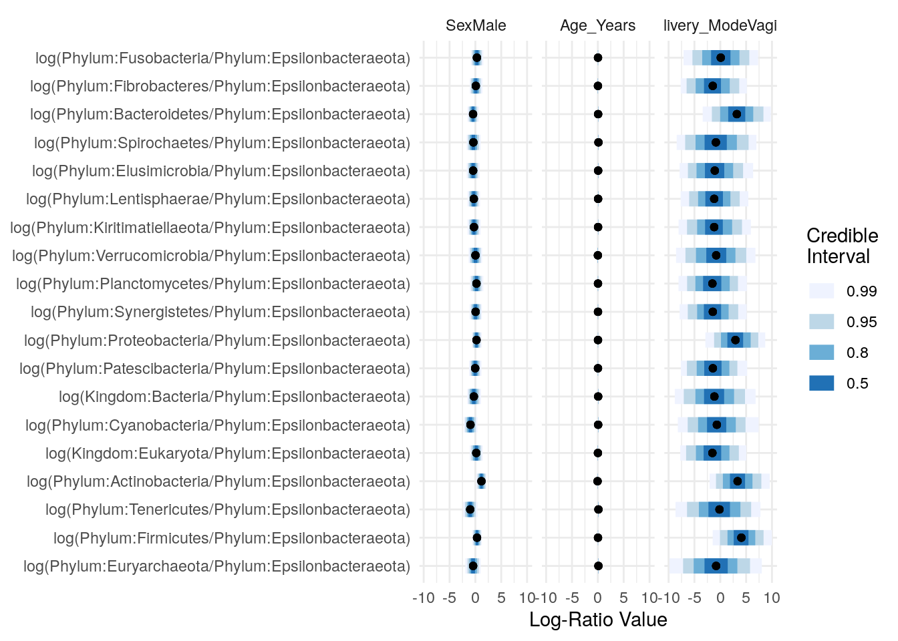

# Differential Abundance {#differential-abundance}

<script>
document.addEventListener("click", function (event) {
    if (event.target.classList.contains("rebook-collapse")) {
        event.target.classList.toggle("active");
        var content = event.target.nextElementSibling;
        if (content.style.display === "block") {
            content.style.display = "none";
        } else {
            content.style.display = "block";
        }
    }
})
</script>

<style>
.rebook-collapse {
  background-color: #eee;
  color: #444;
  cursor: pointer;
  padding: 18px;
  width: 100%;
  border: none;
  text-align: left;
  outline: none;
  font-size: 15px;
}

.rebook-content {
  padding: 0 18px;
  display: none;
  overflow: hidden;
  background-color: #f1f1f1;
}
</style>


A number of methods for differential abundance analysis are available,
and reviewed elsewhere.

## Tree-based methods

### Group-wise associations testing based on balances

[TreeSummarizedExperiment](https://bioconductor.org/packages/release/bioc/html/TreeSummarizedExperiment.html) 
frequently includes a Phylogenetic tree along with associated data about the experiment (at `colData`), that holds covariates which can be used for analyzing group-wise associations. 

Such an analysis could be performed with the function `pibble` from the `fido` package, that offers a Multinomial Logistic-Normal Linear Regression model; see [vignette](https://jsilve24.github.io/fido/articles/introduction-to-fido.html) of package.

The following presents such an exemplary analysis based on the [Sprockett et al. (2020)](https://doi.org/10.1038/s41467-020-17541-6) available through `microbiomeDataSets` package.


```r
if (!require(fido)){
  # installing the fido package
  devtools::install_github("jsilve24/fido")
}
```

Loading the libraries and importing data:


```r
library(fido)
library(mia)
library(microbiomeDataSets)

tse <- SprockettTHData()
names(colData(tse))
```

```
##  [1] "Sample_ID"                "Sample_Type"             
##  [3] "Subject_ID"               "Sex"                     
##  [5] "Country"                  "Age_Days"                
##  [7] "Age_Months"               "Age_Years"               
##  [9] "Days_After_Birth"         "Months_After_Birth"      
## [11] "Age_Group"                "Age_Class"               
## [13] "Feeding_Status_Corrected" "Study_Code"              
## [15] "AgeGroup_By_SampleType"   "Dyad"                    
## [17] "Delivery_Mode"            "Community"               
## [19] "Community_Type"           "Community_Subtype"       
## [21] "Sample_Label"             "Cohort"                  
## [23] "Sample_Collection_Date"   "Community_Alias"
```

We pick three covariates ("Sex","Age_Years","Delivery_Mode") during this analysis as an example, and beforehand we check for missing data:


```r
cov_names <- c("Sex","Age_Years","Delivery_Mode")
na_counts <- apply(is.na(colData(tse)[,cov_names]), 2, sum)
na_summary<-as.data.frame(na_counts,row.names=cov_names)
na_summary
```

```
##               na_counts
## Sex                   0
## Age_Years          1603
## Delivery_Mode      1100
```

We drop samples with na values at the covariates (features) under analysis: 


```r
tse <- tse[ , !is.na(colData(tse)$Delivery_Mode) ]
tse <- tse[ , !is.na(colData(tse)$Age_Years) ]
tse
```

```
## class: TreeSummarizedExperiment 
## dim: 2319 483 
## metadata(0):
## assays(1): counts
## rownames(2319): ASV_4_Candidatus_Methanogranum ASV_9_Methanobrevibacter
##   ... ASV_6837_Proteus_cibarius/hauseri+4 ASV_6838_Proteus
## rowData names(8): Kingdom Phylum ... Species lowest_rank
## colnames(483): 100.BF1 101.BF9A ... 98.MF35A 99.MF134A
## colData names(24): Sample_ID Sample_Type ... Sample_Collection_Date
##   Community_Alias
## reducedDimNames(0):
## mainExpName: NULL
## altExpNames(0):
## rowLinks: a LinkDataFrame (2319 rows)
## rowTree: 1 phylo tree(s) (2319 leaves)
## colLinks: NULL
## colTree: NULL
## referenceSeq: a DNAStringSet (2319 sequences)
```

We agglomerate the data at a Phylum rank.
Note: Large assay data (along with the covariates/features data) could prevent the analysis later,
since the computation will construct matrices that would not always fit memory.


```r
tse_phylum <- agglomerateByRank(tse, "Phylum")
tse_phylum
```

```
## class: TreeSummarizedExperiment 
## dim: 20 483 
## metadata(0):
## assays(1): counts
## rownames(20): Phylum:Euryarchaeota Phylum:Firmicutes ...
##   Phylum:Fusobacteria Phylum:Epsilonbacteraeota
## rowData names(8): Kingdom Phylum ... Species lowest_rank
## colnames(483): 100.BF1 101.BF9A ... 98.MF35A 99.MF134A
## colData names(24): Sample_ID Sample_Type ... Sample_Collection_Date
##   Community_Alias
## reducedDimNames(0):
## mainExpName: NULL
## altExpNames(0):
## rowLinks: a LinkDataFrame (20 rows)
## rowTree: 1 phylo tree(s) (2319 leaves)
## colLinks: NULL
## colTree: NULL
## referenceSeq: a DNAStringSet (20 sequences)
```

We extract the counts assay and feature data to build the model matrix having an extra row of ones presenting the intercept for the regression task later: 


```r
Y <- assays(tse_phylum)$counts
# design matrix
# taking 3 covariates
sample_data<-as.data.frame(colData(tse_phylum)[,cov_names])
X <- t(model.matrix(~Sex+Age_Years+Delivery_Mode,data=sample_data))
X[,1:5]
```

```
##                      100.BF1 101.BF9A 102.BF36A 103.BF53A 104.BF83A
## (Intercept)             1.00     1.00      1.00      1.00      1.00
## SexMale                 0.00     0.00      0.00      0.00      0.00
## Age_Years               0.88     0.89      0.94      0.99      1.05
## Delivery_ModeVaginal    1.00     1.00      1.00      1.00      1.00
```

```r
Y[1:5,1:5]
```

```
##                       100.BF1 101.BF9A 102.BF36A 103.BF53A 104.BF83A
## Phylum:Euryarchaeota        0        0         0         0         0
## Phylum:Firmicutes       10724    12129     15453     14446      4160
## Phylum:Tenericutes          0      173         0         3         2
## Phylum:Actinobacteria   18127    19122      1395      9666     19633
## Kingdom:Eukaryota           0        0         0         0         0
```

Building the parameters for the `pibble` call to build the model; see more at [vignette](https://jsilve24.github.io/fido/articles/introduction-to-fido.html):


```r
n_taxa<-nrow(Y)
upsilon <- n_taxa+3
Omega <- diag(n_taxa)
G <- cbind(diag(n_taxa-1), -1)
Xi <- (upsilon-n_taxa)*G%*%Omega%*%t(G)
Theta <- matrix(0, n_taxa-1, nrow(X))
Gamma <- diag(nrow(X))
```

Automatically initializing the priors and visualizing their distributions:


```r
priors <- pibble(NULL, X, upsilon, Theta, Gamma, Xi)
names_covariates(priors) <- rownames(X)
fido::plot(priors, pars="Lambda") + ggplot2::xlim(c(-5, 5))
```



Estimating the posterior by including the data at `Y`.
Note: Some computational failures could occur (see [discussion](https://github-wiki-see.page/m/jsilve24/fido/wiki/Frequently-Asked-Questions))
the arguments `multDirichletBoot` `calcGradHess` could be passed in such case.


```r
priors$Y <- Y 
posterior <- refit(priors, optim_method="adam", multDirichletBoot=0.5) # ,, calcGradHess=FALSE
```

Printing a summary about the posterior predictive distribution:


```r
ppc_summary(posterior)
```

```
## Proportions of Observations within 95% Credible Interval: 0.9981
```
Plotting the summary of the posterior distributions of the regression parameters:


```r
names_categories(posterior) <- rownames(Y)
fido::plot(posterior,par="Lambda",focus.cov=rownames(X)[2:4])
```



Seemingly the covariate "Age_Years" does not have effect on the model as "Delivery_Mode" would,
and "Sex" to some extent. Let's take a closer look at the two latter ones:


```r
fido::plot(posterior, par="Lambda", focus.cov = rownames(X)[c(2,4)])
```


## Session Info {-}

<button class="rebook-collapse">View session info</button>
<div class="rebook-content">
```
R version 4.1.0 (2021-05-18)
Platform: x86_64-pc-linux-gnu (64-bit)
Running under: Ubuntu 20.04.2 LTS

Matrix products: default
BLAS/LAPACK: /usr/lib/x86_64-linux-gnu/openblas-pthread/libopenblasp-r0.3.8.so

locale:
 [1] LC_CTYPE=en_US.UTF-8       LC_NUMERIC=C              
 [3] LC_TIME=en_US.UTF-8        LC_COLLATE=en_US.UTF-8    
 [5] LC_MONETARY=en_US.UTF-8    LC_MESSAGES=C             
 [7] LC_PAPER=en_US.UTF-8       LC_NAME=C                 
 [9] LC_ADDRESS=C               LC_TELEPHONE=C            
[11] LC_MEASUREMENT=en_US.UTF-8 LC_IDENTIFICATION=C       

attached base packages:
[1] stats4    stats     graphics  grDevices utils     datasets  methods  
[8] base     

other attached packages:
 [1] microbiomeDataSets_1.1.1       MultiAssayExperiment_1.19.5   
 [3] mia_1.1.9                      TreeSummarizedExperiment_2.1.3
 [5] Biostrings_2.61.2              XVector_0.33.0                
 [7] SingleCellExperiment_1.15.1    SummarizedExperiment_1.23.1   
 [9] Biobase_2.53.0                 GenomicRanges_1.45.0          
[11] GenomeInfoDb_1.29.3            IRanges_2.27.0                
[13] S4Vectors_0.31.0               BiocGenerics_0.39.1           
[15] MatrixGenerics_1.5.3           matrixStats_0.60.0            
[17] fido_0.1.13                    BiocStyle_2.21.3              
[19] rebook_1.3.0                  

loaded via a namespace (and not attached):
  [1] backports_1.2.1               AnnotationHub_3.1.5          
  [3] BiocFileCache_2.1.1           plyr_1.8.6                   
  [5] lazyeval_0.2.2                driver_0.1.1                 
  [7] splines_4.1.0                 svUnit_1.0.6                 
  [9] BiocParallel_1.27.3           ggplot2_3.3.5                
 [11] scater_1.21.3                 digest_0.6.27                
 [13] htmltools_0.5.1.1             viridis_0.6.1                
 [15] fansi_0.5.0                   magrittr_2.0.1               
 [17] checkmate_2.0.0               memoise_2.0.0                
 [19] ScaledMatrix_1.1.0            cluster_2.1.2                
 [21] DECIPHER_2.21.0               colorspace_2.0-2             
 [23] rappdirs_0.3.3                blob_1.2.2                   
 [25] ggrepel_0.9.1                 ggdist_3.0.0                 
 [27] xfun_0.25                     dplyr_1.0.7                  
 [29] crayon_1.4.1                  RCurl_1.98-1.3               
 [31] jsonlite_1.7.2                graph_1.71.2                 
 [33] ape_5.5                       glue_1.4.2                   
 [35] gtable_0.3.0                  zlibbioc_1.39.0              
 [37] DelayedArray_0.19.1           distributional_0.2.2         
 [39] BiocSingular_1.9.1            abind_1.4-5                  
 [41] scales_1.1.1                  DBI_1.1.1                    
 [43] Rcpp_1.0.7                    xtable_1.8-4                 
 [45] viridisLite_0.4.0             decontam_1.13.0              
 [47] tidytree_0.3.4                bit_4.0.4                    
 [49] rsvd_1.0.5                    httr_1.4.2                   
 [51] RColorBrewer_1.1-2            arrayhelpers_1.1-0           
 [53] dir.expiry_1.1.0              posterior_1.0.1              
 [55] ellipsis_0.3.2                pkgconfig_2.0.3              
 [57] XML_3.99-0.6                  tidybayes_3.0.0              
 [59] farver_2.1.0                  scuttle_1.3.1                
 [61] dbplyr_2.1.1                  CodeDepends_0.6.5            
 [63] sass_0.4.0                    utf8_1.2.2                   
 [65] labeling_0.4.2                AnnotationDbi_1.55.1         
 [67] later_1.2.0                   tidyselect_1.1.1             
 [69] rlang_0.4.11                  reshape2_1.4.4               
 [71] munsell_0.5.0                 BiocVersion_3.14.0           
 [73] tools_4.1.0                   cachem_1.0.5                 
 [75] DirichletMultinomial_1.35.0   generics_0.1.0               
 [77] RSQLite_2.2.7                 ExperimentHub_2.1.4          
 [79] evaluate_0.14                 stringr_1.4.0                
 [81] fastmap_1.1.0                 yaml_2.2.1                   
 [83] knitr_1.33                    bit64_4.0.5                  
 [85] purrr_0.3.4                   KEGGREST_1.33.0              
 [87] nlme_3.1-152                  sparseMatrixStats_1.5.2      
 [89] mime_0.11                     compiler_4.1.0               
 [91] png_0.1-7                     interactiveDisplayBase_1.31.2
 [93] curl_4.3.2                    beeswarm_0.4.0               
 [95] filelock_1.0.2                treeio_1.17.2                
 [97] tibble_3.1.3                  bslib_0.2.5.1                
 [99] stringi_1.7.3                 highr_0.9                    
[101] lattice_0.20-44               Matrix_1.3-4                 
[103] vegan_2.5-7                   permute_0.9-5                
[105] tensorA_0.36.2                vctrs_0.3.8                  
[107] pillar_1.6.2                  lifecycle_1.0.0              
[109] BiocManager_1.30.16           jquerylib_0.1.4              
[111] BiocNeighbors_1.11.0          bitops_1.0-7                 
[113] irlba_2.3.3                   httpuv_1.6.1                 
[115] R6_2.5.0                      promises_1.2.0.1             
[117] bookdown_0.22                 gridExtra_2.3                
[119] vipor_0.4.5                   codetools_0.2-18             
[121] MASS_7.3-54                   assertthat_0.2.1             
[123] withr_2.4.2                   GenomeInfoDbData_1.2.6       
[125] mgcv_1.8-36                   parallel_4.1.0               
[127] grid_4.1.0                    beachmat_2.9.1               
[129] tidyr_1.1.3                   coda_0.19-4                  
[131] rmarkdown_2.10                DelayedMatrixStats_1.15.2    
[133] shiny_1.6.0                   ggbeeswarm_0.6.0             
```
</div>
