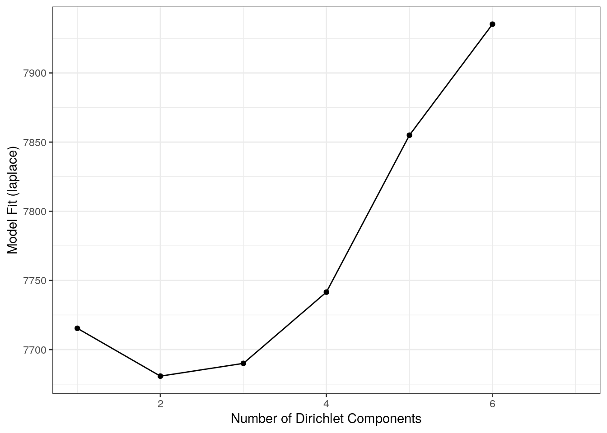
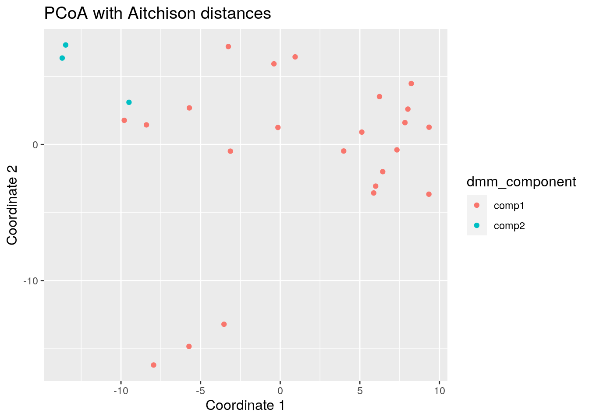
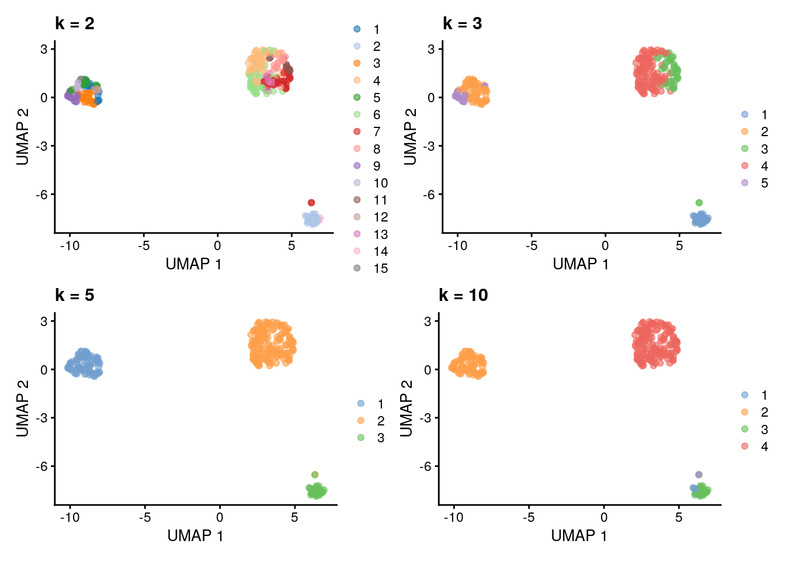
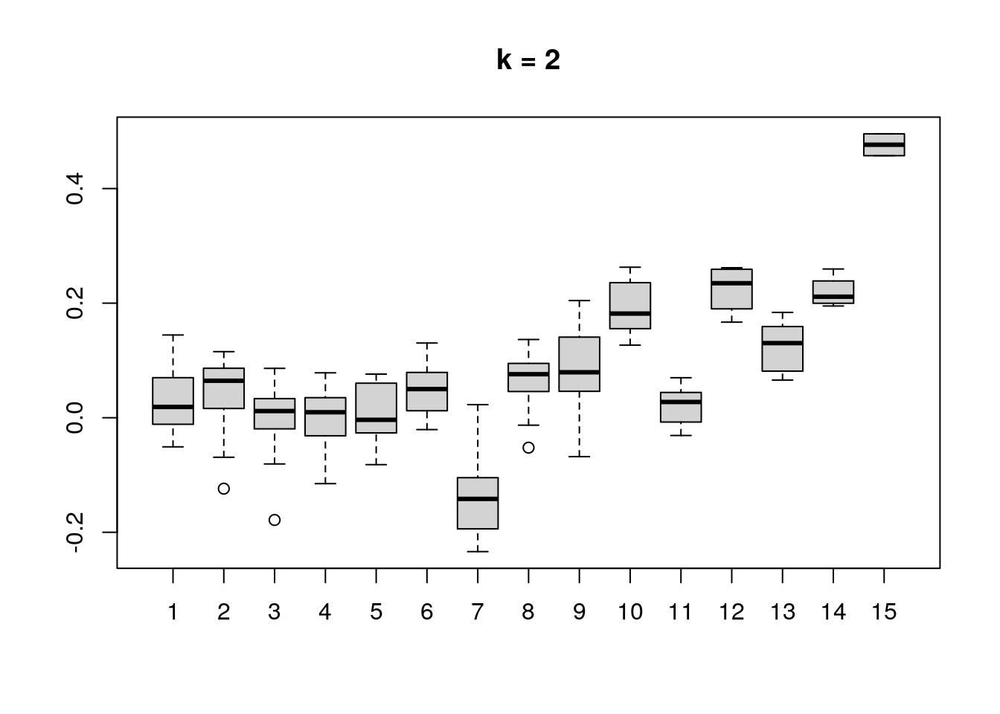
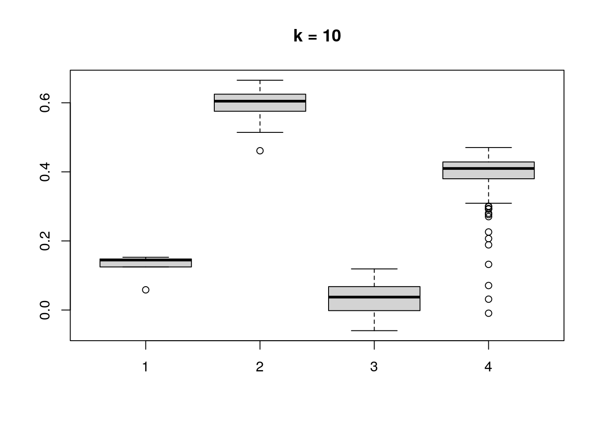

# Community composition {#microbiome-community}

<script>
document.addEventListener("click", function (event) {
    if (event.target.classList.contains("rebook-collapse")) {
        event.target.classList.toggle("active");
        var content = event.target.nextElementSibling;
        if (content.style.display === "block") {
            content.style.display = "none";
        } else {
            content.style.display = "block";
        }
    }
})
</script>

<style>
.rebook-collapse {
  background-color: #eee;
  color: #444;
  cursor: pointer;
  padding: 18px;
  width: 100%;
  border: none;
  text-align: left;
  outline: none;
  font-size: 15px;
}

.rebook-content {
  padding: 0 18px;
  display: none;
  overflow: hidden;
  background-color: #f1f1f1;
}
</style>

```
## Loading required package: ecodist
```


```r
library(mia)
data("GlobalPatterns", package="mia")
tse <- GlobalPatterns
```

## Visualizing taxonomic composition

### Composition barplot

A typical way to visualize microbiome composition is by using
composition barplot. In the following, relative abundance is
calculated and top taxa are retrieved for the Phylum rank. Thereafter,
the barplot is visualized ordering rank by abundance values and
samples by "Bacteroidetes":


```r
library(miaViz)
# Computing relative abundance
tse <- relAbundanceCounts(tse)

# Getting top taxa on a Phylum level
tse_phylum <- agglomerateByRank(tse, rank ="Phylum", onRankOnly=TRUE)
top_taxa <- getTopTaxa(tse_phylum,top = 5, abund_values = "relabundance")

# Renaming the "Phylum" rank to keep only top taxa and the rest to "Other"
phylum_renamed <- lapply(rowData(tse)$Phylum,
                   function(x){if (x %in% top_taxa) {x} else {"Other"}})
rowData(tse)$Phylum <- as.character(phylum_renamed)

# Visualizing the composition barplot, with samples order by "Bacteroidetes"
plotAbundance(tse, abund_values="relabundance", rank = "Phylum",
              order_rank_by="abund", order_sample_by = "Bacteroidetes")
```


### Composition heatmap 

Community composition can be visualized with heatmap, where the
horizontal axis represents samples and the vertical axis the
taxa. Color of each intersection point represents abundance of a taxon
in a specific sample.

Here,  abundances are  first CLR  (centered log-ratio)  transformed to
remove  compositionality bias. Then  Z  transformation  is applied  to
CLR-transformed  data. This  shifts all  taxa  to zero  mean and  unit
variance, allowing visual comparison  between taxa that have different
absolute  abundance  levels.  After  these  rough  visual  exploration
techniques, we can visualize the abundances at Phylum level.


```r
library(ggplot2)
# Add clr-transformation on samples
tse_phylum <- transformSamples(tse_phylum, method = "clr", pseudocount = 1)
# Add z-transformation on features (taxa)
tse_phylum <- transformFeatures(tse_phylum, abund_values = "clr", 
                                method = "z", name = "clr_z")
# Melts the assay
df <- meltAssay(tse_phylum, abund_values = "clr_z")

# Determines the scaling of colours
maxval <- round(max(abs(df$clr_z)))
limits <- c(-maxval, maxval)
breaks <- seq(from = min(limits), to = max(limits), by = 0.5)
colours <- c("darkblue", "blue", "white", "red", "darkred")

# Creates a ggplot object
ggplot(df, aes(x = SampleID, y = FeatureID, fill = clr_z)) +
  geom_tile() +
  scale_fill_gradientn(name = "CLR + Z transform", 
                       breaks = breaks, limits = limits, colours = colours) + 
  theme(text = element_text(size=10),
        axis.text.x = element_text(angle=45, hjust=1),
        legend.key.size = unit(1, "cm")) +
  labs(x = "Samples", y = "Taxa")
```


_pheatmap_ is a package that provides methods to plot clustered heatmaps. 


```r
if(!require(pheatmap)){
  install.packages("pheatmap")
  library(pheatmap)
}

# Takes subset: only samples from feces, skin, or tongue
tse_phylum_subset <- tse_phylum[ , colData(tse_phylum)$SampleType %in% c("Feces", "Skin", "Tongue") ]

# Does clr-transformation
tse_phylum_subset <- transformSamples(tse_phylum_subset, method = "clr", pseudocount = 1)
# Does z-transformation
tse_phylum_subset <- transformFeatures(tse_phylum_subset, abund_values = "clr", 
                                       method = "z", name = "clr_z")

# Get n most abundant taxa, and subsets the data by them
top_taxa <- getTopTaxa(tse_phylum_subset, top = 20)
tse_phylum_subset <- tse_phylum_subset[top_taxa, ]

# Gets the assay table
mat <- assay(tse_phylum_subset, "clr_z")

# Creates the heatmap
pheatmap(mat)
```


We can create clusters by hierarchical clustering and add them to the plot.


```r
if(!require(ape)){
    install.packages("ape")
    library(ape)
}

# Hierarchical clustering
taxa_hclust <- hclust(dist(mat), method = "complete")

# Creates a phylogenetic tree
taxa_tree <- as.phylo(taxa_hclust)
```


```r
if(!require(ggtree)){
    install.packages("ggtree")
    library(ggtree)
}

# Plot taxa tree
taxa_tree <- ggtree(taxa_tree) + 
  theme(plot.margin=margin(0,0,0,0)) # removes margins

# Get order of taxa in plot
taxa_ordered <- get_taxa_name(taxa_tree)

taxa_tree
```


Based on phylo tree, we decide to create three clusters. 


```r
# Creates clusters
taxa_clusters <- cutree(tree = taxa_hclust, k = 3)

# Converts into data frame
taxa_clusters <- data.frame(clusters = taxa_clusters)
taxa_clusters$clusters <- factor(taxa_clusters$clusters)

# Order data so that it's same as in phylo tree
taxa_clusters <- taxa_clusters[taxa_ordered, , drop = FALSE] 

# Prints taxa and their clusters
taxa_clusters
```

```
##                  clusters
## Chloroflexi             3
## Actinobacteria          3
## Crenarchaeota           3
## Planctomycetes          3
## Gemmatimonadetes        3
## Thermi                  3
## Acidobacteria           3
## Spirochaetes            2
## Fusobacteria            2
## SR1                     2
## Cyanobacteria           2
## Proteobacteria          2
## Synergistetes           2
## Lentisphaerae           1
## Bacteroidetes           1
## Verrucomicrobia         1
## Tenericutes             1
## Firmicutes              1
## Euryarchaeota           1
## SAR406                  1
```


```r
# Adds information to rowData
rowData(tse_phylum_subset)$clusters <- taxa_clusters[order(match(rownames(taxa_clusters), 
                                                                 rownames(tse_phylum_subset))), ]

# Prints taxa and their clusters
rowData(tse_phylum_subset)$clusters
```

```
##  [1] 1 1 2 3 2 2 1 1 1 1 3 2 3 3 3 2 2 3 3 1
## Levels: 1 2 3
```


```r
# Hierarchical clustering
sample_hclust <- hclust(dist(t(mat)), method = "complete")

# Creates a phylogenetic tree
sample_tree <- as.phylo(sample_hclust)

# Plot sample tree
sample_tree <- ggtree(sample_tree) + layout_dendrogram() + 
  theme(plot.margin=margin(0,0,0,0)) # removes margins

# Get order of samples in plot
samples_ordered <- rev(get_taxa_name(sample_tree))

sample_tree
```


```r
# Creates clusters
sample_clusters <- factor(cutree(tree = sample_hclust, k = 3))

# Converts into data frame
sample_data <- data.frame(clusters = sample_clusters)

# Order data so that it's same as in phylo tree
sample_data <- sample_data[samples_ordered, , drop = FALSE] 

# Order data based on 
tse_phylum_subset <- tse_phylum_subset[ , rownames(sample_data)]

# Add sample type data
sample_data$sample_types <- unfactor(colData(tse_phylum_subset)$SampleType)

sample_data
```

```
##         clusters sample_types
## M11Plmr        2         Skin
## M31Plmr        2         Skin
## F21Plmr        2         Skin
## M31Fcsw        1        Feces
## M11Fcsw        1        Feces
## TS28           3        Feces
## TS29           3        Feces
## M31Tong        3       Tongue
## M11Tong        3       Tongue
```

Now we can create heatmap with additional annotations.


```r
# Determines the scaling of colorss
# Scale colors
breaks <- seq(-ceiling(max(abs(mat))), ceiling(max(abs(mat))), 
              length.out = ifelse( max(abs(mat))>5, 2*ceiling(max(abs(mat))), 10 ) )
colors <- colorRampPalette(c("darkblue", "blue", "white", "red", "darkred"))(length(breaks)-1)

pheatmap(mat, annotation_row = taxa_clusters, 
         annotation_col = sample_data,
         breaks = breaks,
         color = colors)
```


In addition to _pheatmap_ package, there are also other packages that
provide functions for more complex heatmaps, such as [_iheatmapr_](https://docs.ropensci.org/iheatmapr/articles/full_vignettes/iheatmapr.html)
and 
[ComplexHeatmap](https://academic.oup.com/bioinformatics/article/32/18/2847/1743594?login=true).

[sechm](http://www.bioconductor.org/packages/release/bioc/vignettes/sechm/inst/doc/sechm.html)
package provides wrapper for _ComplexHeatmap_.


```r
if(!require(sechm)){
  BiocManager::install("sechm")
  library(sechm)
}
# Stores annotation colros to metadata
metadata(tse_phylum_subset)$anno_colors$SampleType <- c(Feces = "blue", 
                                                        Skin = "red", 
                                                        Tongue = "gray")

# Create a plot
sechm(tse_phylum_subset, 
      genes = rownames(tse_phylum_subset), 
      assayName = "clr", 
      do.scale = TRUE, 
      top_annotation = c("SampleType"), 
      gaps_at = "SampleType",
      cluster_cols = TRUE, cluster_rows = TRUE)
```


It is also possible to create similar heatmap by just using _ggplot2_.


```r
# Add feature names to column as a factor
taxa_clusters$Feature <- rownames(taxa_clusters)
taxa_clusters$Feature <- factor(taxa_clusters$Feature, levels = taxa_clusters$Feature)

# Create annotation plot
row_annotation <- ggplot(taxa_clusters) + 
  geom_tile(aes(x = NA, y = Feature, fill = clusters)) + coord_equal(ratio = 1) +
  theme(
        axis.text.x=element_blank(),
        axis.text.y=element_blank(),
        axis.ticks.y=element_blank(),
        axis.title.y=element_blank(),
        axis.title.x = element_text(angle = 90, vjust = 0.5, hjust=1),
        plot.margin=margin(0,0,0,0),
        ) +
      labs(fill = "Clusters", x = "Clusters")

row_annotation
```


```r
# Add sample names to one of the columns
sample_data$sample <- factor(rownames(sample_data), levels = rownames(sample_data))

# Create annotation plot
sample_types_annotation <- ggplot(sample_data) + scale_y_discrete(position = "right", expand = c(0,0)) +
  geom_tile(aes(y = NA, x = sample, fill = sample_types)) + coord_equal(ratio = 1) +
  theme(
        axis.text.x=element_blank(),
        axis.text.y=element_blank(),
        axis.title.x=element_blank(),
        axis.ticks.x=element_blank(),
        plot.margin=margin(0,0,0,0),
        axis.title.y.right = element_text(angle=0, vjust = 0.5)
        ) +
      labs(fill = "Sample types", y = "Sample types")

sample_types_annotation
```


```r
# Create annotation plot
sample_clusters_annotation <- ggplot(sample_data) + scale_y_discrete(position = "right", expand = c(0,0)) +
  geom_tile(aes(y = NA, x = sample, fill = clusters)) + coord_equal(ratio = 1) +
  theme(
        axis.text.x=element_blank(),
        axis.text.y=element_blank(),
        axis.title.x=element_blank(),
        axis.ticks.x=element_blank(),
        plot.margin=margin(0,0,0,0),
        axis.title.y.right = element_text(angle=0, vjust = 0.5)
        ) +
      labs(fill = "Clusters", y = "Clusters")

sample_clusters_annotation
```


```r
if(!require(reshape2)){
    install.packages("reshape2")
    library(reshape2)
}
# Order data based on clusters and sample types
mat <- mat[unfactor(taxa_clusters$Feature), unfactor(sample_data$sample)]

# ggplot requires data in melted format
melted_mat <- melt(mat)
colnames(melted_mat) <- c("Taxa", "Sample", "clr_z")

# Determines the scaling of colorss
maxval <- round(max(abs(melted_mat$clr_z)))
limits <- c(-maxval, maxval)
breaks <- seq(from = min(limits), to = max(limits), by = 0.5)
colours <- c("darkblue", "blue", "white", "red", "darkred")

heatmap <- ggplot(melted_mat) + 
  geom_tile(aes(x = Sample, y = Taxa, fill = clr_z)) +
  theme(
    axis.title.y=element_blank(),
    axis.title.x=element_blank(),
    axis.ticks.y=element_blank(),
    axis.text.x = element_text(angle = 90, vjust = 0.5, hjust=1),
    
    plot.margin=margin(0,0,0,0), # removes margins
    legend.key.height= unit(1, 'cm')
    ) +
  scale_fill_gradientn(name = "CLR + Z transform", 
                       breaks = breaks, 
                       limits = limits, 
                       colours = colours) + 
  scale_y_discrete(position = "right")

heatmap
```


```r
if(!require(patchwork)){
    install.packages("patchwork")
    library(patchwork)
}

# Create layout
design <- c(
  area(3, 1, 4, 1),
  area(1, 2, 1, 3),
  area(2, 2, 2, 3),
  area(3, 2, 4, 3)
)

plot(design)
```


```r
# Combine plots
plot <- row_annotation + sample_clusters_annotation + sample_types_annotation + heatmap  +
    plot_layout(design = design, guides = "collect", # Specify layout, collect legends
                
                # Adjust widths and heights to align plots.
                # When annotation plot is larger, it might not fit into its column/row.
                # Then you need to make column/row larger.
                
                # Relative widths and heights of each column and row:
                # Currently, the width of the first column is 15 % and the height of
                # first two rows are 30 % the size of others
                
                # To get this work most of the times, you can adjust all sizes to be 1, i.e. equal, 
                # but then the gaps between plots are larger.
                widths = c(0.15, 1, 1),
                heights = c(0.3, 0.3, 1, 1))

plot
```


```r
# Create layout
design <- c(
  area(4, 1, 5, 1),
  area(4, 2, 5, 2),
  area(1, 3, 1, 4),
  area(2, 3, 2, 4),
  area(3, 3, 3, 4),
  area(4, 3, 5, 4)
)

plot(design)
```


```r
# Combine plots
plot <- taxa_tree + 
  row_annotation +
  sample_tree + 
  sample_clusters_annotation +
  sample_types_annotation +
  heatmap +
    plot_layout(design = design, guides = "collect", # Specify layout, collect legends
                widths = c(0.2, 0.15, 1, 1, 1),
                heights = c(0.1, 0.15, 0.15, 0.25, 1, 1))

plot
```


# Community typing {#community-typing}


## Dirichlet Multinomial Mixtures (DMM)

This section focus on DMM analysis. 

One technique that allows to search for groups of samples that are
similar to each other is the [Dirichlet-Multinomial Mixture
Model](https://journals.plos.org/plosone/article?id=10.1371/journal.pone.0030126). In
DMM, we first determine the number of clusters (k) that best fit the
data (model evidence) using Laplace approximation. After fitting the
model with k clusters, we obtain for each sample k probabilities that
reflect the probability that a sample belongs to the given cluster.

Let's cluster the data with DMM clustering. 


```r
# Runs model and calculates the most likely number of clusters from 1 to 7.
# Since this is a large dataset it takes long computational time.
# For this reason we use only a subset of the data; agglomerated by Phylum as a rank.
tse <- GlobalPatterns
tse <- agglomerateByRank(tse, rank = "Phylum", agglomerateTree=TRUE)
tse_dmn <- runDMN(tse, name = "DMN", k = 1:7)
```


```r
# It is stored in metadata
tse_dmn
```

```
## class: TreeSummarizedExperiment 
## dim: 67 26 
## metadata(1): DMN
## assays(1): counts
## rownames(67): Phylum:Crenarchaeota Phylum:Euryarchaeota ...
##   Phylum:Synergistetes Phylum:SR1
## rowData names(7): Kingdom Phylum ... Genus Species
## colnames(26): CL3 CC1 ... Even2 Even3
## colData names(7): X.SampleID Primer ... SampleType Description
## reducedDimNames(0):
## mainExpName: NULL
## altExpNames(0):
## rowLinks: a LinkDataFrame (67 rows)
## rowTree: 1 phylo tree(s) (66 leaves)
## colLinks: NULL
## colTree: NULL
```

Return information on metadata that the object contains.


```r
names(metadata(tse_dmn))
```

```
## [1] "DMN"
```

This returns a list of DMN objects for a closer investigation.


```r
getDMN(tse_dmn)
```

```
## [[1]]
## class: DMN 
## k: 1 
## samples x taxa: 26 x 67 
## Laplace: 7715 BIC: 7802 AIC: 7760 
## 
## [[2]]
## class: DMN 
## k: 2 
## samples x taxa: 26 x 67 
## Laplace: 7689 BIC: 7932 AIC: 7847 
## 
## [[3]]
## class: DMN 
## k: 3 
## samples x taxa: 26 x 67 
## Laplace: 7728 BIC: 8124 AIC: 7996 
## 
## [[4]]
## class: DMN 
## k: 4 
## samples x taxa: 26 x 67 
## Laplace: 7751 BIC: 8274 AIC: 8103 
## 
## [[5]]
## class: DMN 
## k: 5 
## samples x taxa: 26 x 67 
## Laplace: 7863 BIC: 8553 AIC: 8340 
## 
## [[6]]
## class: DMN 
## k: 6 
## samples x taxa: 26 x 67 
## Laplace: 7943 BIC: 8822 AIC: 8566 
## 
## [[7]]
## class: DMN 
## k: 7 
## samples x taxa: 26 x 67 
## Laplace: NaN BIC: NaN AIC: NaN
```


Show Laplace approximation (model evidence) for each model of the k models.


```r
library(miaViz)
plotDMNFit(tse_dmn, type = "laplace")
```



Return the model that has the best fit.


```r
getBestDMNFit(tse_dmn, type = "laplace")
```

```
## class: DMN 
## k: 2 
## samples x taxa: 26 x 67 
## Laplace: 7689 BIC: 7932 AIC: 7847
```

### PCoA for ASV-level data with Bray-Curtis; with DMM clusters shown with colors

Group samples and return DMNGroup object that contains a summary.
Patient status is used for grouping.


```r
dmn_group <- calculateDMNgroup(tse_dmn, variable = "SampleType",  exprs_values = "counts",
                               k = 2, seed=.Machine$integer.max)

dmn_group
```

```
## class: DMNGroup 
## summary:
##                    k samples taxa    NLE  LogDet Laplace    BIC  AIC
## Feces              2       4   67 1078.3 -106.19   901.1 1171.9 1213
## Freshwater         2       2   67  889.6  -97.28   716.9  936.4 1025
## Freshwater (creek) 2       3   67 1600.3  860.08  1906.3 1674.5 1735
## Mock               2       3   67 1008.4  -55.37   856.6 1082.5 1143
## Ocean              2       3   67 1096.7  -56.21   944.6 1170.9 1232
## Sediment (estuary) 2       3   67 1195.5   18.63  1080.8 1269.7 1331
## Skin               2       3   67  992.6  -84.81   826.2 1066.8 1128
## Soil               2       3   67 1380.3   11.21  1261.8 1454.5 1515
## Tongue             2       2   67  783.0 -107.74   605.1  829.8  918
```

Mixture weights  (rough measure of the cluster size).


```r
DirichletMultinomial::mixturewt(getBestDMNFit(tse_dmn))
```

```
##       pi  theta
## 1 0.5769  9.926
## 2 0.4231 23.760
```


Samples-cluster assignment probabilities / how probable it is that sample belongs
to each cluster


```r
head(DirichletMultinomial::mixture(getBestDMNFit(tse_dmn)))
```

```
##              [,1]      [,2]
## CL3     3.139e-13 1.000e+00
## CC1     1.084e-15 1.000e+00
## SV1     2.581e-06 1.000e+00
## M31Fcsw 1.000e+00 4.251e-32
## M11Fcsw 1.000e+00 5.146e-25
## M31Plmr 1.000e+00 1.188e-16
```

Contribution of each taxa to each component


```r
head(DirichletMultinomial::fitted(getBestDMNFit(tse_dmn)))
```

```
##                            [,1]   [,2]
## Phylum:Crenarchaeota  0.1335130 0.3841
## Phylum:Euryarchaeota  0.1544894 0.2165
## Phylum:Actinobacteria 0.8579863 1.2065
## Phylum:Spirochaetes   0.1239763 0.2636
## Phylum:MVP-15         0.0005771 0.0404
## Phylum:Proteobacteria 1.5144095 8.3255
```
Get the assignment probabilities


```r
prob <- DirichletMultinomial::mixture(getBestDMNFit(tse_dmn))
# Add column names
colnames(prob) <- c("comp1", "comp2")

# For each row, finds column that has the highest value. Then extract the column 
# names of highest values.
vec <- colnames(prob)[max.col(prob,ties.method = "first")]
```

Computing the euclidean PCoA and storing it as a data frame


```r
# Does clr transformation. Pseudocount is added, because data contains zeros.
tse <- transformCounts(tse, method = "clr", pseudocount = 1)

# Gets clr table
clr_assay <- assays(tse)$clr

# Transposes it to get taxa to columns
clr_assay <- t(clr_assay)

# Calculates Euclidean distances between samples. Because taxa is in columns,
# it is used to compare different samples.
euclidean_dist <- vegan::vegdist(clr_assay, method = "euclidean")

# Does principal coordinate analysis
euclidean_pcoa <- ecodist::pco(euclidean_dist)

# Creates a data frame from principal coordinates
euclidean_pcoa_df <- data.frame(pcoa1 = euclidean_pcoa$vectors[,1], 
                                pcoa2 = euclidean_pcoa$vectors[,2])
```


```r
# Creates a data frame that contains principal coordinates and DMM information
euclidean_dmm_pcoa_df <- cbind(euclidean_pcoa_df,
                               dmm_component = vec)
# Creates a plot
euclidean_dmm_plot <- ggplot(data = euclidean_dmm_pcoa_df, 
                             aes(x=pcoa1, y=pcoa2,
                                 color = dmm_component)) +
  geom_point() +
  labs(x = "Coordinate 1",
       y = "Coordinate 2",
       title = "PCoA with Aitchison distances") +  
  theme(title = element_text(size = 12)) # makes titles smaller

euclidean_dmm_plot
```



## Community Detection

Another approach for discovering communities within the samples of the
data, is to run community detection algorithms after building a
graph. The following demonstration builds a graph based on the k
nearest-neighbors and performs the community detection on the fly.

_`bluster`_ [@R-bluster] package offers several clustering methods,
among which graph-based are present, enabling the community detection
task.

Installing package:


```r
if(!require(bluster)){
  BiocManager::install("bluster")
}
```

The algorithm used is "short random walks" [@Pons2006]. Graph is
constructed using different k values (the number of nearest neighbors
to consider during graph construction) using the robust centered log
ratio (rclr) assay data. Then plotting the communities using UMAP
[@McInnes2018] ordination as a visual exploration aid.  In the
following demonstration we use the `enterotype` dataset from the
[@R-mia] package.


```r
library(bluster)
library(patchwork) # For arranging several plots as a grid
library(scater)

data("enterotype", package="mia")
tse <- enterotype
tse <- transformCounts(tse, method = "rclr")

# Performing and storing UMAP
tse <- runUMAP(tse, name="UMAP", exprs_values="rclr")

k <- c(2,3,5,10)
ClustAndPlot <- function(x) {
  # Creating the graph and running the short random walks algorithm  
  graph_clusters <- clusterRows(t(assays(tse)$rclr), NNGraphParam(k=x))
  
  # Results of the clustering as a color for each sample
  plotUMAP(tse, colour_by = I(graph_clusters)) +
    labs(title = paste0("k = ", x))
}

# Applying the function for different k values
plots <- lapply(k,ClustAndPlot)

# Displaying plots in a grid
(plots[[1]] + plots[[2]]) / (plots[[3]] + plots[[4]])
```



Similarly, the _`bluster`_ [@R-bluster] package offers clustering
diagnostics that can be used for judging the clustering quality (see
[Assorted clustering
diagnostics](http://bioconductor.org/packages/release/bioc/vignettes/bluster/inst/doc/diagnostics.html)).
In the following, Silhouette width as a diagnostic tool is computed
and results are visualized for each case presented earlier. For more
about Silhouettes read [@Rousseeuw1987].


```r
ClustDiagPlot <- function(x) {
  # Getting the clustering results
  graph_clusters <- clusterRows(t(assays(tse)$rclr), NNGraphParam(k=x))
  
  # Computing the diagnostic info
  sil <- approxSilhouette(t(assays(tse)$rclr), graph_clusters)
  
  # Plotting as a boxlpot to observe cluster separation
  boxplot(split(sil$width, graph_clusters), main=paste0("k = ", x))
  
}
# Applying the function for different k values
res <- lapply(k,ClustDiagPlot)
```



## Additional Community Typing

For more community typing techniques applied to the 'SprockettTHData' data set, see the attached .Rmd file.

Link:

   * [Rmd](add-comm-typing.Rmd)


## Session Info {-}

<button class="rebook-collapse">View session info</button>
<div class="rebook-content">
```
R version 4.1.2 (2021-11-01)
Platform: x86_64-pc-linux-gnu (64-bit)
Running under: Ubuntu 20.04.3 LTS

Matrix products: default
BLAS/LAPACK: /usr/lib/x86_64-linux-gnu/openblas-pthread/libopenblasp-r0.3.8.so

locale:
 [1] LC_CTYPE=en_US.UTF-8       LC_NUMERIC=C              
 [3] LC_TIME=en_US.UTF-8        LC_COLLATE=en_US.UTF-8    
 [5] LC_MONETARY=en_US.UTF-8    LC_MESSAGES=C             
 [7] LC_PAPER=en_US.UTF-8       LC_NAME=C                 
 [9] LC_ADDRESS=C               LC_TELEPHONE=C            
[11] LC_MEASUREMENT=en_US.UTF-8 LC_IDENTIFICATION=C       

attached base packages:
[1] stats4    stats     graphics  grDevices utils     datasets  methods  
[8] base     

other attached packages:
 [1] scater_1.22.0                  scuttle_1.4.0                 
 [3] bluster_1.4.0                  patchwork_1.1.1               
 [5] reshape2_1.4.4                 sechm_1.2.0                   
 [7] ggtree_3.2.1                   ape_5.6-1                     
 [9] pheatmap_1.0.12                miaViz_1.3.2                  
[11] ggraph_2.0.5                   ggplot2_3.3.5                 
[13] mia_1.3.14                     MultiAssayExperiment_1.20.0   
[15] TreeSummarizedExperiment_2.1.4 Biostrings_2.62.0             
[17] XVector_0.34.0                 SingleCellExperiment_1.16.0   
[19] SummarizedExperiment_1.24.0    Biobase_2.54.0                
[21] GenomicRanges_1.46.1           GenomeInfoDb_1.30.0           
[23] IRanges_2.28.0                 S4Vectors_0.32.3              
[25] BiocGenerics_0.40.0            MatrixGenerics_1.6.0          
[27] matrixStats_0.61.0-9001        ecodist_2.0.7                 
[29] BiocStyle_2.22.0               rebook_1.4.0                  

loaded via a namespace (and not attached):
  [1] circlize_0.4.13             plyr_1.8.6                 
  [3] igraph_1.2.11               lazyeval_0.2.2             
  [5] splines_4.1.2               BiocParallel_1.28.3        
  [7] digest_0.6.29               foreach_1.5.1              
  [9] yulab.utils_0.0.4           htmltools_0.5.2            
 [11] viridis_0.6.2               fansi_1.0.0                
 [13] magrittr_2.0.1              memoise_2.0.1              
 [15] ScaledMatrix_1.2.0          doParallel_1.0.16          
 [17] cluster_2.1.2               DECIPHER_2.22.0            
 [19] ComplexHeatmap_2.10.0       graphlayouts_0.8.0         
 [21] colorspace_2.0-2            blob_1.2.2                 
 [23] ggrepel_0.9.1               xfun_0.29                  
 [25] dplyr_1.0.7                 crayon_1.4.2               
 [27] RCurl_1.98-1.5              jsonlite_1.7.2             
 [29] graph_1.72.0                iterators_1.0.13           
 [31] glue_1.6.0                  polyclip_1.10-0            
 [33] registry_0.5-1              gtable_0.3.0               
 [35] zlibbioc_1.40.0             V8_4.0.0                   
 [37] GetoptLong_1.0.5            DelayedArray_0.20.0        
 [39] BiocSingular_1.10.0         shape_1.4.6                
 [41] scales_1.1.1                DBI_1.1.2                  
 [43] randomcoloR_1.1.0.1         Rcpp_1.0.7                 
 [45] viridisLite_0.4.0           clue_0.3-60                
 [47] decontam_1.14.0             gridGraphics_0.5-1         
 [49] tidytree_0.3.7              bit_4.0.4                  
 [51] rsvd_1.0.5                  FNN_1.1.3                  
 [53] RColorBrewer_1.1-2          dir.expiry_1.2.0           
 [55] ellipsis_0.3.2              pkgconfig_2.0.3            
 [57] XML_3.99-0.8                farver_2.1.0               
 [59] uwot_0.1.11                 CodeDepends_0.6.5          
 [61] sass_0.4.0                  utf8_1.2.2                 
 [63] ggplotify_0.1.0             tidyselect_1.1.1           
 [65] labeling_0.4.2              rlang_0.4.12               
 [67] munsell_0.5.0               tools_4.1.2                
 [69] cachem_1.0.6                DirichletMultinomial_1.36.0
 [71] generics_0.1.1              RSQLite_2.2.9              
 [73] evaluate_0.14               stringr_1.4.0              
 [75] fastmap_1.1.0               yaml_2.2.1                 
 [77] knitr_1.37                  bit64_4.0.5                
 [79] tidygraph_1.2.0             purrr_0.3.4                
 [81] nlme_3.1-153                sparseMatrixStats_1.6.0    
 [83] aplot_0.1.2                 compiler_4.1.2             
 [85] curl_4.3.2                  png_0.1-7                  
 [87] beeswarm_0.4.0              filelock_1.0.2             
 [89] treeio_1.18.1               tibble_3.1.6               
 [91] tweenr_1.0.2                bslib_0.3.1                
 [93] stringi_1.7.6               highr_0.9                  
 [95] lattice_0.20-45             Matrix_1.4-0               
 [97] vegan_2.5-7                 permute_0.9-5              
 [99] vctrs_0.3.8                 pillar_1.6.4               
[101] lifecycle_1.0.1             BiocManager_1.30.16        
[103] GlobalOptions_0.1.2         jquerylib_0.1.4            
[105] BiocNeighbors_1.12.0        cowplot_1.1.1              
[107] bitops_1.0-7                irlba_2.3.5                
[109] seriation_1.3.1             R6_2.5.1                   
[111] TSP_1.1-11                  bookdown_0.24              
[113] gridExtra_2.3               vipor_0.4.5                
[115] codetools_0.2-18            MASS_7.3-54                
[117] assertthat_0.2.1            rjson_0.2.20               
[119] withr_2.4.3                 GenomeInfoDbData_1.2.7     
[121] mgcv_1.8-38                 parallel_4.1.2             
[123] grid_4.1.2                  ggfun_0.0.4                
[125] beachmat_2.10.0             tidyr_1.1.4                
[127] rmarkdown_2.11              DelayedMatrixStats_1.16.0  
[129] Rtsne_0.15                  ggnewscale_0.4.5           
[131] ggforce_0.3.3               ggbeeswarm_0.6.0           
```
</div>

