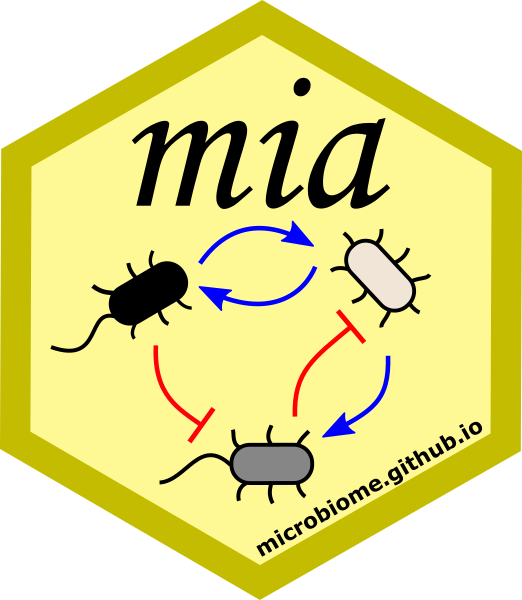

<!-- badges: start -->
📦 [Repo](https://github.com/js2264/OMA) [](https://github.com/js2264/OMA/actions/workflows/rworkflows.yml)   
📖 [Book](https://js2264.github.io/OMA/) [](https://github.com/js2264/OMA/actions/workflows/pages/pages-build-deployment)  
🐳 [Docker](https://github.com/js2264/OMA/pkgs/container/OMA) [](https://github.com/js2264/OMA/actions/workflows/biocbook.yml)  
<!-- badges: end -->

**README from [microbiome/OMA](https://github.com/microbiome/OMA)**

# Orchestrating Microbiome Analysis Book 

## Overview

This is a reference cookbook for performing **Microbiome Analysis** with 
Bioconductor in R. This is a book based on Quarto and **`BiocBook`** 
(https://www.bioconductor.org/packages/release/bioc/html/BiocBook.html).

## Deployment

The book is automatically built and deployed from the `devel` branch to 
the `gh-pages` branch using GitHub Actions.

You can also preview it locally after _cloning_ this Github
repository. This is useful for instance if you like to suggest
improvements in the material. You can use this to test the build
before making a pull request to add your new changes in the official
release.

Building and viewing the book locally involves the following steps:

1. Install the necessary dependencies to build to book, if necessary:

```
BiocManager::install(remotes::local_package_deps(dependencies=TRUE))
devtools::install('.')
```

2. Render and view the book:

```
BiocBook::preview(BiocBook::BiocBook('.'))
```

### Nix

Nix is a programming language and a package manager that allows building
(relatively) isolated project-specific environments with all R and system
dependencies necessary to run the project. It is not necessary to have
R or any R package installed on the system to build the OMA book with Nix.

#### How?

1. Nix supports all Linux distributions, macOS and Windows via [WSL2](https://learn.microsoft.com/en-us/windows/wsl/install)
2. It is recommended for beginners to install Nix with [Determinate Systems installer](https://github.com/DeterminateSystems/nix-installer)
3. Before you proceed with piping the script into the
shell, examine the script's [code](https://install.determinate.systems/nix)
4. Run `nix --version` in the terminal to check if `nix` was installed
5. This repository contains the `default.nix` file, which is written in Nix language and declares the dependencies for the OMA book
6. Run `nix-shell` in the directory with `default.nix`. The installation of will begin
7. After the installation, you will be dropped into the `nix` shell, where you can open R, even if you do not have it installed on the system
8. Run `R`, and then `BiocBook::preview(BiocBook::BiocBook('.'))`. The compilation of the book will begin

#### Troubleshooting

1. If your system does not have a writable `/usr` directory
(for example, one of Fedora Atomic Desktops [distributions](https://fedoraproject.org/atomic-desktops/)), and you ran `install.packages()` at any point, it is possible that R will attempt 
to install packages to the `R` directory in the home
directory. `nix-shell` will prioritize package version installed there,
which
will break full reproducibility. The solution is to delete the
`R` directory,
and use R from the `nix` shell
2. The current `nixpkgs` repository for `nix` packages
uses a [fork](https://github.com/rstats-on-nix/nixpkgs)
instead of the [official repository](https://github.com/NixOS/nixpkgs).
It is because the official repository is not fast
enough to update all the dependencies required to build R
packages. Thus, the building process might fail.
The current file uses the fork, but you can change
it to the official repository. If it fails, switch back to the fork

## Development and Contributions

To contribute reports, follow the Git flow procedure (you can see instructions
to [getting started with Github](https://docs.github.com/en/get-started)):

1. Fork the project
2. Clone your fork
3. Modify the material
4. Check locally that the changes render successfully (see above)
5. Add and commit the changes to your fork
6. Create a pull request (PR) from your fork back to the original repo
7. Fix and discuss issues in the review process

You can set OMA `devel` branch as your _upstream_ branch and pull the
changes from that before making new Pull Requests (see below). This way you can
make sure that your local version is in sync with the latest full
release.

### Setting upstream

After you forked OMA, you have two repositories to care about:

- **origin:** your own Github fork of OMA, under your github account
- **upstream:** [`devel` branch of OMA](https://github.com/microbiome/OMA/)

The origin you have after you cloned your own fork.

The upstream you can set on command line as follows, for instance (and
you can educate yourself more through various online resources on
using Git/hub):


```
git remote add upstream git@github.com:microbiome/OMA.git
```


Pull changes from the _origin_ and _upstream_ to your local version:

```
git fetch --all
git merge origin/devel
git merge upstream/devel
```


Sync your local version with the _origin_ and _upstream_:

```
git add . 
git commit -am "my changes"
```


Push your changes to origin:

```
git push origin devel
```


After this you can open a PR from origin to the [official devel branch](https://github.com/microbiome/OMA/) in Github.


### Adding new sections

Please note that chapters should be independent of each other.

- Create the relevant `.qmd` file; follow the numbering logic.
- Add it also to the list in file [inst/assets/_book.yml](inst/assets/_book.yml). 
- **Add any new dependency you uese to the [DESCRIPTION](DESCRIPTION) file**.

# Code of conduct

Please note that the OMA project is released with a [Contributor Code of Conduct](https://contributor-covenant.org/version/2/0/CODE_OF_CONDUCT.html).
By contributing to this project, you agree to abide by its terms.


