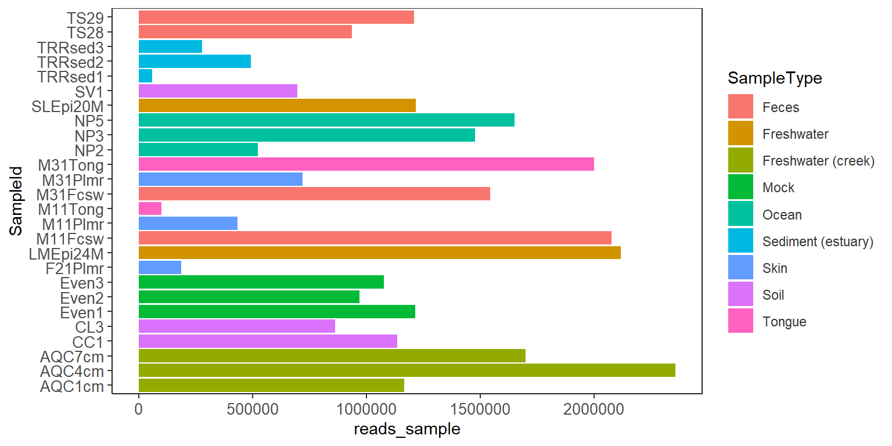
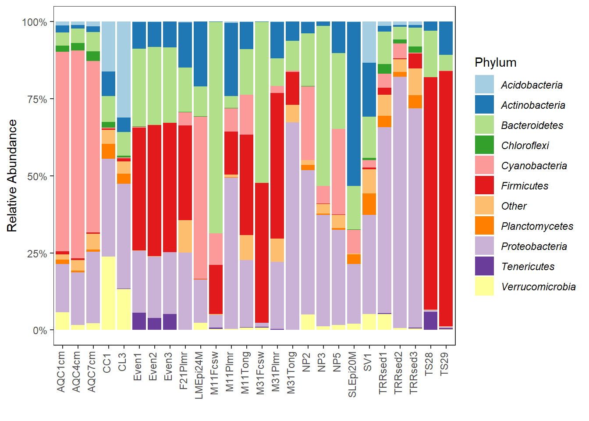

# Data Operations  

## Common terminologies  

The `mia` package uses classes defined by [`TreeSummarizedExperiment`](https://www.bioconductor.org/packages/release/bioc/html/TreeSummarizedExperiment.html), [`MicrobiomeExperiment`](https://github.com/FelixErnst/MicrobiomeExperiment) and in general [`SummarizedExperiment`](https://bioconductor.org/packages/release/bioc/html/SummarizedExperiment.html).  

`assays`     : Similar to `otu_table` in `phyloseq`. An `SummarizedExperiment` object 
               can hold multiple assays, raw counts, transformed counts. See also 
               [`MultiAssayExperiment`](https://bioconductor.org/packages/release/bioc/html/MultiAssayExperiment.html)   
`rowData`    : Slot similar to `tax_table` in `phyloseq`   
`colData`    : Slot similar to `sample_data` in `phyloseq`  
`rowTree`    : Slot for phylogenetic tree. Similar to `phy_tree` in `phyloseq`  
`FeatureIDs` : These are row names in `assays` and `rowData`. Synonymous to OTU/ASV ids.  
`SampleIDs`  : These are column names in `assays` and row names in `colData`.   


## Retrieving data elements  

Extract specific elements from `TreeSummarizedExperiment` and `MicrobiomeExperiment` object.    


```r
library(mia)
```

```
## Warning: multiple methods tables found for 'agglomerateByRank'
```

```r
library(dplyr)
library(ggplot2)
library(tibble)
```

Example data  

```r
data(GlobalPatterns, package = "MicrobiomeExperiment")
me <- GlobalPatterns 
```

Create a relative abundance assay

```r
me <- relAbundanceCounts(GlobalPatterns)
me
```

```
## class: TreeSummarizedExperiment 
## dim: 19216 26 
## metadata(0):
## assays(2): counts relabundance
## rownames(19216): 549322 522457 ... 200359 271582
## rowData names(7): Kingdom Phylum ... Genus Species
## colnames(26): CL3 CC1 ... Even2 Even3
## colData names(7): X.SampleID Primer ... SampleType Description
## reducedDimNames(0):
## altExpNames(0):
## rowLinks: a LinkDataFrame (19216 rows)
## rowTree: a phylo (19216 leaves)
## colLinks: NULL
## colTree: NULL
```

Above there are now two `assays` 1] counts 2] relabundance

## Extract specific elements  

### Assays  
Assay slots hold the counts and transformed data for `FeatureIDs`

```r
me_counts <- assay(me, "counts")
me_counts[1:5,1:7]
```

```
##        CL3 CC1 SV1 M31Fcsw M11Fcsw M31Plmr M11Plmr
## 549322   0   0   0       0       0       0       0
## 522457   0   0   0       0       0       0       0
## 951      0   0   0       0       0       0       1
## 244423   0   0   0       0       0       0       0
## 586076   0   0   0       0       0       0       0
```
Extract relative abundance data.  

```r
me_reab <- assay(me, "relabundance")
me_reab[1:5,1:7]
```

```
##        CL3 CC1 SV1 M31Fcsw M11Fcsw M31Plmr     M11Plmr
## 549322   0   0   0       0       0       0 0.00000e+00
## 522457   0   0   0       0       0       0 0.00000e+00
## 951      0   0   0       0       0       0 2.30471e-06
## 244423   0   0   0       0       0       0 0.00000e+00
## 586076   0   0   0       0       0       0 0.00000e+00
```

### colData  
Get colData as a data.frame.   

```r
me_sample_data <- colData(me) %>% 
    as.data.frame()
# show select row and columns
me_sample_data[1:5,1:5]
```

```
##         X.SampleID  Primer Final_Barcode Barcode_truncated_plus_T
## CL3            CL3 ILBC_01        AACGCA                   TGCGTT
## CC1            CC1 ILBC_02        AACTCG                   CGAGTT
## SV1            SV1 ILBC_03        AACTGT                   ACAGTT
## M31Fcsw    M31Fcsw ILBC_04        AAGAGA                   TCTCTT
## M11Fcsw    M11Fcsw ILBC_05        AAGCTG                   CAGCTT
##         Barcode_full_length
## CL3             CTAGCGTGCGT
## CC1             CATCGACGAGT
## SV1             GTACGCACAGT
## M31Fcsw         TCGACATCTCT
## M11Fcsw         CGACTGCAGCT
```


### rowData  
Get rowData as a data.frame  

```r
me_row_data <- rowData(me) %>% 
    as.data.frame()
# show select row and columns
me_row_data[1:5,1:5]
```

```
##        Kingdom        Phylum        Class        Order        Family
## 549322 Archaea Crenarchaeota Thermoprotei         <NA>          <NA>
## 522457 Archaea Crenarchaeota Thermoprotei         <NA>          <NA>
## 951    Archaea Crenarchaeota Thermoprotei Sulfolobales Sulfolobaceae
## 244423 Archaea Crenarchaeota        Sd-NA         <NA>          <NA>
## 586076 Archaea Crenarchaeota        Sd-NA         <NA>          <NA>
```


### rowTree  
Get rowTree     

```r
me_row_tree <- rowTree(me) 
me_row_tree
```

```
## 
## Phylogenetic tree with 19216 tips and 19215 internal nodes.
## 
## Tip labels:
##   549322, 522457, 951, 244423, 586076, 246140, ...
## Node labels:
##   , 0.858.4, 1.000.154, 0.764.3, 0.995.2, 1.000.2, ...
## 
## Rooted; includes branch lengths.
```
Check link between rownames (OTU/ASV ids)

```r
# extract the linkData
# on rows
rowL <- rowLinks(x = me)
```

## Library size   

Get total counts/sample  


```r
reads_sample <- colSums(assay(me, "counts")) 
# add it to colData
colData(me)$reads_sample <- reads_sample
```

Visualize library size 

```r
me_sample_data <- colData(me) %>% 
    as.data.frame() %>% 
    rownames_to_column("SampleId")

ggplot(me_sample_data, aes(reads_sample, SampleId)) +
    geom_col(aes(fill=SampleType)) +
    theme_bw() + # prettify plot
    theme(axis.text = element_text(size = 10), 
          axis.line.x = element_line(color = "#242424"), 
          axis.line.y = element_line(color = "#242424"), 
          panel.grid.major = element_blank(), panel.grid.minor = element_blank(), 
          panel.border = element_rect(colour = "#242424"), 
          legend.key = element_blank(), legend.text = element_text(color = "#353535"), 
          legend.background = element_rect(colour = NA, fill = NA))
```


  
## Agglomerate  

Agglomerate at a specific taxonomic rank. If multiple assays (counts and relabundance) exists, both will be agglomerated.  

```r
me_fam <- agglomerateByRank(me, rank = "Family",
                        agglomerateTree = TRUE)

print(me_fam)
```

```
## class: TreeSummarizedExperiment 
## dim: 603 26 
## metadata(0):
## assays(2): counts relabundance
## rownames(603): Class::Thermoprotei Family::Sulfolobaceae ...
##   Family::Thermodesulfobiaceae Phylum::SR1
## rowData names(7): Kingdom Phylum ... Genus Species
## colnames(26): CL3 CC1 ... Even2 Even3
## colData names(8): X.SampleID Primer ... Description reads_sample
## reducedDimNames(0):
## altExpNames(0):
## rowLinks: a LinkDataFrame (603 rows)
## rowTree: a phylo (603 leaves)
## colLinks: NULL
## colTree: NULL
```


```r
me_fam_reab <- assay(me_fam, "relabundance")
me_fam_reab[1:5,1:7]
```

```
##                                CL3          CC1 SV1 M31Fcsw M11Fcsw M31Plmr
## Class::Thermoprotei   0.0000000000 0.000000e+00   0       0       0       0
## Family::Sulfolobaceae 0.0000000000 0.000000e+00   0       0       0       0
## Class::Sd-NA          0.0000000000 0.000000e+00   0       0       0       0
## Order::NRP-J          0.0001990563 2.069651e-04   0       0       0       0
## Family::SAGMA-X       0.0000000000 6.164919e-06   0       0       0       0
##                            M11Plmr
## Class::Thermoprotei   0.000000e+00
## Family::Sulfolobaceae 2.304710e-06
## Class::Sd-NA          0.000000e+00
## Order::NRP-J          6.914131e-06
## Family::SAGMA-X       0.000000e+00
```
  

```r
me_fam_reab <- assay(me_fam, "counts")
me_fam_reab[1:5,1:7]
```

```
##                       CL3 CC1 SV1 M31Fcsw M11Fcsw M31Plmr M11Plmr
## Class::Thermoprotei     0   0   0       0       0       0       0
## Family::Sulfolobaceae   0   0   0       0       0       0       1
## Class::Sd-NA            0   0   0       0       0       0       0
## Order::NRP-J          172 235   0       0       0       0       3
## Family::SAGMA-X         0   7   0       0       0       0       0
```

These data can also be kept in 


```r
altExp(me, "family") <- me_fam
```
`altExpNames` now consists of `family` level data. This can be extended to use any level present in Kingdom, Phylum, Class, Order, Family, Genus, Species  

## Get unique  
Get which Phyla are present.  

```r
head(unique(rowData(me)[,"Phylum"]))
```

```
## [1] "Crenarchaeota"  "Euryarchaeota"  "Actinobacteria" "Spirochaetes"  
## [5] "MVP-15"         "Proteobacteria"
```
## Pick specific  
Retrieving of specific elements are required for specific analysis. For instance, extracting abundances for a specific taxa in all samples or all taxa in one sample.  

### Abundances of all taxa in specific sample 

```r
#Note: getAbundanceSample()
taxa.abundances.cc1 <- assay(me)[, "CC1"]
taxa.abundances.cc1[1:10]
```

```
## 549322 522457    951 244423 586076 246140 143239 244960 255340 144887 
##      0      0      0      0      0      0      1      0    194      5
```

### Abundances of specific taxa in all samples   


```r
#Note: getAbundanceFeature()
taxa.abundances <- assay(me)["255340",]
taxa.abundances[1:10]
```

```
##     CL3     CC1     SV1 M31Fcsw M11Fcsw M31Plmr M11Plmr F21Plmr M31Tong M11Tong 
##     153     194       0       0       0       0       0       0       0       0
```

## Join  

Joining otu/asv table and taxonomy in one data frame


```r
me_reab <- assay(me, "relabundance") %>% 
    as.data.frame() %>% 
    rownames_to_column("FeatureID")

me_joined <- rowData(me) %>% 
    as.data.frame() %>% 
    rownames_to_column("FeatureID") %>% 
    left_join(me_reab) 
```

```
## Joining, by = "FeatureID"
```

```r
head(me_joined)
```

```
##   FeatureID Kingdom        Phylum        Class        Order        Family
## 1    549322 Archaea Crenarchaeota Thermoprotei         <NA>          <NA>
## 2    522457 Archaea Crenarchaeota Thermoprotei         <NA>          <NA>
## 3       951 Archaea Crenarchaeota Thermoprotei Sulfolobales Sulfolobaceae
## 4    244423 Archaea Crenarchaeota        Sd-NA         <NA>          <NA>
## 5    586076 Archaea Crenarchaeota        Sd-NA         <NA>          <NA>
## 6    246140 Archaea Crenarchaeota        Sd-NA         <NA>          <NA>
##        Genus                  Species CL3 CC1 SV1 M31Fcsw M11Fcsw M31Plmr
## 1       <NA>                     <NA>   0   0   0       0       0       0
## 2       <NA>                     <NA>   0   0   0       0       0       0
## 3 Sulfolobus Sulfolobusacidocaldarius   0   0   0       0       0       0
## 4       <NA>                     <NA>   0   0   0       0       0       0
## 5       <NA>                     <NA>   0   0   0       0       0       0
## 6       <NA>                     <NA>   0   0   0       0       0       0
##       M11Plmr F21Plmr M31Tong M11Tong LMEpi24M     SLEpi20M       AQC1cm
## 1 0.00000e+00       0       0       0        0 8.214821e-07 2.312143e-05
## 2 0.00000e+00       0       0       0        0 0.000000e+00 0.000000e+00
## 3 2.30471e-06       0       0       0        0 0.000000e+00 0.000000e+00
## 4 0.00000e+00       0       0       0        0 0.000000e+00 0.000000e+00
## 5 0.00000e+00       0       0       0        0 0.000000e+00 0.000000e+00
## 6 0.00000e+00       0       0       0        0 0.000000e+00 0.000000e+00
##         AQC4cm       AQC7cm          NP2 NP3 NP5 TRRsed1 TRRsed2 TRRsed3 TS28
## 1 4.242356e-05 7.650240e-05 1.909731e-06   0   0       0       0       0    0
## 2 8.484711e-07 3.530880e-06 0.000000e+00   0   0       0       0       0    0
## 3 0.000000e+00 0.000000e+00 0.000000e+00   0   0       0       0       0    0
## 4 9.333182e-06 1.706592e-05 0.000000e+00   0   0       0       0       0    0
## 5 8.484711e-07 5.884800e-07 0.000000e+00   0   0       0       0       0    0
## 6 4.242356e-07 1.765440e-06 0.000000e+00   0   0       0       0       0    0
##   TS29 Even1 Even2 Even3
## 1    0     0     0     0
## 2    0     0     0     0
## 3    0     0     0     0
## 4    0     0     0     0
## 5    0     0     0     0
## 6    0     0     0     0
```

## Barplot  
As example we first `agglomerateByRank` to phylum level.  

```r
me_phy <- agglomerateByRank(me, rank = "Phylum",
                        agglomerateTree = TRUE)
```

### Top taxa  
Define a function to get top taxa.  

```r
topTaxa <- function(x, method=c("sum","mean","median"), top=5){
    taxs <- NULL
    if(method=="sum"){
        taxs <- sort(rowSums(assay(x)),decreasing = TRUE)[1:top]
    } else if (method=="mean"){
        taxs <- sort(rowMeans(assay(x)),decreasing = TRUE)[1:top]
    } else if (method=="median") {
        taxs <- rowMedians(assay(x))
        names(taxs) <- rownames(assay(x))
        taxs <- sort(taxs,decreasing = TRUE)[1:top]
    }
    return(names(taxs))
}
```

Get top 10 taxa  

```r
top_phy <- topTaxa(me_phy, method="median", top=10)
top_phy
```

```
##  [1] "Phylum::Proteobacteria"  "Phylum::Bacteroidetes"  
##  [3] "Phylum::Actinobacteria"  "Phylum::Cyanobacteria"  
##  [5] "Phylum::Firmicutes"      "Phylum::Verrucomicrobia"
##  [7] "Phylum::Planctomycetes"  "Phylum::Acidobacteria"  
##  [9] "Phylum::Chloroflexi"     "Phylum::Tenericutes"
```

### Convert to long data.frame  


```r
molten_se <- meltAssay(me_phy,
  add_row_data = TRUE,
  add_col_data = TRUE,
  abund_values = "relabundance"
)
```


### Barplot visualization    

A barplot of composition for top 10 phyla  


```r
# Chage all not in top_phy to "Other" category
molten_se <- molten_se %>% 
    mutate(TaxVar= ifelse(FeatureID %in% top_phy, Phylum, "Other"))

p <- ggplot(molten_se, aes_string(x="SampleID", y="relabundance", fill="TaxVar")) +
    geom_bar(position="stack", stat="identity") +
    scale_x_discrete() + 
    labs(y = "Relative Abundance",x="") + 
    theme_bw() +
    theme(axis.text.x=element_text(angle=90, 
                                   hjust=0.95,
                                   vjust=0.2),
          panel.grid = element_blank(),
          legend.text = element_text(face="italic")) +
    scale_fill_brewer("Phylum",palette = "Paired") # this can be argument (fill.colors= "Paired") or something similar
p + scale_y_continuous(labels = scales::percent) # this can be optional (relative==TRUE) or something similar
```




