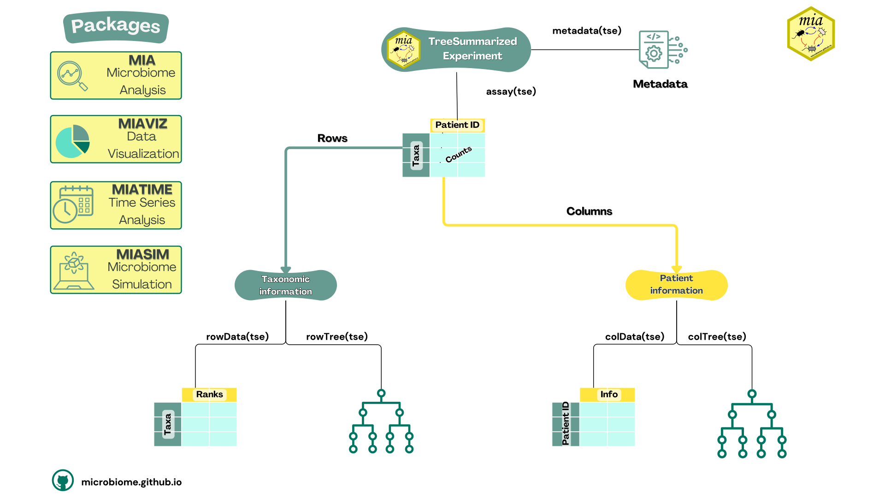

## Introductory

**Version:** 2.0

```{r}
#| label: setup
#| echo: FALSE
#| results: "asis"
library(rebook)
chapterPreamble()
```

<div id="workflow">

::: {#translate}
<a href="introductory_workflow_french_version.qmd"> **French** </a> <a href="introductory_workflow_dutch_version.qmd"> **Dutch** </a>
:::


## Introduction

Hello and welcome to a complete workflow using the latest R/Bioconductor tools
for microbiome data science. In this tutorial, we’ll walk you through some
basic steps of a microbiome analysis using _miaverse_. These steps are
applicable to almost any of your projects and will help you understand the
fundamental concepts that will skyrocket 🚀 your future microbiome analyses.

In this workflow, we cover:

    - Data wrangling and transformations
    - Basic exploration
    - Alpha diversity analysis
    - Beta diversity analysis

## Load packages

Let's start by loading the necessary packages. The following script ensures
that all required packages are loaded and installed if they aren’t already.

```{r}
#| label: install
#| output: FALSE
# List of packages that we need
packages <- c(
    "dplyr", "ggplot2", "mia",  "miaViz", "scater"
    )

# Get packages that are already installed installed
packages_already_installed <- packages[ packages %in% installed.packages() ]

# Get packages that need to be installed
packages_need_to_install <- setdiff( packages, packages_already_installed )

# Loads BiocManager into the session. Install it if it not already installed.
if( !require("BiocManager") ){
    install.packages("BiocManager")
    library("BiocManager")
}

# If there are packages that need to be installed, installs them with BiocManager
# Updates old packages.
if( length(packages_need_to_install) > 0 ) {
   install(packages_need_to_install, ask = FALSE)
}

# Load all packages into session. Stop if there are packages that were not
# successfully loaded
pkgs_not_loaded <- !sapply(packages, require, character.only = TRUE)
pkgs_not_loaded <- names(pkgs_not_loaded)[ pkgs_not_loaded ]
if( length(pkgs_not_loaded) > 0 ){
    stop(
        "Error in loading the following packages into the session: '",
        paste0(pkgs_not_loaded, collapse = "', '"), "'")
}
```

## Importing data

Depending on the bioinformatics tools used in the upstream part of the
workflow, the data format may vary slightly. We cover the most widely used
formats, with importers available for convenience. You can also build a
`TreeSummarizedExperiment` (`TreeSE`) from scratch using basic text files. For more
information, see @sec-loading-experimental-microbiome-data.

For this demonstration, you can either use your own data or one of the
built-in datasets provided by mia, which you can find here: @sec-example-data.

In this tutorial, we'll be using the @Tengeler2020 dataset. This dataset was
created by A.C. Tengeler to explore the impact of altered microbiomes on brain
structure 🧠, specifically comparing patients with ADHD
(Attention Deficit Hyperactivity Disorder) to controls. Here's how we can
load the data into our R environment 💻:

```{r}
#| label: loadDataset
data("Tengeler2020", package = "mia")
tse <- Tengeler2020
```

<hr>

## Subsetting and accession

`TreeSE` object is the type of object used within
the miaverse framework to store your data.
It's a versatile and multi-purpose data container that allows for an efficient way
to store and access data.

### Subsetting

In many cases, you may need to work with only a portion of your original
`TreeSE` for various reasons. Subsetting the object is as straightforward as
working with a basic matrix in R; the object includes rows and columns.

For example, using the Tengeler2020 dataset, we can focus on a specific cohort.
Here's how:

```{r}
#| label: subsetBySample
dim(tse)
# Subset based on sample metadata
tse <- tse[ , tse$cohort == "Cohort_2" ]
dim(tse)
```

This will create a `TreeSE` object only containing
samples of the second cohort. You can find more information on subsetting from
here [@sec-rows-and-cols].

### Accessing data

Here's a quick reminder on how to access certain types of data:

You can access the abundance table, or assays, as follows. In this example,
we specify that we want to fetch an abundance table named "counts". For more
details, see [@sec-assay-slot].

```{r}
#| label: showAssay
assay(tse, "counts") |> head()
```

Sample (or column) metadata is stored in `colData`. In this example, it includes
the diagnosis of the patient from whom the sample was drawn
(see for more info on `colData` [@sec-add-or-modify-data]).

```{r}
#| label: showColdata

colData(tse)
```

`rowData` contains data on feature characteristics,
particularly taxonomic information (see [@sec-rowData]).

```{r}
#| warning: FALSE
#| label: showRowdata
rd <- rowData(tse)
rd
```

Here `rowData(tse)` returns a DataFrame with 151 rows and 7 columns. Each
row represents an organism and each column a taxonomic level.

To recap the structures of commonly used data containers, see the dedicated
chapter [@sec-containers]. Also, please take a look at
figure below.

{.lightbox .contentimg}

<hr>

## Data wrangling

### Agglomerating data

To further push your data analysis and focus on its distribution at a
specific taxonomic rank, it can be beneficial to agglomerate your data to
that particular level. The `agglomerateByRank()` function simplifies this process,
enabling more streamlined and effective analyses. Here’s an example:

```{r}
#| label: agglomerating-data
tse_phylum <- agglomerateByRank(tse, rank = "Phylum")

# Check
tse_phylum
```

Great! Now, our data is confined to the taxonomic information up to the Phylum
level, allowing the analysis to be focused on this specific rank. Although we
won't use the agglomerated data in the rest of the workflow, all the code below
can also be applied to it.

### Transformation

The [`mia` package](https://microbiome.github.io/mia/)
provides an easy way to calculate the relative abundances for our `TreeSE`
using the `transformAssay()` method.

```{r}
#| label: calculateRelabundance
tse <- transformAssay(tse, method = "relabundance")
tse_phylum <- transformAssay(tse_phylum, method = "relabundance")
```

This function takes the original counts assay and calculates the relative
abundances, storing the newly computed matrix back into the TreeSE. You can
access it in the assays of the TreeSE by specifying the name of the relative
abundance assay (e.g., "relabundance"):

```{r}
#| label: showRelabundance
assay(tse, "relabundance") |> head()
```

For more information on the capabilities and transformation options of 
`mia::transformAssay()`, see [@sec-assay-transform].

## Community composition

A common way to summarize composition is to use a bar plot to display relative
abundances. See [@sec-microbiome-community] for more details on composition
summaries. This approach visualizes the relative abundances of selected taxa
in each sample, providing a quick overview of common compositions and major
changes across samples. Here, we choose to plot all the phyla found in the
samples.

```{r}
#| label: composition_plot

p <- plotAbundance(tse_phylum, assay.type = "relabundance")
p
```

As we can see, _Bacteroidetes_ is a common phylum in all samples. When its
abundance drops below 50%, _Firmicutes_ notably increases to fill the space.

## Community diversity

Community diversity measures in microbiology can be categorized into three groups:

    - Richness: The total number of taxa.
    - Equitability: How evenly the abundances of taxa are distributed.
    - Diversity: A combination of taxa richness and equitability.

Diversity may be altered in association with specific phenotypes.
Below, we calculate Faith's phylogenetic diversity index. What sets this index
apart is its incorporation of phylogeny into the diversity calculation. For
more information on diversity, see [@sec-community-diversity].

```{r}
#| label: calculateRichness

# Estimate faith index
tse <- addAlpha(tse, index = "faith")
```

Thr results are stored to `colData`. The calculated index shows how diverse
each sample is in terms of the number of different microbes present. We can
then create a graph to visualize this.

```{r}
#| label: plotColdata
p <- plotColData(tse, x = "patient_status", y = "faith")
p <- p + labs(title = "Faith plot")
p
```

The graph shows that there is no significant difference in microbial diversity
between the ADHD and control groups.

<hr>

## Community similarity

Community similarity describes how similar the microbial compositions and
abundances are across different samples. By examining these similarities,
we can understand how closely related different samples are and identify key
patterns or differences. For more detailed information on community similarity,
see [@sec-community-similarity].

We can perform Principal Coordinate Analysis (PCoA) using the `scater::runMDS()`
function. PCoA reduces the complexity of high-dimensional data by projecting
it into a lower-dimensional space, while trying to keep the distances between
samples as accurate as possible. The results are called principal coordinates.

```{r}
#| label: calculateBrayCurtis
#| output: false

# Run PCoA
tse <- runMDS(
    tse,
    FUN = getDissimilarity,
    tree = rowTree(tse),
    method = "unifrac",
    assay.type = "counts",
    niter = 100
    )
```

In order to visualize this newly generated projection, we can apply
`scater::plotReducedDim()`.

```{r}
#| label: showPCoA
# Create a ggplot object
p <- plotReducedDim(
    tse, "MDS",
    colour_by = "patient_status",
    point_size = 3
    )
p
```

The plot shows that the data clusters into three groups, with two of them
consisting solely of one diagnosis or another. This suggests that the microbial
profiles differ between ADHD patients and controls.

To further explore the factors driving these differences in microbial profiles,
we can perform a differential abundance analysis, for instance
(see [@sec-differential-abundance]).

<hr>

</div>
