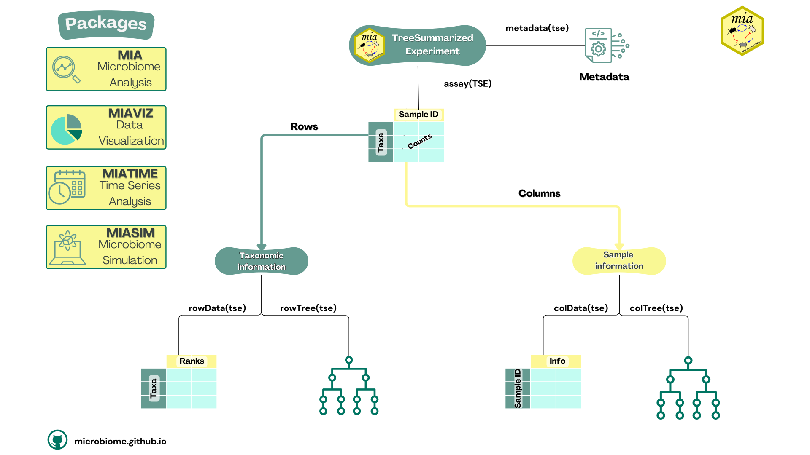

## Introductory (French)

```{r}
#| label: setup
#| echo: FALSE
#| results: "asis"
library(rebook)
chapterPreamble()
```

<div id="workflow">

<div id="translate">
  <a href="Introductory-workflow.html"> **English** </a>
  <a href="Introductory-workflow-dutch-version.html"> **Dutch** </a>
</div>


## Introduction

Bonjour et bienvenue dans un workflow complet utilisant les derniers outils
R/Bioconductor pour la science des données du microbiome. Dans ce tutoriel,
nous vous guiderons à travers quelques étapes de base d'une étude d'analyse
de composition utilisant OMA. Celles-ci seront applicables à presque tous vos
projets et vous aideront à comprendre les concepts fondamentaux qui
propulseront 🚀 vos futures analyses du microbiome.

## Importation des données

Lors de l'utilisation de packages pour le microbiome, il existe de
nombreuses façons différentes d'importer vos données. Commençons par charger
les packages requis:

```{r}
#| label: install
#| output: FALSE
# List of packages that we need
packages <- c(
    "ggplot2", "knitr", "mia", "dplyr", "miaViz", "vegan", "DT",
    "scater", "patchwork", "sechm", "plotly"
    )

# Get packages that are already installed installed
packages_already_installed <- packages[ packages %in% installed.packages() ]

# Get packages that need to be installed
packages_need_to_install <- setdiff( packages, packages_already_installed )

# Loads BiocManager into the session. Install it if it not already installed.
if( !require("BiocManager") ){
    install.packages("BiocManager")
    library("BiocManager")
}

# If there are packages that need to be installed, installs them with BiocManager
# Updates old packages.
if( length(packages_need_to_install) > 0 ) {
   install(packages_need_to_install, ask = FALSE)
}

# Load all packages into session. Stop if there are packages that were not
# successfully loaded
pkgs_not_loaded <- !sapply(packages, require, character.only = TRUE)
pkgs_not_loaded <- names(pkgs_not_loaded)[ pkgs_not_loaded ]
if( length(pkgs_not_loaded) > 0 ){
    stop(
        "Error in loading the following packages into the session: '",
        paste0(pkgs_not_loaded, collapse = "', '"), "'")
}
```

Vous pouvez choisir d'utiliser vos propres données ou l'un des ensembles
de données intégrés fournis par mia que vous trouverez ici @sec-example-data:

Dans ce tutoriel, nous utiliserons l'ensemble de données @Tengeler2020. Cet
ensemble de données a été créé par A.C. Tengeler pour essayer de démontrer
l'impact des microbiomes altérés sur la structure du cerveau. Voici comment
nous pouvons charger les données dans notre environnement R :

```{r}
#| label: loadDataset
data("Tengeler2020", package="mia")
tse <- Tengeler2020
```

Bien sûr, il existe d'autres moyens d'importer vos données en utilisant le
[**package mia**](https://microbiome.github.io/mia/). Ceux-ci incluent :
utiliser **vos propres données** ([@sec-import-from-file]) ou convertir un
objet existant en un objet *TreeSummarizedExperiment* comme indiqué
dans **cette section** : [@sec-conversions-between-data-formats-in-r].

<hr>

## Stockage des données du microbiome

*TreeSummarizedExperiment* ou objet TreeSE est le type d'objet utilisé dans
le [**package mia**](https://microbiome.github.io/mia/) pour stocker vos
données. C'est un type de données polyvalent et multi-usages qui permet de
stocker et d'accéder aux données de manière efficace.

Voici un rappel rapide sur la façon d'accéder à certains types de données :

Vous pouvez accéder aux assays  **assays** ([@sec-assay-slot]) de cette
manière :

```{r}
#| label: showAssay
assay(tse)[1:5,1:10] 
```

Alors que **colData** ([@sec-add-or-modify-data]) est accessible via :

```{r}
#| label: showColdata
# Transform the colData to a dataframe
tse_df_colData <- as.data.frame(colData(tse))

# Show as an interactive table
datatable(tse_df_colData,options = list(pageLength = 5),rownames = FALSE)
```

**rowData** ([@sec-rowData]) contient des données sur les caractéristiques
des échantillons, notamment des informations taxonomiques.

```{r}
#| warning: FALSE
#| label: showRowdata
tse_df_rowData <- as.data.frame(rowData(tse))
datatable(tse_df_rowData, options = list(pageLength = 5))
```

Ici `rowData(tse)` renvoie un DataFrame avec 151 lignes et 7 colonnes. Chaque
ligne représente un organisme et chaque colonne un niveau taxonomique.

Pour illustrer la structure d'un *TreeSummarizedExperiment*, voici un
article de @Huang2021 qui utilise ce type d'objet. De plus, veuillez consulter
la figure 1 ci-dessous.

{.lightbox .contentimg}

<hr>

## Manipulation des données

Dans certains cas, vous devrez peut-être modifier vos données pour obtenir
les résultats souhaités. Dans cette section, nous verrons comment agglomérer
les données, les sous-ensembles et plus encore. Un TreeSummarizedExperiment
permet une manipulation astucieuse des données en utilisant
le [**package dplyr**](https://dplyr.tidyverse.org/).

### Sous-ensembles

Dans certains cas, vous n'aurez peut-être besoin d'utiliser qu'une partie de
votre *TreeSummarizedExperiment* d'origine.

En utilisant l'ensemble de données Tengeler2020, nous pouvons nous concentrer
sur une certaine cohorte par exemple. Cela est assez simple :

```{r}
#| label: subsetBySample
tse_subset_by_sample <- tse[ , tse$cohort =="Cohort_1"]
```

Cela créera un objet *TreeSummarizedExperiment* ne contenant que les
échantillons de la première cohorte.

### Agglomération des données

Pour pousser davantage votre analyse de données et vous concentrer sur sa
distribution à un rang taxonomique spécifique, il peut être bénéfique
d'agglomérer vos données à ce niveau particulier. La fonction
`agglomerateByRank` simplifie ce processus, permettant des analyses plus
fluides et efficaces. Voici un exemple :

```{r}
#| label: agglomerating-data
tse.agglomerated <- agglomerateByRank(tse, rank='Phylum')

# Check
datatable(
    data.frame(rowData(tse.agglomerated)),
    options = list(pageLength = 5),rownames = FALSE)
```

Génial ! Maintenant, nos données sont confinées aux informations taxonomiques
jusqu'au niveau du Phylum, permettant à l'analyse de se concentrer sur ce
rang spécifique. Dans le reste du workflow, nous n'utiliserons pas les
données agglomérées, mais tout le code ci-dessous peut être utilisé sur
celles-ci.

## Indicateurs

### Diversité de la communauté

La diversité de la communauté en microbiologie est mesurée par plusieurs
indices :
-   la richesse en espèces (nombre total d'espèces)
-   l'équitabilité (répartition des espèces au sein d'un microbiome)
-   la diversité (combinaison des deux)

Le **coefficient de @Hill** combine ces mesures en une seule équation.
Toutes ces variations sont appelées diversité alpha.

```{r}
#| label: calculateRichness

# Estimate (observed) richness
tse_alpha <- addAlpha(
    tse, 
    assay.type = "counts", 
    index = "observed", 
    name="observed")

# Check some of the first values in colData
head(tse_alpha$observed)
```

Le résultat montre les valeurs de richesse estimées pour différents
échantillons ou emplacements au sein de l'ensemble de données. Il donne une
idée de la diversité de chaque échantillon en termes de nombre d'espèces
différentes présentes. Nous pouvons ensuite créer un graphique pour
visualiser cela.

```{r}
#| label: plotColdata
plotColData(
    tse_alpha, 
    "observed", 
    "cohort", 
    colour_by = "patient_status") +
    
    theme(axis.text.x = element_text(angle=45,hjust=1)) + 
    labs(y=expression(Richness[Observed]))
```

Pour aller encore plus loin, nous pouvons également comparer l'indice de
Shannon estimé à la richesse observée. Shannon quantifie la diversité en
termes à la fois du nombre d'espèces différentes (richesse) et de
l'uniformité de leur répartition (abondance) et est calculé comme suit :

$$
H' = -\sum_{i=1}^{R} p_i \ln(p_i)
$$ p~i~ étant la proportion d'un certain microorganisme.

<hr>

D'abord, nous pouvons facilement calculer cette mesure et l'ajouter à
notre TreeSE.

```{r}
#| label: calculateDiversity
tse_alpha <- addAlpha(
    tse_alpha, 
    assay.type = "counts",
    index = c("shannon"), 
    name = c("shannon"))
```

Nous pouvons également comparer les deux mesures de diversité en produisant
les graphiques suivants.

```{r}
#| label: violinPlots

# Create the plots
plots <- lapply(
    c("observed", "shannon"),
    plotColData,
    object = tse_alpha,
    x = "patient_status",
    colour_by = "patient_status")

# Fine-tune visual appearance
plots <- lapply(plots, "+", 
    theme(
        axis.text.x = element_blank(),
        axis.title.x = element_blank(),
        axis.ticks.x = element_blank()))

# Plot the figures
(plots[[1]] | plots[[2]]) +
  plot_layout(guides = "collect")

```

Il est très important de faire toutes ces comparaisons afin de quantifier
la diversité et de comparer les échantillons dans nos données en utilisant
différentes mesures. - Vous pouvez trouver d'autres types de comparaisons
directement dans le livre @sec-community-diversity.

<hr>

### Similarité de la communauté

La similarité de la communauté fait référence à la manière dont les
microorganismes se ressemblent en termes de composition et d'abondance
des différents taxons microbiens. Cela peut nous aider à comprendre dans
quelle mesure différents échantillons se ressemblent et à trouver des
informations clés. Cependant, en analyse de microbiome, il est plus courant
de mesurer la dissimilarité/diversité bêta entre deux échantillons A et B en
utilisant la mesure de Bray-Curtis qui est définie comme suit :

$$
BC_{ij} = \frac{\sum_{k} |A_{k} - B_{k}|}{\sum_{k} (A_{k} + B_{k})}
$$

Heureusement pour nous, le [**package mia**](https://microbiome.github.io/mia/)
fournit un moyen facile de calculer l'abondance relative pour notre TreeSE en
utilisant la méthode transformAssay.

```{r}
#| label: calculateRelabundance
tse <- transformAssay(
    tse,
    assay.type = "counts",
    method = "relabundance")
```

Cela prendra l'assay des comptes d'origine et appliquera le calcul des
abondances relatives. Le résultat est une matrice avec les identifiants des
échantillons en lignes et les abondances relatives pour chaque taxon dans ces
échantillons en colonnes. Il peut être consulté dans les assays du tse :

```{r}
#| label: showRelabundance
assay(tse, "relabundance")[5:10,1:10]
```

Ensuite, nous pouvons ajouter la dissimilarité de Bray-Curtis :

```{r}
#| label: calculateBrayCurtis
#| output: false

# Run PCoA on relabundance assay with Bray-Curtis distances
tse <- runMDS(
    tse,
    FUN = vegdist,
    method = "bray",
    assay.type = "relabundance",
    name = "MDS_bray")
```

Dans notre cas, l'assay contient 151 lignes et 27 colonnes. Avoir autant de
colonnes et donc de dimensions peut être problématique pour visualiser la
dissimilarité.

Pour visualiser la dissimilarité entre les différents échantillons, nous
pouvons effectuer une analyse en coordonnées principales sur l'assay
nouvellement créé. Cela projette essentiellement les dimensions de Bray-Curtis
sur un espace inférieur tout en conservant autant de variation que possible,
les valeurs projetées étant appelées coordonnées principales. Vous pouvez en
lire plus sur @Multidimensional-scaling ici.

mia fournit certaines techniques de réduction de dimension, telles que dbRDA.
De plus, nous pouvons utiliser le package scater de Bioconductor et le
package vegan, créé par @R_vegan pour transformer la dissimilarité en distances
réelles pouvant être visualisées :

```{r}
#| label: showPCoA
# Create ggplot object
p <- plotReducedDim(tse, "MDS_bray",colour_by = "cohort")

# Convert to an interactive plot with ggplotly
ggplotly(p)
```

Cependant, les axes ne sont pas très informatifs et la quantité de variance
capturée par l'algorithme n'est nulle part indiquée. Nous pouvons ajuster le
graphique pour montrer plus d'informations comme suit :

```{r}
#| label: addVariancePCoA
# Calculate explained variance
e <- attr(reducedDim(tse, "MDS_bray"), "eig")
rel_eig <- e / sum(e[e > 0])

# Add explained variance for each axis on the plot
p <- p + labs(
    x = paste("PCoA 1 (", round(100 * rel_eig[[1]], 1), "%", ")", sep = ""),
    y = paste("PCoA 2 (", round(100 * rel_eig[[2]], 1), "%", ")", sep = ""))

# Reonvert to an interactive plot with ggplotly
ggplotly(p)
```

Et voilà ! Chaque axe montre la quantité de variance ou dans notre cas de
dissimilarité retenue par chaque coordonnée principale. Vous pouvez
également ajouter d'autres options pour colorier par une certaine
caractéristique par exemple. Vous pouvez en savoir plus dans
[@sec-community-similarity].

<hr>

## Visualisation des données

Les cartes de chaleurs sont l'un des moyens les plus polyvalents de
visualiser vos données. Dans cette section, nous verrons comment créer
une heatmap de base pour visualiser les caractéristiques les plus répandues
en utilisant la
[**bibliothèque sechm**](https://bioconductor.org/packages/release/bioc/html/sechm.html).
Pour une carte de chaleur plus détaillée, veuillez vous reporter
à **cette section** [@sec-cross-correlation].

Ensuite, nous allons créer un sous-ensemble de TreeSE pour les taxons les
plus répandus en utilisant une expérience alternative :

```{r}
#| label: most-prevalent
altExp(tse, "prevalence-subset") <- subsetByPrevalent(tse,prevalence=0.5)[1:5,]
```

Lors de la création de sous-ensembles avec cette fonction, l'objet
résultant ne contient plus les abondances relatives correctes car ces
abondances ont été calculées à l'origine sur la basees données complètes.
Par conséquent, il est essentiel de recalculer les abondances relatives pour
notre sous-ensemble :

```{r}
#| label: recalculate-relabundance
altExp(tse, "prevalence-subset") <- transformAssay(
    altExp(tse, "prevalence-subset"),
    assay.type = "counts",
    method = "relabundance")
```

Maintenant que nous avons préparé les données, nous pouvons utiliser la
bibliothèque sechm précédemment chargée pour visualiser la carte de chaleur :

```{r}
#| label: heatmap
# Sets the colors
setSechmOption("hmcols", value=c("#F0F0FF","#007562"))

# Plots the actual heatmap.
sechm(
    altExp(tse, "prevalence-subset"), features =
    rownames(rowData(altExp(tse, "prevalence-subset"))),
    assayName="relabundance",show_colnames=TRUE)
```

Sur la carte de chaleur ci-dessus, il est évident que les Parabacteroides
sont relativement fréquents dans certains échantillons, tandis que les
Akkermansia sont détectés très rarement.

</div>
