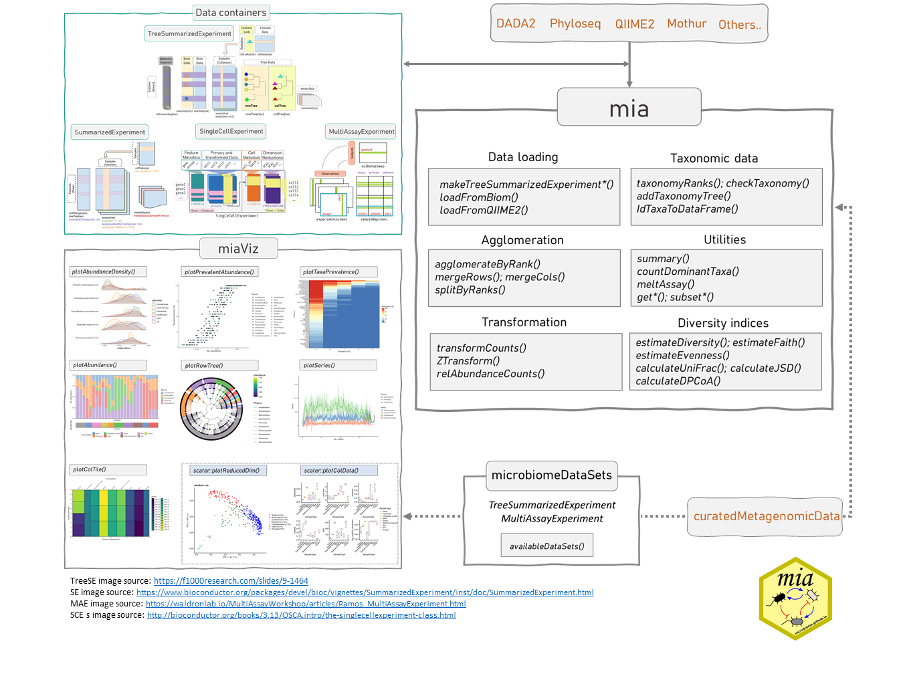

# miaverse {#sec-ecosystem}

```{r}
#| label: setup
#| echo: false
#| results: asis

library(rebook)
chapterPreamble()
```

This chapter provides an overview of the miaverse ecosystem.
[@sec-data-containers] aims to describe the relationship between data
containers utilized in `miaverse`. [@sec-packages] details the packages
involved, while [@sec-installation] provides guidance on installing
these packages.

[miaverse](https://microbiome.github.io/) (MIcrobiome Analysis uniVERSE)
is an actively developed
R/Bioconductor framework for microbiome downstream analysis. It becomes
particularly relevant when working with abundance tables derived from
sequencing data, whether from shotgun metagenomics or 16S rRNA
sequencing. Before utilizing miaverse, sequencing data must undergo
preprocessing to convert raw sequence reads into abundance tables.

`miaverse` consists of multiple R/Bioc packages and this online book
that you are reading. The idea is not only to offer tools for microbiome
downstream analysis but also to serve as a resource for valuable
insights, offering guidance on conducting microbiome data analysis and
developing effective microbiome data science workflows.

The key concept of miaverse lies in its utilization of
`r BiocStyle::Biocpkg("SummarizedExperiment")`-based data containers.
This design choice enhances interoperability and versatility within the broader
Bioconductor framework, facilitating access to an expanding array of
tools. In practice, this approach allows for the integration of
promising methods from related fields, such as single-cell sequencing.

{width="100%"}

## Data containers {#sec-data-containers}

As discussed, miaverse is built upon
`r BiocStyle::Biocpkg("TreeSummarizedExperiment")` (`TreeSE`) data container.
`TreeSE` is expanded from `r BiocStyle::Biocpkg("SingleCellExperiment")`
(`SCE`) by incorporating additional slots tailored for microbiome analysis.
The `SCE` class is designed for single-cell sequencing
[@R_SingleCellExperiment]. Bioconductor offers wide variety of tools for this
field including online book Orchestrating Single-Cell Analysis in Bioconductor
(OSCA) [@Amezquita2020]. `SCE`, on the other hand, is further derived from
the `r BiocStyle::Biocpkg("SummarizedExperiment")` (`SE`) class.
This hierarchical relationship among data containers means that all methods
applicable to `SCE` and `SE` objects can also be applied to `TreeSE)` objects.

- `r BiocStyle::Biocpkg("SummarizedExperiment")` (`SE`)
[@R_SummarizedExperiment] is a generic
and highly optimized container for complex data structures. It has
become a common choice for analyzing various types of biomedical
profiling data, such as RNAseq, ChIp-Seq, microarrays, flow
cytometry, proteomics, and single-cell sequencing.

- `r BiocStyle::Biocpkg("SingleCellExperiment")` (`SCE`)
[@R_SingleCellExperiment] was developed 
as an extension to store copies of data to same data container.

- `r BiocStyle::Biocpkg("TreeSummarizedExperiment")` (`TreeSE`)
[@R_TreeSummarizedExperiment] was developed as an extension to incorporate
hierarchical information (such as phylogenetic trees and sample hierarchies)
and reference sequences.

```{r}
#| label: TreeSE-figure
#| fig-cap: "SummarizedExperiment is extended to SingleCellExperiment and it is further extended to TreeSummarizedExperiment."
#| fig-width: 4
#| echo: false

library(ggplot2)

p <- ggplot() +
    theme_void() + # Remove axis and background
    annotate("text", x = c(1, 2, 3), y = 1, label = c("SE", "SCE", "TreeSE"), size = 6) +
    annotate(
        "segment",
        x = c(1 + 0.25, 2 + 0.25),
        xend = c(2 - 0.25, 3 - 0.25), y = 1, yend = 1,
        arrow = arrow(length = unit(0.2, "inches"), type = "closed")
    )

p + expand_limits(x = c(0.75, 3.25))
```

`r BiocStyle::Biocpkg("MultiAssayExperiment")` (`MAE`) [@Ramos2017] provides
an organized way to bind several different data containers together in a
single object. For example, we can bind microbiome data (in `TreeSE` container)
with metabolomic profiling data (in `SE`) container, with (partially) shared
sample metadata. This is convenient and robust for instance, in
subsetting and other data manipulation tasks. Microbiome data can be
part of multiomics experiments and analysis strategies. We highlight how
the methods used throughout in this book relate to this data framework
by using the `TreeSE`, `MAE`, and classes beyond.

## Package ecosystem {#sec-packages}

Methods for the`(Tree)SummarizedExperiment` and `MultiAssayExperiment`
data containers are provided by multiple independent developers through
R/Bioconductor packages. Some of these are listed below (tips on new
packages are [welcome](https://microbiome.github.io)).

Especially, Bioconductor packages include comprehensive manuals as they
are required. Follow the links below to find package vignettes and other
materials showing the utilization of packages and their methods.

### mia package family

The `r BiocStyle::Biocpkg("mia")` package family provides general methods
for microbiome data wrangling, analysis and visualization.

- `r BiocStyle::Biocpkg("mia")`: Microbiome analysis tools [@R_mia]
- `r BiocStyle::Biocpkg("miaViz")`: Microbiome analysis specific visualization
[@Borman2024]
- `r BiocStyle::Biocpkg("miaSim")`: Microbiome data simulations [@Simsek2021]
- `r BiocStyle::Biocpkg("miaTime")`: Microbiome time series analysis
[@Lahti2021]
- `r BiocStyle::Biocpkg("miaDash")`: Interactive analysis and visualization
[@Benedetti2024miadash]

### SE supporting packages {#sec-sub-diff-abund}

The following methods support `(Tree)SummarizedExperiment`.

- `r BiocStyle::Biocpkg("ALDEx2")` [@Gloor2016] for differential abundance
analysis
- [ampliseq](https://nf-co.re/ampliseq) [@straub2020] for amplicon
sequencing analysis workflow using DADA2 and QIIME2
- `r BiocStyle::Biocpkg("ANCOMBC")` [@ancombc2020] for differential abundance
analysis
- `r BiocStyle::Biocpkg("benchdamic")` [@Calgaro2022] for benchmarking
differential abundance methods
-  `r BiocStyle::Biocpkg("curatedMetagenomicData")` contains standardized
curated human microbiome data for novel analyses.
- `r BiocStyle::Biocpkg("DESeq2")` [@Love2014] for differential gene expression
analysis
- `r BiocStyle::Biocpkg("HoloFoodR")` for interfacing EBI HoloFood resource
- `r BiocStyle::Githubpkg("himelmallick/IntegratedLearner")` for multiomics
classification and prediction
- `r BiocStyle::Biocpkg("iSEEtree")` [@Benedetti2025iseetree] for interactive
visualisation of hierarchical data
- `r BiocStyle::Biocpkg("lefser")` [@Asya2024] for metagenomic
biomarker discovery
- `r BiocStyle::Biocpkg("LimROTS")` for differential expression analysis for
proteomics and metabolomics
- `r BiocStyle::Biocpkg("maaslin3")` [@Nickols2024] for differential abundance
analysis
- `r BiocStyle::Biocpkg("MGnifyR")` for accessing and processing MGnify data in R
    - [MGnify Notebooks](https://docs.mgnify.org/src/notebooks_list.html)
    - [EMBL-EBI MGnify user guides and resources](https://github.com/EBI-Metagenomics/notebooks)
- `r BiocStyle::Biocpkg("microbiomeDataSets")` contains microbiome datasets
loaded from Bioconductor's ExperimentHub infrastructure
- `r BiocStyle::Biocpkg("MOFA2")` [@Arpelaguet2017] for multi-omics factor analysis
- `r BiocStyle::Githubpkg("stefpeschel/NetCoMi")` for network construction and
Comparison
- `r BiocStyle::Githubpkg("statdivlab/radEmu")` [@clausen2025] for differential
abundance analysis
- `r BiocStyle::Biocpkg("tidySingleCellExperiment")` and
`r BiocStyle::Biocpkg("tidySummarizedExperiment")` for data manipulation
methods utilizing [tidy](https://www.tidyverse.org/) paradigm

### Other relevant packages

- `r BiocStyle::Biocpkg("dar")` for differential abundance testing
- `r BiocStyle::CRANpkg("MicrobiomeStat")`, specifically the
[LinDA](https://rdrr.io/cran/MicrobiomeStat/man/linda.html) method
for differential abundance analysis [@Zhou2022]
- `r BiocStyle::Biocpkg("MicrobiotaProcess")` [@Xu2023] framework for the
"tidy" analysis of microbiome and other ecological data
- `r BiocStyle::CRANpkg("microeco")` [@Liu2020] microbiome analysis framework
- `r BiocStyle::Biocpkg("microSTASIS")` [@Sanchez2022] for microbiota stability
assessment via iterative clustering
- `r BiocStyle::Biocpkg("philr")` [@Silverman2017] phylogeny-aware phILR
transformation
- `r BiocStyle::Biocpkg("PLSDAbatch")` [@Wang2023] for batch effect correction
- `r BiocStyle::Githubpkg("csoneson/treeclimbR")` [@Hang2021] for
finding optimal signal levels in a tree
- `r BiocStyle::CRANpkg("vegan")` [@R_vegan] for community ecologists
- [Tools for Microbiome Analysis](https://microsud.github.io/Tools-Microbiome-Analysis/)
site listed over 130 R packages for microbiome data science in 2023.
Many of these are not in Bioconductor, or do not directly support
the data containers used in this book but can be often used with
minor modifications. The `r BiocStyle::Biocpkg("phyloseq")`-based tools can
be used by converting the TreeSE data into phyloseq with `convertToPhyloseq()`
(see [@sec-convert]).

### Open microbiome data

Hundreds of published microbiome datasets are readily available in these
data containers (see [@sec-example-data]).

## Installation {#sec-installation}

### Installing specific packages {#sec-packages_specific}

You can install R packages of your choice with the following procedures.

**Bioconductor release version** is the most stable and tested version
but may miss some of the latest methods and updates.

```{r}
#| label: bioc_release
#| eval: false

BiocManager::install("microbiome/mia")
```

**Bioconductor development version** requires the installation of the
latest R beta version. This is primarily recommended for those who
already have experience with R/Bioconductor and need access to the
latest updates.

```{r}
#| label: bioc_devel
#| eval: false

library(BiocManager)
install("microbiome/mia", version = "devel")
```

**Github development version** provides access to the latest but
potentially unstable features. This is useful when you want access to
all available tools.

```{r}
#| label: github
#| eval: false

library(remotes)
install_github("microbiome/mia")
```

### Install key packages {#sec-key-packages}

Installing the core packages listed below is sufficient for training
sessions and courses, as they provide the essential functionality
required to run common tasks and most example workflows. You can then
install additional packages as needed, depending on the specific
requirements of your analysis.

Let us first define a script to install packages.

```{r}
#| label: install_function

install_packages <- function(pkg) {
    # Get packages that are already installed installed
    pkg_installed <- pkg[pkg %in% installed.packages()]

    # Get packages that need to be installed
    pkg_to_install <- setdiff(pkg, pkg_installed)

    # Loads BiocManager into the session. Install it if it not already
    # installed.
    if (!require("BiocManager")) {
        install.packages("BiocManager")
        library("BiocManager")
    }

    # If there are packages that need to be installed, installs them with
    # BiocManager.
    if (length(pkg_to_install) > 0) {
        install(pkg_to_install, ask = FALSE)
    }

    # Load all packages into session. Stop if there are packages that were not
    # successfully loaded.
    pkgs_not_loaded <- !sapply(pkg, require, character.only = TRUE)
    pkgs_not_loaded <- names(pkgs_not_loaded)[pkgs_not_loaded]
    if (length(pkgs_not_loaded) > 0) {
        stop(
            "Error in loading the following packages into the session: '",
            paste0(pkgs_not_loaded, collapse = "', '"), "'"
        )
    }
    return(TRUE)
}
```

The core packages include `r BiocStyle::Biocpkg("mia")`,
`r BiocStyle::Biocpkg("miaViz")`, `r BiocStyle::Biocpkg("maaslin3")`
(for differential abundance), and `r BiocStyle::CRANpkg("mikropml")`
(for supervised ML).

```{r}
#| label: install_key_packages

pkgs <- c("mia", "miaViz", "maaslin3", "mikropml")
install_packages(pkgs)
```

### Installing all packages

You can install all packages that are required to run every example in
this book via the following command:

```{r}
#| label: install_packages
#| eval: false

library(remotes)
install_github("microbiome/OMA", dependencies = TRUE, upgrade = TRUE)
```

Optionally, you can install all packages or just certain ones with the
following script.

```{r}
#| label: all_packages
#| eval: false

# URL of the raw CSV file on GitHub. It includes all packages needed.
url <- "https://raw.githubusercontent.com/microbiome/OMA/devel/oma_packages/oma_packages.csv"

# Read the CSV file directly into R
df <- read.csv(url)
packages <- df[[1]]

# Install packages
install_packages(packages)
```

### Docker container

Installing all the packages might take some time, and sometimes there
can be some troubles. To get quickly access to all packages, you might
want to consider loading the Docker image. You can find more information
from [@sec-docker-image].

### Troubleshoot in installing

If you encounter installation issue related to package dependencies
please see the troubleshoot page
[here](https://github.com/microbiome/OMA/blob/devel/PackageInstallations_Troubleshoots.qmd)
and [@sec-support].

## Interactive analysis {#sec-webapp}

We also provide the Microbiome Analysis Dashboard
(`r BiocStyle::Biocpkg("miaDash")`), a web app to interactively explore
microbiome data through an intuitive Graphical User Interface (GUI).
The app features a large part of the `r BiocStyle::Biocpkg("mia")`
functionality and does not require any knowledge of R programming. This
way, beginners can practice and learn the concepts of microbiome
analysis while free from technical burdens. The app is hosted online at
[this address](https://miadash-microbiome.2.rahtiapp.fi/) by the Finnish
IT Center for Science (CSC). Feature requests and bug reports can be
submitted [here](https://github.com/microbiome/miaDash/issues/).

::: callout-tip
## Summary

- `r BiocStyle::Biocpkg("TreeSummarizedExperiment")` is derived from
`r BiocStyle::Biocpkg("SummarizedExperiment")` class.
- [miaverse](https://microbiome.github.io/) is based on
`TreeSummarizedExperiment` data container.
- We can borrow methods from packages utilizing
`r BiocStyle::Biocpkg("SingleCellExperiment")` and `SummarizedExperiment`.
:::

::: {.callout-tip icon="false"}
## Exercises

**Goal:** Learn related packages and resources.

**Exercise 1: Introduction to miaverse**

1. How are `SummarizedExperiment`, `SingleCellExperiment` and
`TreeSummarizedExperiment` related?

2. Go and explore
[this CSV file](https://raw.githubusercontent.com/microbiome/OMA/devel/oma_packages/oma_packages.csv).
Which packages have you already used? Which packages are new to you?

3. Search each package from internet. What tools does each package offer?

4. Go to [the discussion forum](https://github.com/microbiome/OMA/discussions).
Here you can get help and ask questions if you come up with one.

5. Visit [@sec-resources] for additional resources.
:::
